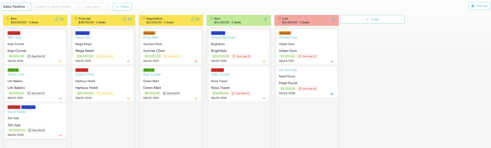
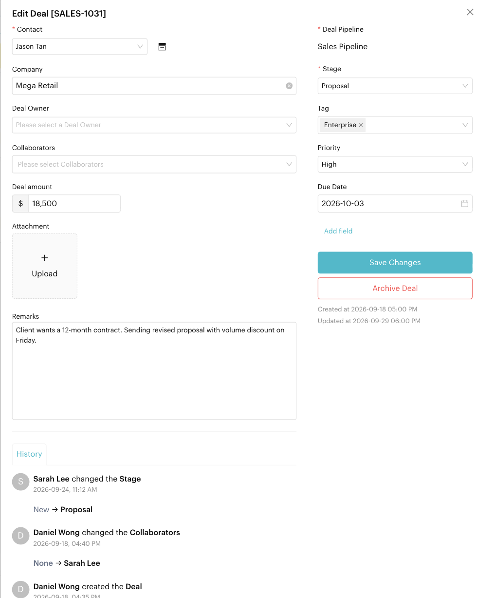

# Deals: Board

## What is the Deals Board?
The Board is your primary workspace for managing sales. It uses a Kanban layout to visualize your sales funnel, making it easy to see which stage each deal is in and what needs to happen next.

Open it from `Deals` > `Board` in the left menu.

<figure><figcaption>
Deals Board
</figcaption></figure>

## Managing the Sales Board

### Visualizing Revenue
One of the key features of the Deals Board is the **Amount Display**:
- Each card shows the deal's value, e.g. `$12,500.00`.
- Each stage header displays the **Total Amount** of all deals within that column.

Each card shows the deal's tags, contact, company, amount, due date, deal number and a priority icon. Due dates turn orange when they are close and red when they have passed.

### Moving Deals
- **Progressing a Deal**: Drag a card from left to right as the lead moves closer to a sale.
- **Winning or Losing**: Move a deal to a stage with the *Won* or *Lost* stage type. This is what counts it as won or lost in the [Deals Report](../reports/deals.md).

### Board Actions
- **Create Deal**: Click the **+ (Plus)** icon in any stage column.
- **Pipeline settings**: Use the **Settings (gear)** icon to **Edit Deal Pipeline** or **Delete Deal Pipeline**.
- **Stage actions**: Use the icons on a stage header to **Edit Stage** (rename it, change its type, or delete it) or **Archive Stage**. Click **+ Stage** to add a new stage.

## Pipelines and Stages

A pipeline is a set of stages that matches your sales process. A new pipeline starts with sample stages such as *New*, *Proposal*, *Negotiation*, *Won* and *Lost*, which you can rename or remove.

Each stage has a **Stage Name** and a **Stage Type**:

| Stage Type | Use it for |
| --- | --- |
| **Custom** | Any in-progress step, e.g. *New*, *Proposal*, *Negotiation* |
| **Won** | Deals you closed successfully. Deals here count as won in reports, and the deal gets a **Won Date**. |
| **Lost** | Deals that didn't close. Deals here count as lost in reports. |


If no stage has the *Won* or *Lost* type, the Deals Report shows 0 won and 0 lost.


## Filtering the Board
- **Deal Number**: Search for a specific deal by its number.
- **Deal Owner**: Filter the board to see only deals owned by a specific salesperson.
- **Advanced Filters**: Filter by **Tags**, **Amount** range, **Priority**, **Created Date** and **Due Date**. Due date filters include *Overdue*, *Due within 1 week*, *Due within this month*, *Due within 1 month*, *With due date* and a *Custom* range.

## The Deal Form
Opening a deal lets you update:

| Field | Description |
| --- | --- |
| **Deal Pipeline & Stage** | Where the deal sits in your funnel |
| **Contact** | The customer the deal is linked to |
| **Company** | The company the deal is with |
| **Deal amount** | Expected revenue. Thousands separators are added as you type, e.g. `12,500` |
| **Deal Owner** | The team member responsible for the deal |
| **Collaborators** | Other team members working on the deal |
| **Priority** | Highest, High, Medium, Low or Lowest |
| **Due Date** | When the deal should be closed or followed up |
| **Won Date** | Shown only when the stage type is *Won*. Cleared automatically if the deal is moved out of a Won stage. |
| **Tags** | Labels for grouping and reporting |
| **Remarks & attachments** | Notes and files for your team |
| **Custom Attributes** | Data specific to your sales process |

Use **Add field** to add custom attributes. At the bottom of an existing deal, the **History** tab shows every change made to the deal and who made it. To remove a deal from the board without deleting it, click **Archive Deal**.

<figure><figcaption>
Deal form with History
</figcaption></figure>

## Important behavior to know
- **Contact Sync**: Deals are linked to contact profiles. You can create a deal for a contact directly from the **Contact Info** panel in the `Inbox`.
- **Automatic Calculations**: The board totals update in real time as you move deals or update their amounts.
- **Automations**: Moving a deal into a stage can start a message flow with the [Deal Stage trigger](../automations/steps/trigger.md).
- **Archived deals**: Archived deals no longer appear on the board. Find them from **Archived Deals** in the [List](./list.md) view.

## Best practice 💡
- **Set stage types correctly**: Mark your closing stages as *Won* and *Lost* so reports are accurate.
- **Clean Pipelines**: Archive old or stale deals regularly to keep the board focused on active opportunities.
- **Always enter an amount** so stage totals and the Deals Report reflect your real pipeline value.
- **Use History** to see who changed a deal and when.
