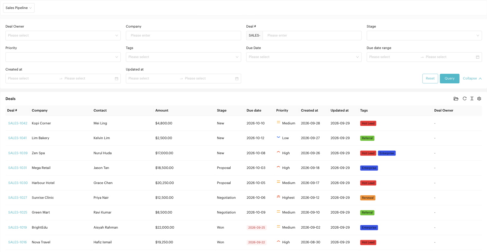

# Deals: List

## What is the Deals List?
The List view is a spreadsheet-style interface for your deals. It shows all deals in a pipeline in a single table, making it the best view for filtering and detailed searching.

Open it from `Deals` > `List` in the left menu, then choose a pipeline at the top.

<figure><figcaption>
Deals List
</figcaption></figure>

## Using the List View

### Filtering
Use the filter panel above the table, then click **Query**. Click **Reset** to clear all filters, or **Collapse** to hide the panel.

| Filter | Use it to find |
| --- | --- |
| **Deal Owner** | Deals owned by a specific team member |
| **Company** | Deals with a company name |
| **Deal #** | A specific deal by its number, e.g. `SALES-1031` |
| **Stage** | Deals in one stage |
| **Priority** | Deals with a priority, e.g. *Highest* |
| **Tags** | Deals with one or more tags |
| **Due Date** | *Overdue*, *Due within 1 week*, *Due within this month*, *Due within 1 month* or *With due date* |
| **Due date range** | Deals due between two dates |
| **Created at / Updated at** | Deals created or changed between two dates |

### Viewing Deal Data
Each row represents a deal. Click a deal number to open the deal form.

| Column | Description |
| --- | --- |
| **Deal #** | The deal number |
| **Company** | The company the deal is with |
| **Contact** | The linked contact |
| **Amount** | The deal value |
| **Stage** | The deal's current stage |
| **Due date** | When the deal is due. Past due dates are highlighted in red. |
| **Priority** | Highest to Lowest |
| **Created at / Updated at** | When the deal was created and last changed |
| **Tags** | Tags on the deal |
| **Deal Owner** | The responsible team member |

Use the page size selector at the bottom to show up to 500 deals per page.

### Archived Deals
Click the **folder** icon above the table (*Archived Deals*) to see deals that were archived.

### Opening the List from the Deals Report
Clicking a card, chart or count in the [Deals Report](../reports/deals.md) opens the List in a new tab, already filtered to the deals behind that number (for example, *deals won in September*). Adjust or reset the filters to broaden the list.

## When to use List vs Board?
- **Use Board** for day-to-day management and moving deals through the funnel.
- **Use List** for a more granular look at your data, such as all overdue deals, deals with a specific tag, or those assigned to a specific rep.
