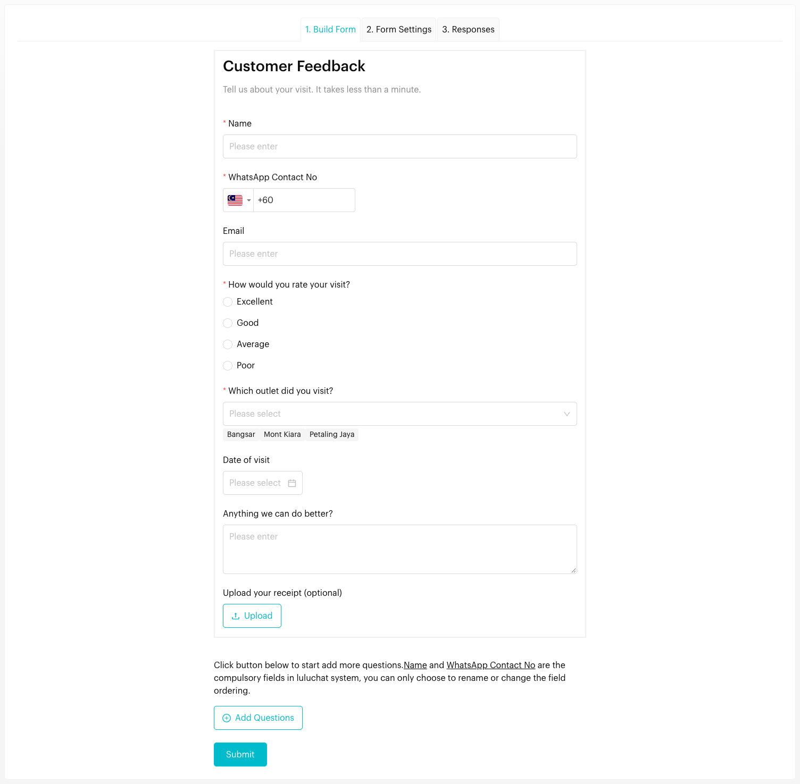
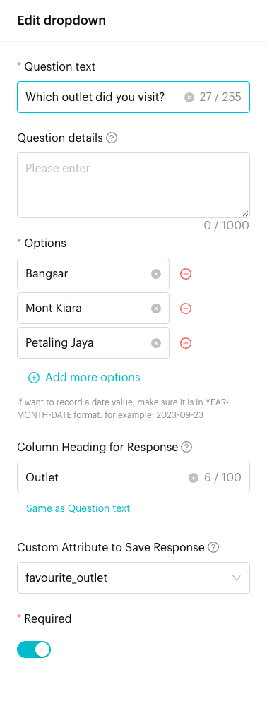

# Forms: Building a Form

## How to Build a Form (Step 1)
Go to `Forms` in the left menu and click a form to open it (or create a new one). The **1. Build Form** tab shows your form's questions in order.

Every new form starts with a title and two required questions, **Name** and **WhatsApp Contact No**. These two are compulsory: you can rename them or change their order, but not remove them.

<figure><figcaption>
Build Form tab
</figcaption></figure>

### Adding Questions
Click **Add Questions** at the bottom of the form and pick an element:

| Element | Use it for |
| --- | --- |
| **Title** | A heading and description for your form or a section |
| **Text** / **Textarea** | Short answers, or longer open-ended feedback |
| **Email** | Email addresses |
| **Phone** | Extra contact numbers (the country code is guessed automatically) |
| **Multiple Choice** | Pick one option. Options can have images. |
| **Checkbox** | Pick one or more options |
| **Dropdown** | Pick one option from a list |
| **Date** / **Time** | Booking requests or availability |
| **Image** / **Video** | Visual instructions or promotional content |
| **Files** | Let customers upload receipts, documents or photos |


**File Storage Required**: To use the Files element, you need the "File Storage 200G" add-on. Go to `Settings` > `Account Management` > `Billing` to view and purchase storage add-ons.


#### Supported file types and size limits
Customers can upload one file per Files question. The maximum size of each file depends on its type:

| File type | Formats | Max size per file |
| --- | --- | --- |
| **Images** | JPG, JPEG, PNG | 16 MB |
| **Audio** | AAC, MP3, M4A, MP4 audio, AMR, OGG | 16 MB |
| **Video** | MP4, 3GP, MOV | 32 MB |
| **Documents** | PDF, TXT, CSV, HTML, Word (DOC, DOCX), Excel (XLS, XLSX), PowerPoint (PPT, PPTX), ODS | 100 MB |

Files in any other format are rejected with an invalid-file error.

### Editing and ordering questions
- **Edit**: Click a question to open its settings panel.
- **Reorder**: Use the **Move Up** and **Move Down** arrows next to a question.
- **Remove**: Click the red **minus** icon next to a question.

### Question settings
When you click a question, you can set:

| Setting | Description |
| --- | --- |
| **Question text** | The question the customer sees |
| **Question details** | Extra instructions shown under the question |
| **Options** | The choices, for Multiple Choice, Checkbox and Dropdown |
| **Column Heading for Response** | A short name used as the column heading in [Responses](responses.md), e.g. `Rating` |
| **Custom Attribute to Save Response** | Save the answer to a contact's custom attribute |
| **Required** | The customer must answer before submitting |

### Mapping to Custom Attributes
Link a question to a **Custom Attribute** and the answer is saved to the contact's profile as soon as the form is submitted. For example, map *Which outlet did you visit?* to `favourite_outlet`, then use it to personalise your message flows.

<figure><figcaption>
Question settings panel
</figcaption></figure>

Click **Submit** at the bottom of the tab to save your changes. Use **Open Form Link** at the top right to preview the live form.

## Important behavior to know

* **Compulsory fields**: **Name** and **WhatsApp Contact No** are always part of the form. You can rename and reorder them, but not delete them.
* **File Upload Storage**: The Files element requires the "File Storage 200G" add-on. Without it, you can't add file upload questions. Go to `Settings` > `Account Management` > `Billing` to purchase it.
* **File Size Limits**: Each uploaded file is limited by its type: 16 MB for images and audio, 32 MB for video, and 100 MB for documents. See [Supported file types and size limits](#supported-file-types-and-size-limits).

## Best practice 💡
- **Keep it Short**: Only ask for essential information to increase submission rates.
- **Use Clear Labels**: Make sure your questions are easy to understand.
- **Set Column Headings**: Give long questions a short column heading so the Responses table stays readable.
- **Required Fields**: Mark critical questions as **Required** so you get the data you need.
- **Plan Ahead for File Uploads**: If you need to collect documents or images, get the File Storage add-on before creating your form.
