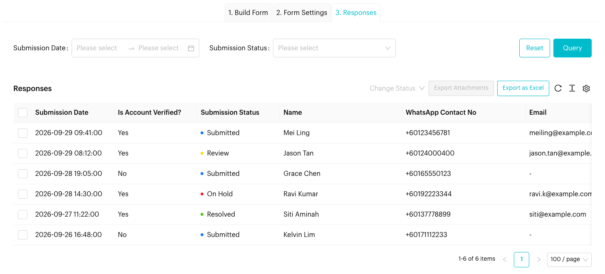

# Forms: Managing Responses

## Viewing Submissions (Step 3)
Once your form is live and customers start submitting, open the form and go to the **3. Responses** tab.

<figure><figcaption>
Responses tab (sample data)
</figcaption></figure>

### The Responses Table
Each row is one submission. The table shows:

| Column | Description |
| --- | --- |
| **Submission Date** | When the form was submitted |
| **Is Account Verified?** | **Yes** if the person verified their number with OTP or came from a Message Flow |
| **Submission Status** | *Submitted*, *Review*, *On Hold* or *Resolved* |
| **One column per question** | The answer to each question. The heading is the question's **Column Heading for Response**. File uploads show a **View File** link. |

Drag the edge of a column heading to resize it.

### Filtering
Use the filter panel above the table to find responses by **Submission Date** range or **Submission Status**, then click **Query**.

### Managing Responses
Select one or more responses with the checkboxes, then:

| Action | Description |
| --- | --- |
| **Change Status** | Mark the selected responses as **Review**, **On Hold** or **Resolved** to track your follow-up |
| **Export Attachments** | Download the files uploaded in the selected responses (up to 100 responses at a time) |
| **Delete** | Permanently delete the selected responses (button at the bottom of the page) |

Click **Export as Excel** to download all responses as a spreadsheet.


**Export as Excel** and **Delete** only appear for users with permission to export or delete form responses.


## Best practice 💡
- **Monitor Regularly**: Check your responses frequently to follow up with new leads.
- **Use Statuses**: Mark responses as *Review*, *On Hold* or *Resolved* so your team knows what's been handled.
- **Link to Automations**: Use the data collected in forms to trigger specific **Message Flows** for personalized follow-ups.
