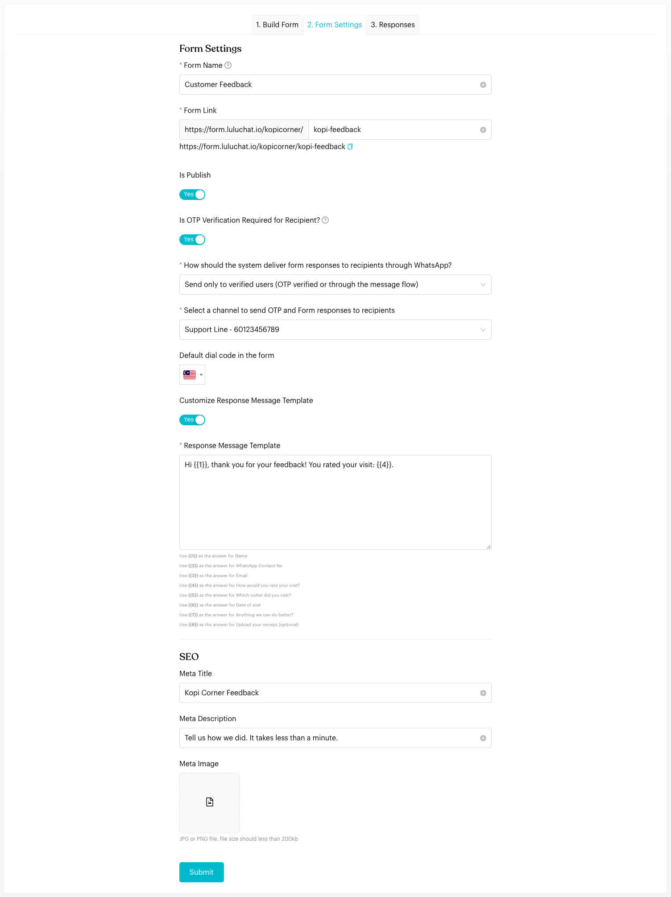

# Forms: Settings & SEO

## Configuring Your Form (Step 2)
The **2. Form Settings** tab is where you control how the form behaves and how responses are delivered.

<figure><figcaption><p>Form Settings tab</p></figcaption></figure>

### General Settings
| Setting | Description |
| --- | --- |
| **Form Name** | The internal name for your reference |
| **Form Link** | The web address of your form. Customize the last part, e.g. `kopi-feedback`. |
| **Is Publish** | Turn on to make the form live, or off to take it offline |

### Verification & Delivery
- **Is OTP Verification Required for Recipient?**: If on, people who open the form link directly must verify their WhatsApp number with a one-time code before submitting. People who reach the form through a **Message Flow** are already identified and skip this step.
- **How should the system deliver form responses to recipients through WhatsApp?**:
    - **Do not send**: Only your team sees the responses.
    - **Send only to verified users (OTP verified or through the message flow)**: Only verified people get a copy of their answers.
    - **Send to all recipients**: Everyone gets a copy of their answers.
- **Select a channel to send OTP and Form responses to recipients**: The WhatsApp channel used to send the code and the copy of the answers.
- **Default dial code in the form**: The country code pre-selected in phone number questions.

### Response Message
Choose the message customers receive after submitting.

**WhatsApp Personal channels**: Turn on **Customize Response Message Template** and write your message in **Response Message Template**. Use placeholders to include the customer's answers: `{{1}}` is the answer to the first question, `{{2}}` the second, and so on. The list of placeholders is shown under the text box.

```
Hi {{1}}, thank you for your feedback! You rated your visit: {{4}}.
```

**WhatsApp Cloud (WABA) channels**: Click **Select Message Template** to pick an approved message template. See [Setup WABA Template for Form Response](waba-form-response-template.md).

### SEO & Sharing
Customize how your form looks when shared on social media or WhatsApp:
- **Meta Title & Meta Description**: The text that appears in the link preview.
- **Meta Image**: A brand logo or promotional banner for the link preview (JPG or PNG, under 200 KB).

Click **Submit** at the bottom of the tab to save your changes.


If you change the **Form Link**, a **Save the Form** reminder appears at the top right until you click **Submit**.


## Important behavior to know
- **OTP for External Links**: OTP is only needed for forms shared as public links. If a customer opens the form from a **Message Flow**, they're already verified, and OTP is skipped.
