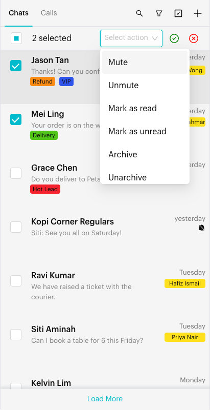

# Bulk Actions (Bulk Change)

## What are Bulk Actions?

**Bulk Change** lets you select many chats in the chat list and apply one action to all of them at once. You can:

* **Mark as read** / **Mark as unread**
* **Mute** / **Unmute** (WhatsApp Personal channels only)
* **Archive** / **Unarchive**
* **Close conversation**

To change a single chat, you can also use the row menu described in [Conversation Controls](conversation-controls.md).

## When to use it?

* **Clearing a backlog**: Mark many old chats as read in one go.
* **Tidying up**: Archive or close finished chats after a campaign or event.
* **Quieting groups**: Mute several noisy group chats together.

## How to use it (Step by Step)



#### Turn on Bulk Change mode

In the Inbox, on the **Chats** tab, click the **Bulk Change** icon (a checkbox icon) at the top of the chat list, next to the Search and Filters icons.

A bar appears above the chat list, and each chat shows a checkbox instead of its avatar.

<figure><figcaption>
The Bulk Change (checkbox) icon is in the chat list header (sample data)
</figcaption></figure>



#### Select chats

Click a chat row (or its checkbox) to select it. Click again to deselect it. The bar shows how many chats are selected, for example "3 selected".

To select every chat currently loaded in the list, tick the checkbox at the left of the bar. Untick it to clear the selection.

📸 Screenshot placeholder:

> \[Screenshot: Chat list in Bulk Change mode with three chats ticked and the bar showing "3 selected"]



#### Choose an action

Click the **Select action** dropdown in the bar and choose one of:

* **Mute** (mutes for 8 hours) / **Unmute** (shown only for WhatsApp Personal channels)
* **Mark as read**
* **Mark as unread**
* **Archive**
* **Unarchive**
* **Close conversation**

<figure><figcaption>
Choosing a bulk action (sample data)
</figcaption></figure>



#### Confirm or cancel

Click the green tick (**Confirm**) to apply the action. Click the red cross (**Cancel**) to leave Bulk Change mode without changes.



## What happens after it triggers?

* You see a message like "Bulk action applied to 5 conversation(s). Please wait for a few seconds to see the changes in the chat list."
* Bulk Change mode turns off and your selection is cleared.
* The chat list updates after a few seconds. For **Close conversation**, the list reloads automatically.
* If some chats could not be updated, you see a warning such as "2 conversation(s) failed to update."

## Important behavior to know

* **Only loaded chats can be selected.** "Select all" selects the chats currently loaded in the list. Scroll down or click **Load More** to load more chats first.
* **Your filters and list still apply.** Bulk Change works on the chats you see in the current list, filter or search result. Use [Filters](filters.md) or a [Custom List](custom-lists.md) to narrow down the chats first.
* **Mute** in Bulk Change always mutes for **8 hours**. To mute for **1 Week** or **Always**, use the chat row menu (see [Conversation Controls](conversation-controls.md)).
* **Mute and Unmute** are only offered on WhatsApp Personal channels.
* **Close conversation** needs a saved contact. Chats without a contact record are skipped, and you see a warning such as "1 conversation(s) were skipped because contact\_id is missing."
* **Archive limit**: On WhatsApp Personal channels you can archive or unarchive up to **500** chats at a time.
* **Bulk Change is available on WhatsApp channels** (WhatsApp Personal and WhatsApp Cloud). The Bulk Change icon is not shown for Messenger or Instagram channels.
* While Bulk Change mode is on, clicking a chat selects it instead of opening it.

## Common issues & solutions

* **I can't see the Bulk Change icon**: Make sure you are on the **Chats** tab (not **Calls**) and that search is closed. The icon is only shown for WhatsApp channels.
* **"Please select an action."**: Choose an action from **Select action** before clicking Confirm.
* **"Please select at least one conversation."**: Tick at least one chat.
* **Changes don't show right away**: Wait a few seconds. If the list shows **Chat List Updated**, click **Reload**.
* **Some chats were skipped on Close conversation**: Those chats have no saved contact. Open the chat and close it from the conversation header instead (see [Close Conversation](close-conversation.md)).
* **Archive fails for a large selection**: Select 500 chats or fewer and try again.

## Best practice 💡

* Filter first, then bulk-change. For example, filter by a tag, select all, then **Archive**.
* Double-check the "selected" count before you confirm.
* Use **Mark as unread** in bulk to flag a set of chats for a teammate to review.

## Related Documentation

* [Conversation Controls](conversation-controls.md)
* [Filters](filters.md)
* [Close Conversation](close-conversation.md)
* [Inbox Overview](index.md)
