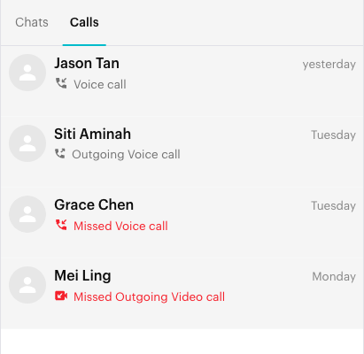
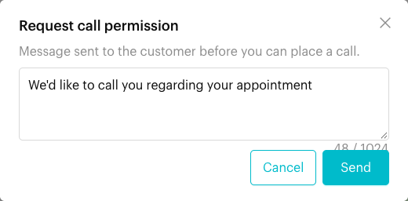
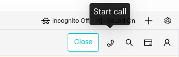

# Calls

## What is Calls?

Calls brings WhatsApp calls into your Inbox. The **Calls** list shows your recent incoming, outgoing and missed calls. On WhatsApp Cloud (WABA) channels with calling turned on, you can also ask a customer for permission to call, start a voice call from the conversation header, and answer incoming calls in your browser.

This page covers using calls in the Inbox. For setup, Meta's rules and limits, see [WhatsApp Calling](../whatsapp-business-app-waba/whatsapp-calling.md).

## When to use it?

* **Check missed calls**: See who tried to call and reply to them straight away.
* **Talk it through**: Switch from chat to a voice call when a question is easier to explain by phone.
* **Answer customers**: Pick up incoming WhatsApp calls without reaching for a phone.

## How to use it (Step by Step)

### View your call history



#### Open the Calls tab

In **Inbox**, click **Calls** at the top of the chat list (next to **Chats**). This tab is shown on WhatsApp Personal and WhatsApp Cloud channels.

<figure><figcaption>
Calls tab
</figcaption></figure>



#### Read the list

Each row shows the contact, the call type and when it happened:

* **Voice call** or **Video call**, with **Outgoing** for calls you made.
* **Missed** calls are shown in red.
* The time shows as a clock time for today, **yesterday**, a weekday for this week, or a date. Hover over it to see the exact date and time.

Scroll down or click **Load More** to see older calls.



#### Open the conversation

Click a call to open the chat with that contact.



### Ask for permission and start a call (WhatsApp Cloud)



#### Open a one-to-one conversation

Open the customer's chat. The phone icon appears in the conversation header when calling is turned on for your WhatsApp Cloud channel. It does not appear in group chats.



#### Request call permission

If the customer hasn't allowed calls yet, the phone icon shows **Request call permission**. Click it, check the message (default: *"We'd like to call you regarding your appointment"*, up to 1,024 characters), then click **Send**. You'll see *"Call permission request sent."*

<figure><figcaption>
Request call permission
</figcaption></figure>



#### Start the call

Once the customer allows calls, the same icon shows **Start call**. Click it and allow microphone access if your browser asks.

<figure><figcaption>
Start call
</figcaption></figure>



#### During the call

A **WhatsApp Call** box appears at the top right. It shows **Calling...**, then **Ringing...**, then **In call** with a timer. Click **End Call** to hang up.

📸 Screenshot placeholder:

> \[Screenshot: WhatsApp Call box at the top right showing "In call (01:23)" and the End Call button]



### Answer an incoming call (WhatsApp Cloud)

When a customer calls, an **Incoming WhatsApp Call** box appears at the top right showing who is calling. Click **Accept** to answer or **Reject** to decline. After you accept, the **WhatsApp Call** box shows the call timer and **End Call**.

📸 Screenshot placeholder:

> \[Screenshot: Incoming WhatsApp Call box with From [number], Accept and Reject buttons]

## What happens after it triggers?

* When a call ends, the box briefly shows **Call ended**, **Call declined** or **Missed call**, then closes.
* The call is added to the **Calls** list.

## Important behavior to know

* Starting calls, requesting permission and answering calls in the browser are only for **WhatsApp Cloud (WABA)** channels with calling turned on in **Settings** > **Inbox** > **WhatsApp Cloud Calling Settings**.
* Calls are voice only from Luluchat. Your computer's microphone and speakers are used.
* You must have the customer's permission before you can call them. If you click to call without it, you'll see *"Customer has not granted call permission. Request permission first."*
* Call alerts and controls work inside Inbox. Keep Inbox open with a one-to-one WhatsApp Cloud chat selected so you see incoming calls.
* Meta limits how often you can request permission and call. See [WhatsApp Calling](../whatsapp-business-app-waba/whatsapp-calling.md).

## Common issues & solutions

* **No phone icon in the header**: Check that the channel is WhatsApp Cloud, calling is enabled, and the chat is not a group.
* **No Calls tab**: The Calls tab is only shown on WhatsApp Personal and WhatsApp Cloud channels, and it is hidden while the chat search is open.
* **"Unable to access microphone or create call session."**: Allow microphone access for Luluchat in your browser settings, then try again.
* **Customer hasn't answered the permission request**: Wait for them to respond. Meta limits how many requests you can send.
* **No sound**: Check your speaker and microphone settings, and try another browser if the problem continues.

## Best practice 💡

* Ask for permission while you are already chatting, and say why you want to call.
* Use a headset for clear audio.
* Check the **Calls** tab for missed calls and send a quick message back.

## Related Documentation

* [WhatsApp Calling](../whatsapp-business-app-waba/whatsapp-calling.md) - Setup, eligibility and Meta's limits
* [Send Messages](send-messages.md) - The conversation header and composer
* [Service Window](../whatsapp-business-app-waba/service-window.md)
