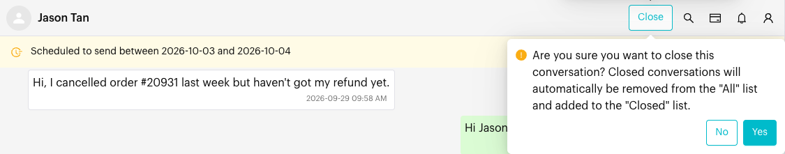

# Close Conversation

## What is Close Conversation?

Close Conversation marks a chat as done. The chat moves from the **All** list to the **Closed** list, and all messages are kept. If the customer sends a new message, the conversation opens again.

## When to use it?

* **Resolved enquiries**: The customer's question is answered and nothing else is needed.
* **Clean working list**: Keep the **All** list focused on chats that still need a reply.
* **Reporting**: Closing a chat records when it was resolved, which feeds the resolution time in the [Conversations Report](../reports/conversations.md).

## How to use it (Step by Step)



#### Open the conversation

In **Inbox**, click the chat you want to close.



#### Click Close

In the conversation header, click **Close**. The tooltip reads **Close conversation until customers send a new message**.

On a small screen, tap the three-dot menu (⋮) in the header and choose **Close Conversation**.

<figure><figcaption>
The Close button in the conversation header
</figcaption></figure>



#### Confirm

A confirmation appears: *"Are you sure want to close this conversation? Closed conversations will automatically removed from "All" list and will be add to "Closed" list."* Click **Yes**.

<figure><figcaption>
Close confirmation
</figcaption></figure>



## What happens after it triggers?

* If you are on the **All** list, the chat disappears from it and you see *"Conversation has moved from 'All' tab to 'Closed' tab"*.
* If you are on any other list, you see *"Conversation has added to 'Closed' tab"*. The chat stays in that list and is also added to **Closed**.
* The full message history stays. Nothing is deleted.
* When the customer sends a new message, the conversation opens again and returns to **All**.

## Important behavior to know

* The **Close** button is hidden while you are viewing the **Closed** list, because those chats are already closed.
* Closing does not send anything to the customer.
* You can only close a chat that is linked to a saved contact.
* You can also close chats automatically with the [Close Inbox Conversation](../automations/logics/actions/close-conversation.md) action in a Message Flow, or close many chats at once with [Bulk Actions](bulk-actions.md).

## Common issues & solutions

* **Can't find the Close button**: You may be on the **Closed** list already. Switch to **All** or another list. On a narrow screen, use the three-dot menu (⋮) instead.
* **The chat came back after I closed it**: The customer sent a new message, so the conversation opened again. This is expected.
* **The chat is still in my custom list**: Closing only removes a chat from **All**. Remove it from custom lists with **List Assignment** (see [Custom Lists](custom-lists.md)).

## Best practice 💡

* Send a short wrap-up message ("Glad we could help!") before closing.
* Add tags or update the deal stage before closing so reports stay accurate.
* Check the **Closed** list now and then to spot chats that were closed too early.

## Related Documentation

* [Custom Lists](custom-lists.md) - The **All** and **Closed** lists, and adding chats to lists
* [Send Messages](send-messages.md) - Other actions in the conversation header
* [Conversations Report](../reports/conversations.md) - Resolution time and closed conversations
