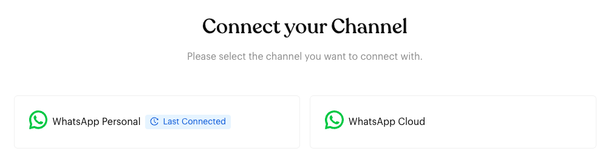
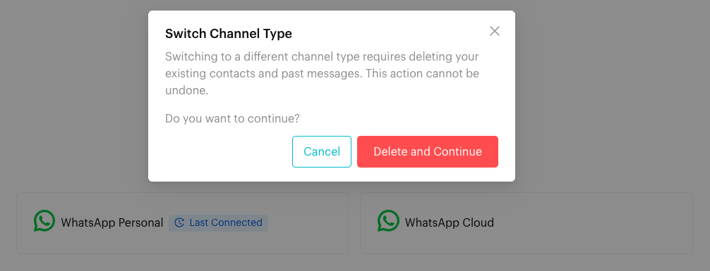

# Connect your Channel

## What is Channel Connection?

Connecting your channel links your WhatsApp number to Luluchat. Once connected, you can manage conversations, run automations, and send broadcasts directly from the platform.

On the **Connect your Channel** page you can choose:

* **WhatsApp Personal**: Link a WhatsApp or WhatsApp Business app account as a linked device (QR code or pairing code).
* **WhatsApp Cloud**: Connect through Meta's official WhatsApp Business Platform (Cloud API) by signing in with Facebook. This is also where you set up **WhatsApp Coexistence** (keep using your WhatsApp Business app on your phone while Luluchat connects through the Cloud API).

## When does it trigger?

The **Connect your Channel** page appears when you open `Inbox` and the channel you are currently using is not connected, for example:

* You just signed up and have not connected any number yet.
* You added a new channel and switched to it.
* Your channel was disconnected (for example, you disconnected it, or WhatsApp logged out the linked device).

## How to set it up (Step by Step)



#### Open Inbox

Click `Inbox` in the left menu. If your current channel is not connected, you will automatically see the **Connect your Channel** page.

While the channel is not connected, the **Channels** button at the top right shows a warning icon.

<figure><figcaption></figcaption></figure>



#### Choose your channel type

Click the card for the channel type you want to connect:

* **WhatsApp Personal**: see [Connect WhatsApp Personal](connect-whatsapp-personal.md).
* **WhatsApp Cloud**: see [Connect WhatsApp Cloud](connect-whatsapp-cloud.md), or [Connect WhatsApp Coexistence](connect-whatsapp-coexistence.md) if you want to connect your existing WhatsApp Business app number.

To go back and pick a different type, click **Back to Channel Selection** at the top left of the setup screen.



#### If you see "Switch Channel Type"

If this channel was connected before, the card for the type it last used shows a blue **Last Connected** tag. Hover over it to see when it was last connected.

If you pick a **different** channel type from the one this channel last used, Luluchat shows a **Switch Channel Type** pop-up:

* Switching to a different channel type requires deleting the existing contacts and past messages of this channel. This cannot be undone.
* Click **Delete and Continue** to delete the data and continue with the new channel type, or **Cancel** to go back.

<figure><figcaption>
Connect your Channel page with the Last Connected tag
</figcaption></figure>

<figure><figcaption>
Switch Channel Type pop-up
</figcaption></figure>



## Channel types

Use these dedicated guides for step-by-step instructions:

* [WhatsApp Personal](connect-whatsapp-personal.md)
* [WhatsApp Cloud](connect-whatsapp-cloud.md)
* [WhatsApp Coexistence](connect-whatsapp-coexistence.md)

Coming soon:

* Meta Messenger
* Instagram Messenger

## What happens after it triggers?

Once the channel is connected (status `ready`), the page refreshes and your `Inbox` opens. You can start receiving and sending messages, and your Message Flows and Broadcasts can run on that channel.

If you have more than one channel (for example, one Personal and one Cloud number), each channel works independently with its own contacts and conversations. Use the **Channels** button at the top right to switch between them. See [Switch Team and Channel](../switch-team-channel.md).

## Important behavior to know

* **One channel, one number**: Each channel should stay on one phone number. If you want to connect a different number to the same channel, delete its contacts and messages first (Luluchat offers a **Delete contacts and messages** button in the **Last connected** box on the setup screen), otherwise some Luluchat features may not work as expected.
* **Adding more channels**: Open **Channels** at the top right and click **Add Channel**. The new channel appears as **Not Connected**. Click **Switch** on it to open the **Connect your Channel** page for that channel.
* **Channel limit**: The **Channels** window shows how many channels you are using out of your plan's limit (for example, "1 out of 2 Channels currently in use").
* **Connection history**: In the **Channels** window, click the history icon next to a channel's status to see its **Last 10 connection history**.

## Common issues & solutions

* **Channel shows "Not Connected"**:
  * Open `Inbox` (or click **Connect Now** on the current channel in the **Channels** window) and complete the connection again for your channel type.
* **Channel disconnected**:
  * For WhatsApp Personal, Luluchat sends a disconnection notice to your registered WhatsApp number.
  * Re-connect by scanning the QR code / using a pairing code (Personal), or by signing in with Facebook again (Cloud).
  * If a Personal channel was disconnected because the phone was inactive, open WhatsApp on your primary phone first, then reconnect.
* **Sync taking too long** (WhatsApp Personal):
  * If you have a large number of contacts, wait up to 15 minutes for the first sync to finish.
  * Check your phone's internet connection – a slow connection will delay syncing.
* **Connection lost frequently**:
  * Make sure your phone (for Personal channels) has a stable internet connection.
  * Make sure you're using the latest version of WhatsApp.
* **Can't add more channels**:
  * Check whether you've reached your plan's channel limit in the **Channels** window.
  * Click **Need More Channel?** to view upgrade options.
  * Contact support if you believe you should have access to more channels.

## Best practice 💡


**Best practice**

* Use one phone number per channel, and give each channel a clear name so your team knows which is which.
* Check the **Channels** button at the top right regularly – a warning icon means the current channel is not connected and automations on it will not run.
* Keep a stable internet connection on your primary phone (Personal) while connecting and while using Luluchat.
* Export your contacts before choosing **Delete and Continue** or **Delete contacts and messages** – deleted data cannot be recovered.


## Related Documentation

* [Switch Team and Channel](../switch-team-channel.md)
* [Coexistence](../whatsapp-business-app-waba/coexistence.md)
