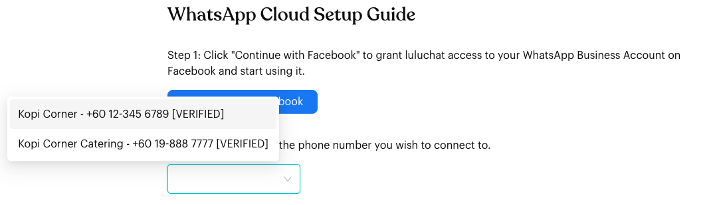
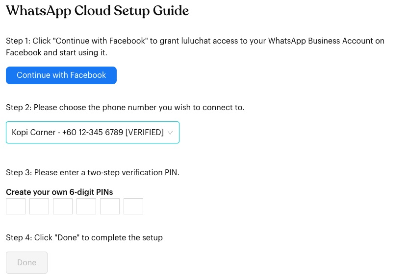

# WhatsApp Cloud

## What is WhatsApp Cloud connection?

Connecting a **WhatsApp Cloud** channel links your WhatsApp Business Account (WABA) to Luluchat through Meta's official WhatsApp Business Platform (Cloud API). This is recommended if you:

* Need higher-volume, API-based messaging.
* Use approved message templates (for outbound messages outside the 24-hour window).
* Manage WhatsApp under a Facebook / Meta Business account.

Use this option if you already have, or plan to create, a WhatsApp Business Platform (Cloud) setup in Meta.


Want to keep using the **WhatsApp Business app** on your phone with the same number? That setup (Coexistence) also starts from **WhatsApp Cloud**, but you choose a different option inside Meta's signup window. See [Connect WhatsApp Coexistence](connect-whatsapp-coexistence.md).


## When does it trigger?

* When you open `Inbox`, your current channel is not connected, and you choose **WhatsApp Cloud** on the **Connect your Channel** page.
* When an existing Cloud channel is disconnected or needs to be connected again.

## How to set it up (Step by Step)


**Learn More**: For detailed information about WhatsApp Business Platform features and configuration, see the [WABA Documentation](../whatsapp-business-app-waba/index.md).




#### Open Inbox and choose WhatsApp Cloud

1. Click `Inbox` in the left menu.
2. If the current channel is not connected, you will see the **Connect your Channel** page. (To connect an additional number, first add a new channel from the **Channels** button at the top right, then switch to it.)
3. Click **WhatsApp Cloud**.

<figure><figcaption></figcaption></figure>


If this channel was last connected with a different channel type (for example, WhatsApp Personal), Luluchat will ask you to confirm **Switch Channel Type** first. Continuing deletes the channel's existing contacts and past messages. See [Connect your Channel](connect-channel.md).




#### Step 1: Continue with Facebook

The **WhatsApp Cloud Setup Guide** screen shows four steps.

1. Click **Continue with Facebook**.
2. A Meta signup window opens. Log in with the Facebook account that manages (or will manage) your WhatsApp Business Account.
3. Follow Meta's steps to choose or create your business, WhatsApp Business Account and phone number, and grant Luluchat access.

If you close the window or don't finish granting access, Luluchat shows "User cancelled login or did not fully authorize." Click **Continue with Facebook** again to retry.

<figure><figcaption></figcaption></figure>



#### Step 2: Choose the phone number

1. After you finish with Facebook, Luluchat loads the phone numbers you shared.
2. Open the drop-down and pick the number you want to connect. Each option shows the business name, phone number and its verification status in brackets (for example, `[VERIFIED]`).

Until Step 1 is done, this step shows "Waiting for Step 1 to be completed."

<figure><figcaption>
Step 2: choose the phone number
</figcaption></figure>



#### Step 3: Create a two-step verification PIN

1. After you select a number, the **Create your own 6-digit PINs** boxes appear.
2. Enter any 6 digits you choose. This is **not** a code sent to you by Meta – you create it yourself.
3. Keep this PIN safe. It is the two-step verification PIN for this number on the WhatsApp Business Platform.

<figure><figcaption>
Step 3: create a 6-digit PIN
</figcaption></figure>



#### Step 4: Click Done

1. Click **Done**. (The button only becomes active after you select a number and enter all 6 PIN digits.)
2. When the connection succeeds, Luluchat shows "Channel connected." and the page refreshes into your Inbox.

If the connection fails, you will see "Failed to register." followed by the reason from Meta.

<figure><figcaption></figcaption></figure>



## What happens after it triggers?

Once the WhatsApp Cloud channel is connected (status `ready`):

* Luluchat can send and receive messages for that phone number through the Cloud API.
* You can use **Message Flows** and **Broadcasts** with WhatsApp Business Platform rules:
  * Template messages for starting conversations outside the 24-hour service window.
  * Normal (session) messages within 24 hours of the customer's last message.
* In the **Channels** window, the channel shows **Channel Type: waba**, and a shield icon lets you check the number's **Messaging health status**.
* If Meta places a violation or restriction on your WhatsApp Business Account, a red alert appears on the channel card in the **Channels** window. Hover over it to see the restrictions.

## Important behavior to know


**Important behavior to know**

* **Multiple Channels**: Depending on your plan, you can connect multiple Cloud channels (different numbers) and/or Personal channels. Each channel has its own conversations and contacts.
* **Channel Limits**: Your subscription plan controls how many channels you can connect. Contact support if you need more.
* **24-Hour Service Window**: Outside 24 hours from the customer's last message, you must use an approved message template.
* **Template Approval**: Templates must be approved by Meta before you can use them in Luluchat.
* **Quotas and Tiers**: Meta enforces messaging limits per number. Going over them can temporarily block more messages.
* **Last connected box**: If this channel was connected before, the setup screen shows the last connected phone number and date. Use one phone number per channel; to connect a different number, click **Delete contacts and messages** first (this permanently deletes contacts, chats and messages, including tags and remarks).
* **Disconnecting**: Open **Channels** (top right) and click **Disconnect** on the channel. Tick **Remove chat history** if you also want to delete chat history, then click **Yes, proceed**.


## Common issues & solutions

* **"User cancelled login or did not fully authorize."**:
  * The Facebook window was closed or access wasn't fully granted. Click **Continue with Facebook** again and complete all steps.
* **No phone numbers in Step 2**:
  * Make sure you selected your WhatsApp Business Account and phone number in the Facebook window and granted access.
  * Try **Continue with Facebook** again.
* **"Failed to register."**:
  * Make sure your Facebook account has the correct permissions for the selected WhatsApp Business Account.
  * Make sure the phone number isn't already connected to another provider that conflicts with Luluchat.
  * Read the reason shown after the message – it comes from Meta.
* **Done button is greyed out**:
  * Select a phone number in Step 2 and enter all 6 PIN digits in Step 3.
* **Channel shows "Not Connected"**:
  * Reconnect the channel from the **Connect your Channel** page.
  * Check in Meta Business settings that your WhatsApp Business Account and phone number are active.
* **Messages failing with 24-hour window errors**:
  * Use approved **template messages** for contacts who haven't messaged you in the last 24 hours.
  * Review error details in the Broadcast Message Queue or logs.
* **Insufficient quota / tier limits**:
  * Check your messaging limits in Meta Business Manager, or click the health status icon in the **Channels** window.
  * Reduce volume, wait for the limit to reset, or grow your tier.

## Error codes (WhatsApp Business Platform)

Sometimes a message cannot be sent from your WhatsApp Cloud channel because the WhatsApp Business Platform (Meta) returns an error.

When this happens:

* Luluchat displays the **error code and message** returned by Meta in places like the Broadcast Message Queue, flow logs, or channel status.
* You can look up what the code means and how to fix it in Meta's official error code reference: [WhatsApp Business Platform Error Codes](https://developers.facebook.com/documentation/business-messaging/whatsapp/support/error-codes).

Use the Meta list to understand whether the issue is quota, template, permission, or something else, then apply the suggested fix and retry from Luluchat if appropriate.

## Best practice 💡


**Best practice (WhatsApp Cloud)**

* Keep your **Facebook Business** and WhatsApp Business Account setup clean – remove unused numbers and integrations to avoid conflicts.
* Write down the 6-digit PIN you create in Step 3 and store it somewhere safe.
* Use **message templates** for outbound campaigns and re-engagement to stay within WhatsApp rules.
* Check **Messaging health status** in the **Channels** window and watch errors in Broadcast queues and flow logs to spot quota or template issues early.


## Related Documentation

* [Connect your Channel](connect-channel.md)
* [Connect WhatsApp Coexistence](connect-whatsapp-coexistence.md)
* [WABA Documentation](../whatsapp-business-app-waba/index.md)
