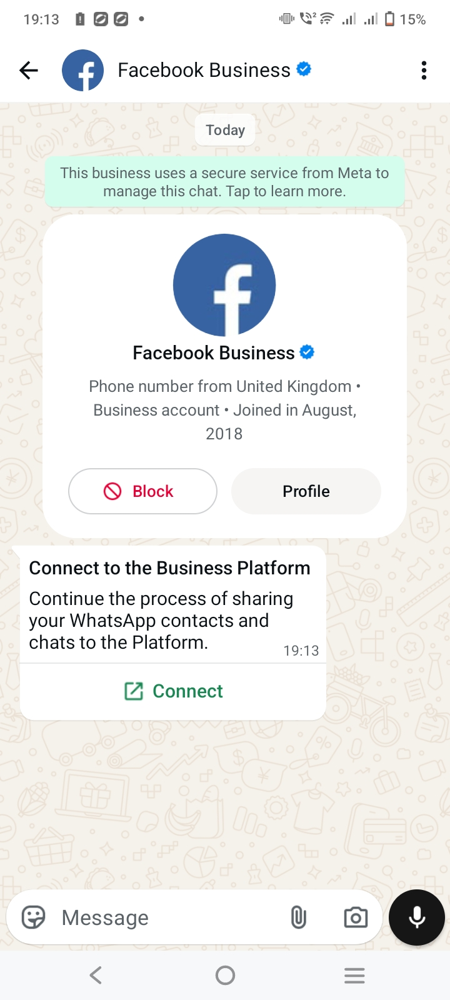
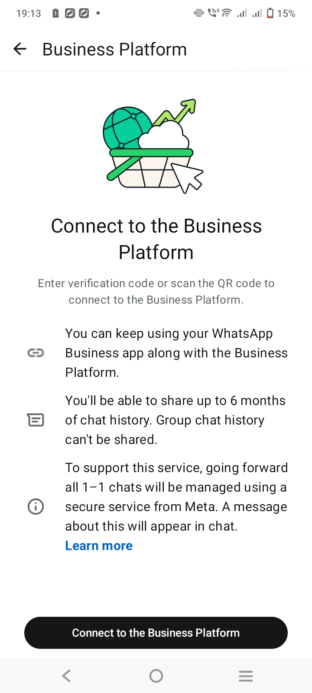
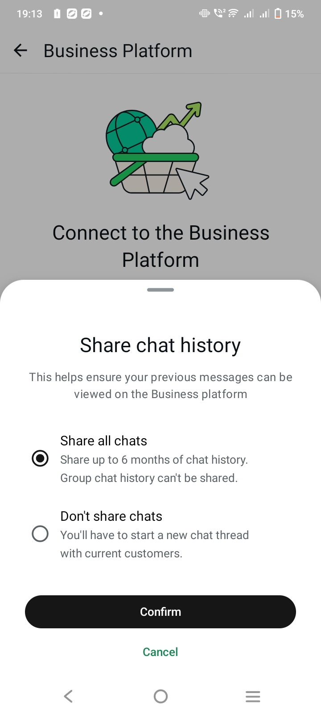
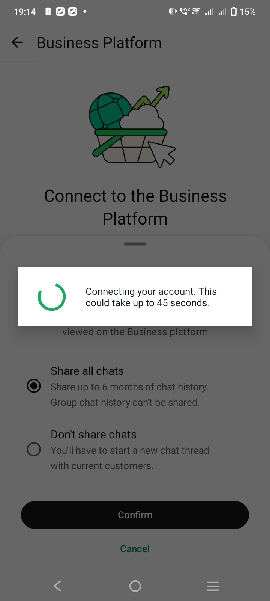
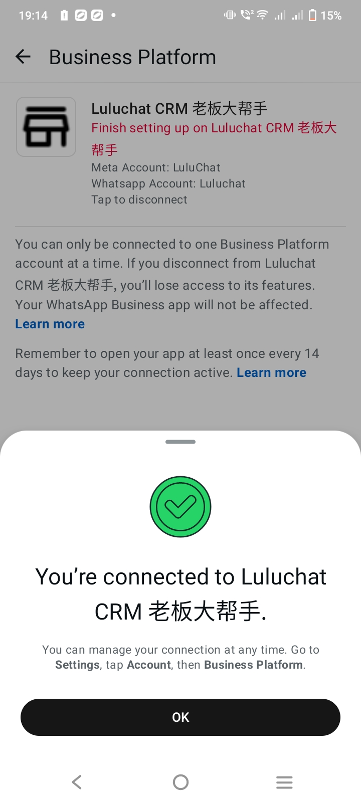

# WhatsApp Coexistence

## What is WhatsApp Coexistence?

**WhatsApp Coexistence** means running **WhatsApp Personal** and **WhatsApp Cloud (WABA)** channels side by side in the same Luluchat workspace. This lets you:

* Use a Personal channel for small‑team, phone‑centric conversations.
* Use a Cloud (WABA) channel for scalable, API‑driven messaging and template‑based outreach.
* Route conversations and automations through the most appropriate channel for each use case.

Coexistence does **not** merge two WhatsApp numbers into one – instead, each number becomes its own channel with its own conversations and limits, but they can be managed together from the same workspace.

## When should you use Coexistence?

Use a coexistence setup when:

* You already have an active WhatsApp number on the mobile app, but also want a WABA number for campaigns or automation.
* Different teams handle different types of conversations (e.g. Support on Personal, Marketing on Cloud).
* You are migrating to WABA but still need to keep the Personal number active for a transition period.

## How to set it up (Step by Step)

These steps describe how to connect your existing **WhatsApp Business app** to Luluchat via the **WhatsApp Cloud (Business Platform)** so that coexistence is enabled.



**Choose WhatsApp Cloud in Inbox**

* In Luluchat, open `Inbox` and go to the **Connect your Channel** screen.
* Select **WhatsApp Cloud** as the channel type.

<figure><figcaption></figcaption></figure>



**Click Continue with Facebook**

* On the WhatsApp Cloud setup screen, click the **Continue with Facebook** button.

<figure><figcaption></figcaption></figure>



**Follow the embedded signup guide (choose WhatsApp Business App)**

* Follow the embedded signup flow opened by Meta.

<figure><figcaption></figcaption></figure>

* When you reach the **WhatsApp Business account** options, choose **Connect a WhatsApp Business App**&#x20;

<figure><figcaption></figcaption></figure>



**Enter your phone number and approve “Connect to the business platform”**

* Continue in the embedded signup guide and enter the phone number of your **WhatsApp Business app**.

<figure><figcaption></figcaption></figure>

* A QR code will appear on the screen in the embedded flow.

<figure><figcaption></figcaption></figure>

* At the same time, your WhatsApp Business app on your phone will receive a notification with the message **"Connect to the business platform"**.

<figure><figcaption></figcaption></figure> <figure><figcaption></figcaption></figure> <figure><figcaption></figcaption></figure> <figure><figcaption></figcaption></figure> <figure><figcaption></figcaption></figure>

* On your phone, tap **Connect** and follow the prompts to share all chat history to Luluchat.
* You will then be taken to a **Scan QR code** screen on your phone – use it to scan the QR code shown in the embedded signup flow.



**Wait for the account to connect and finish the embedded flow**

* Wait for the connection and data sharing to complete.
* Continue following the embedded signup steps until you can click **Finish**.



**Click Done on Step 2 in Luluchat**

* Back in Luluchat’s WhatsApp Cloud setup, click **Done** on the second step to confirm the connection.



**Wait to be redirected to Inbox**

* After a short moment, Luluchat will finalize the setup.
* You should then be redirected to `Inbox`, where you will see your imported conversations.



## How does it behave in Inbox?

* Each channel appears separately in Inbox filters or channel selectors.
* Conversations for the Personal number are independent from conversations for the Cloud number.
* Agents can switch between channels without affecting existing threads.


**Important behavior to know**

* **Multiple Channels**: You can connect multiple channels, including more than one Personal or Cloud number, depending on your plan.
* **Independent Limits**: Each channel respects its own WhatsApp rules:
  * Personal: multi‑device limits and 14‑day login requirement on the primary phone.
  * Cloud: WABA quotas, 24‑hour service window, and template rules.
* **No Auto‑Forwarding**: Messages sent to one number do **not** automatically forward to another. Coexistence is about management convenience, not number aliasing.


## Common patterns and examples

* **Support on Personal, Marketing on Cloud**
  * Keep your long‑used WhatsApp number on the phone for customer support.
  * Use a dedicated WABA number (Cloud) for campaigns, reminders, and template‑based flows.
* **Migration from Personal to Cloud**
  * Temporarily run both channels.
  * Gradually move traffic and automations to the Cloud channel.
  * Eventually retire the Personal channel when customers are fully migrated.

## How to disconnect a coexistence channel

For coexistence setups that use a **WhatsApp Cloud (WABA)** channel, disconnection must be done from the WhatsApp Business side:

1. Open the **WhatsApp Business app**.
2. Go to **Settings > Account > Business Platform**.
3. Tap on **Luluchat CRM**.
4. Tap **Disconnect** to remove the integration.

After you disconnect in WhatsApp Business, the corresponding Cloud channel in Luluchat will stop working and show as not ready. You can reconnect later by following the Cloud setup guide again.

## Best practice for coexistence


**Best practice (Coexistence)**

* Name channels clearly (e.g. "Support – Personal", "Marketing – Cloud") so agents always know which is which.
* Document internally which channel type is allowed for which use case (support, campaigns, notifications, etc.).
* Regularly review usage and consider consolidating if one channel becomes dominant.
* Monitor channel‑specific errors (e.g. 24‑hour window on Cloud, 14‑day login on Personal) so issues are fixed on the correct side.

