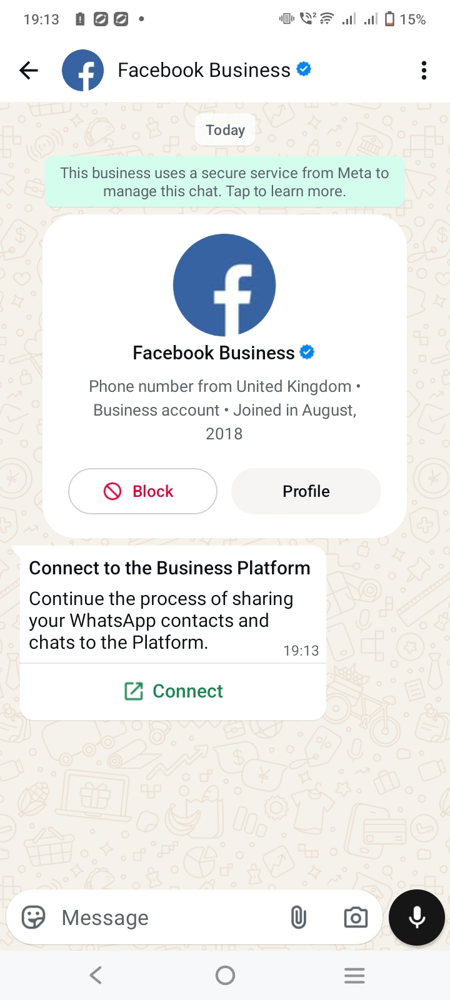
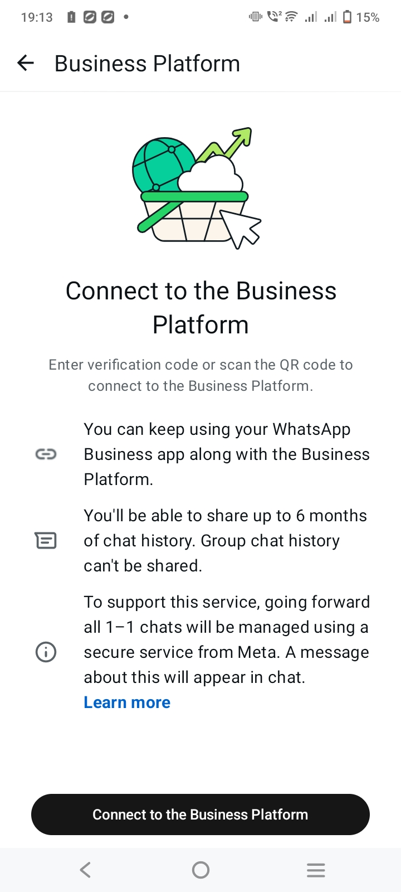
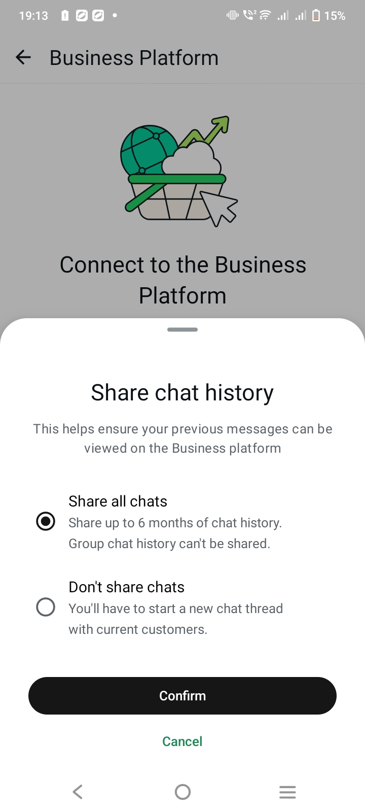
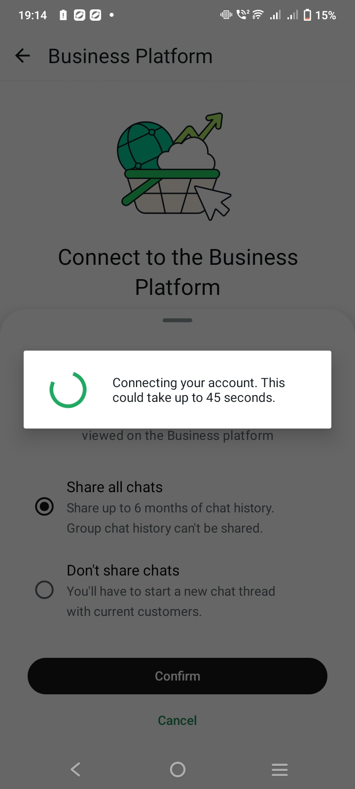
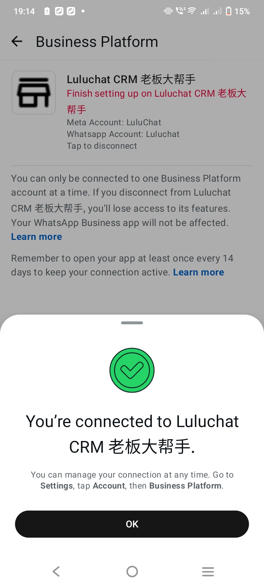
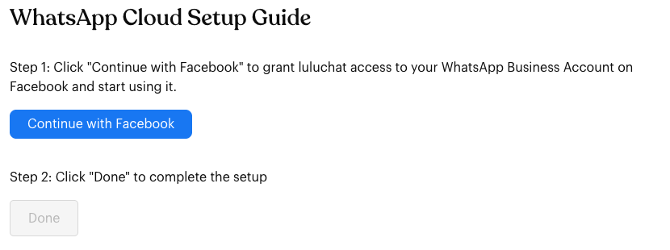

# WhatsApp Coexistence

## What is WhatsApp Coexistence?

**WhatsApp Coexistence** lets you connect the number you already use in the **WhatsApp Business app** to Luluchat through the **WhatsApp Cloud (Business Platform)** – without giving up the app on your phone. This lets you:

* Keep chatting from the WhatsApp Business app on your phone.
* Use the same number in Luluchat with WhatsApp Cloud features, such as message templates and Business Platform messaging.
* Share your existing chat history with Luluchat during setup, so past conversations show up in `Inbox`.

In Luluchat, a coexistence channel is a **WhatsApp Cloud** channel. In the **Channels** window it shows **Channel Type: waba (Coexistence)**.

For a comparison of WhatsApp Personal and WhatsApp Business Platform accounts, see [Coexistence](../whatsapp-business-app-waba/coexistence.md).

## When should you use Coexistence?

Use coexistence when:

* You already have an active number in the **WhatsApp Business app** and want to keep using it on your phone.
* You want that same number to use WhatsApp Cloud features in Luluchat (for example, templates for campaigns or re-engagement).
* You want to bring your existing WhatsApp Business app chats into Luluchat instead of starting from an empty Inbox.

If you want a brand-new number on the WhatsApp Business Platform only, follow [Connect WhatsApp Cloud](connect-whatsapp-cloud.md) instead.

## How to set it up (Step by Step)

These steps connect your existing **WhatsApp Business app** to Luluchat via **WhatsApp Cloud**, so coexistence is turned on.



#### Choose WhatsApp Cloud in Inbox

* In Luluchat, open `Inbox` to see the **Connect your Channel** screen.
* Click **WhatsApp Cloud**.

<figure><figcaption></figcaption></figure>



#### Click Continue with Facebook

* On the **WhatsApp Cloud Setup Guide** screen, click **Continue with Facebook**.

<figure><figcaption></figcaption></figure>



#### Follow the signup window (choose WhatsApp Business App)

* Follow the signup window opened by Meta.

<figure><figcaption></figcaption></figure>

* When you reach the **WhatsApp Business account** options, choose **Connect a WhatsApp Business App**.

<figure><figcaption></figcaption></figure>



#### Enter your phone number and approve "Connect to the business platform"

* Continue in the signup window and enter the phone number of your **WhatsApp Business app**.

<figure><figcaption></figcaption></figure>

* A QR code will appear in the signup window.

<figure><figcaption></figcaption></figure>

* At the same time, the WhatsApp Business app on your phone receives a notification: **"Connect to the business platform"**.

<figure><figcaption></figcaption></figure> <figure><figcaption></figcaption></figure> <figure><figcaption></figcaption></figure> <figure><figcaption></figcaption></figure> <figure><figcaption></figcaption></figure>

* On your phone, tap **Connect** and follow the prompts to share your chat history with Luluchat.
* Your phone then shows a **Scan QR code** screen – use it to scan the QR code shown in the signup window.



#### Finish the signup window

* Wait for the connection and data sharing to complete.
* Continue following the steps in the signup window until you can click **Finish**.



#### Click Done in Luluchat (Step 2)

* Back on Luluchat's **WhatsApp Cloud Setup Guide**, the screen now shows **Step 2: Click "Done" to complete the setup**. You do **not** need to choose a phone number or create a PIN in this flow.
* Click **Done**.

<figure><figcaption>
Finish the setup with Done
</figcaption></figure>



#### Wait for Inbox to open

* Luluchat shows "Channel connected." and the page refreshes.
* Your `Inbox` opens. Your shared conversations will appear as the history import completes.



## What happens after it triggers?

* The number keeps working in the WhatsApp Business app on your phone, and also works in Luluchat as a WhatsApp Cloud channel.
* In the **Channels** window, the channel shows **Channel Type: waba (Coexistence)**.
* Message Flows and Broadcasts on this channel follow WhatsApp Business Platform rules (24-hour service window and approved templates).

## Important behavior to know


**Important behavior to know**

* **It's a Cloud channel**: A coexistence channel follows WhatsApp Cloud rules – the 24-hour service window, template approval, and Meta's messaging limits. See [Connect WhatsApp Cloud](connect-whatsapp-cloud.md).
* **Sync errors are shown on the channel**: If importing contacts or chat history fails, the channel card in the **Channels** window shows a red **Contact Sync Error** or **History Sync Error** with the error code from Meta.
* **Disconnect from the phone, not from Luluchat**: The **Disconnect** button for a coexistence channel in Luluchat is greyed out. You must disconnect from the WhatsApp Business app (see below). The button is only available in Luluchat if a contact or history sync error occurred.
* **Multiple channels**: You can connect other channels (Personal or Cloud) alongside a coexistence channel, depending on your plan. Each channel has its own contacts and conversations, and messages are **not** forwarded between channels.


## How to disconnect a coexistence channel

Coexistence channels must be disconnected from the WhatsApp Business app on your phone:

1. Open the **WhatsApp Business app**.
2. Go to **Settings > Account > Business Platform**.
3. Tap on **LuluChat CRM** (it may show as **LuluChat CRM 老板大帮手**).
4. Tap **Disconnect** to remove the integration.

After you disconnect, the channel in Luluchat stops working and shows as **Not Connected**. You can reconnect later by following the steps on this page again.

## Common issues & solutions

* **The setup screen still asks me to choose a phone number and PIN**:
  * You didn't pick **Connect a WhatsApp Business App** in the signup window. Click **Continue with Facebook** again and choose that option.
* **Done button is greyed out**:
  * Finish all steps in Meta's signup window (until you click **Finish**), then try again.
* **"Failed to register."**:
  * Read the reason shown after the message – it comes from Meta. Check that your Facebook account has access to the WhatsApp Business Account, then try again.
* **No "Connect to the business platform" notification on the phone**:
  * Make sure the number you entered is the one used in your WhatsApp Business app, and that the app is updated to the latest version.
* **Contact Sync Error / History Sync Error on the channel**:
  * Note the error code shown and contact support. In this case the **Disconnect** button becomes available in Luluchat, so you can disconnect and try connecting again.
* **Can't disconnect from Luluchat**:
  * This is expected for coexistence channels. Disconnect from the WhatsApp Business app instead (see above).

## Best practice 💡


**Best practice (Coexistence)**

* Update the WhatsApp Business app on your phone before you start, and keep the phone nearby – you'll need to approve the connection and scan a QR code.
* Name the channel clearly in the **Channels** window so your team knows it's the same number as the phone app.
* Agree internally on who replies from the phone and who replies from Luluchat, so customers don't get duplicate answers.
* Use approved templates for messages sent outside the 24-hour service window.


## Related Documentation

* [Connect your Channel](connect-channel.md)
* [Connect WhatsApp Cloud](connect-whatsapp-cloud.md)
* [Coexistence (WABA)](../whatsapp-business-app-waba/coexistence.md)
