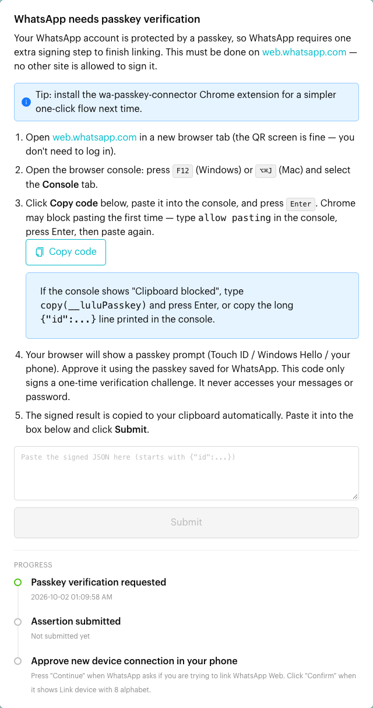
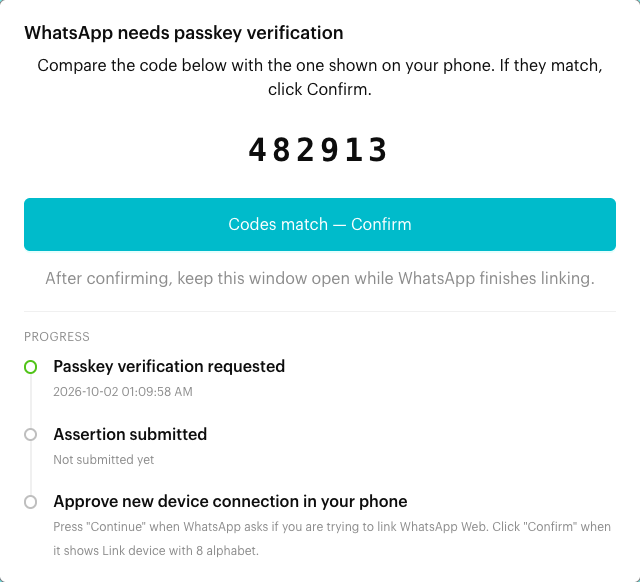

# Connect WhatsApp Personal

## What is WhatsApp Personal connection?

Connecting a **WhatsApp Personal** channel links your standard WhatsApp or WhatsApp Business app account to Luluchat as a **linked device** (the same way WhatsApp Web works). This lets you:

* Receive and reply to conversations from the Inbox.
* Trigger Message Flows and automations.
* Use Broadcasts (subject to your plan and limits).

Use this option if you use the WhatsApp or WhatsApp Business mobile app and do not have a WhatsApp Business API (Cloud) account.

You can link your phone in two ways:

* **Scan a QR code** (default).
* **Link with Phone Number** – enter your number and type a pairing code into WhatsApp on your phone. Useful when you can't scan the QR code.

## When does it trigger?

* When you open `Inbox`, your current channel is not connected, and you choose **WhatsApp Personal** on the **Connect your Channel** page.
* When a previously connected Personal channel was disconnected (for example, logged out from the phone, or disconnected from the **Channels** window) and you need to link it again.

## How to set it up (Step by Step)



#### Open Inbox and choose WhatsApp Personal

1. Click `Inbox` in the left menu.
2. If the current channel is not connected, you will see the **Connect your Channel** page.
3. Click **WhatsApp Personal**.

<figure><figcaption></figcaption></figure>


If this channel was last connected with a different channel type (for example, WhatsApp Cloud), Luluchat will ask you to confirm **Switch Channel Type** first. Continuing deletes the channel's existing contacts and past messages. See [Connect your Channel](connect-channel.md).




#### Check the "Before you connect" notes

The **Connect WhatsApp to luluchat** screen shows a QR code on the left and a short picture guide on the right (click **Next Step** to go through Step 1 to Step 4).

Below the QR code, the **Before you connect** box reminds you to:

* Make sure your phone has a good internet connection.
* Make sure you have the latest WhatsApp installed on your phone.
* Wait up to 15 minutes for syncing if you have a very large number of contacts.
* Log in to your primary phone at least every 14 days to keep linked devices connected.

If this channel was connected before, a **Last connected** box also appears at the top showing the last phone number and when it was connected. See [Important behavior to know](#important-behavior-to-know).



#### Option A: Scan the QR code

1. Wait for the QR code to load (you'll see **Loading QR Code...** for a moment).
2. On your phone, open **WhatsApp** (or **WhatsApp Business**).
3. Go to **Settings** (iPhone) or tap the three dots (Android), then tap **Linked Devices**.
4. Tap **Link a Device** and scan the QR code shown in Luluchat.

If the QR code doesn't appear, Luluchat shows "If the QR code doesn't load, please try again after 10 seconds." Wait a few seconds and click **Reload QR**.

<figure><figcaption></figcaption></figure>



#### Option B: Link with Phone Number

If you cannot scan the QR code (for example, your phone camera isn't working), use a pairing code instead:

1. Under the QR code, click **Link with Phone Number**.
2. In **Whatsapp Number**, choose your country code and enter your WhatsApp number.
3. Click **Request Pairing Code**.

<figure><figcaption></figcaption></figure>

4. A **Link with Phone Number** pop-up shows your **Pairing Code** (8 characters, letters and numbers).
5. On your phone, open WhatsApp and go to **Settings** (iPhone) or the three dots (Android) **> Linked Devices**.
6. Tap **Link a Device**, then choose **Link with phone number** (if available).
7. Enter the pairing code shown on your computer screen.

If the code expires or doesn't work, click **Regenerate Pairing Code** in the pop-up to get a new one. To go back to the QR code, close the pop-up and click **Link with QR Code**.

<figure><figcaption></figcaption></figure>



#### If asked: complete passkey verification

If your WhatsApp account is protected by a **passkey**, WhatsApp may ask for one extra signing step before it finishes linking. Luluchat then opens a **WhatsApp needs passkey verification** window. This window can't be closed until the step is done, and it shows a **Progress** list so you can see where you are.

**If the wa-passkey-connector Chrome extension is installed**, Luluchat detects it automatically:

1. Keep [web.whatsapp.com](https://web.whatsapp.com) open in another browser tab.
2. Approve the passkey prompt when it appears.
3. Wait until you see "Assertion accepted — waiting for WhatsApp to continue linking."

You can click **Use manual steps instead** at any time.

**Otherwise, follow the manual steps shown in the window:**

1. Open [web.whatsapp.com](https://web.whatsapp.com) in a new browser tab. You don't need to log in – the QR screen is fine.
2. Open the browser console: press **F12** (Windows) or **⌥⌘J** (Mac) and select the **Console** tab.
3. In Luluchat, click **Copy code**, paste it into the console, and press **Enter**. If Chrome blocks pasting the first time, type `allow pasting`, press Enter, and paste again.
4. Your browser shows a passkey prompt (Touch ID, Windows Hello, or your phone). Approve it using the passkey saved for WhatsApp. This only signs a one-time verification challenge – it never accesses your messages or password.
5. The signed result is copied to your clipboard automatically. Paste it into the box in Luluchat (it starts with `{"id":...}`) and click **Submit**.

If the console shows "Clipboard blocked", type `copy(__luluPasskey)` and press Enter, or copy the long `{"id":...}` line printed in the console.

**Then approve on your phone:**

1. When WhatsApp on your phone asks if you are trying to link WhatsApp Web, tap **Continue**, then confirm linking the device.
2. If Luluchat shows a code, compare it with the code shown on your phone. If they match, click **Codes match — Confirm**.
3. Keep the window open while WhatsApp finishes linking.

<figure><figcaption>
Passkey verification
</figcaption></figure>

<figure><figcaption>
Confirm the code shown on your phone
</figcaption></figure>



#### Wait for syncing to finish

After your phone is linked, the QR area shows **Syncing contacts...**. When the connection is ready, Luluchat shows "Your WhatsApp has been connected with luluchat, page is refreshing in 5 seconds..." and then opens your Inbox.

WhatsApp may continue syncing your chats to the linked device for a while:

1. On your phone, open **WhatsApp**.
2. Go to **Settings > Linked Devices** (iPhone) or the three dots **> Linked Devices** (Android).
3. Check the sync progress for the newly linked device.
4. Wait for the sync to complete before heavily using Inbox, Message Flows, or Broadcasts.

📸 Screenshot placeholder:

> \[Screenshot: WhatsApp Linked Devices showing sync status]



## What happens after it triggers?

Once the channel is connected (status `ready`):

* New incoming messages to your WhatsApp number appear in `Inbox`.
* You can reply directly from Luluchat and see messages on both your phone and Inbox.
* Message Flows and Broadcasts targeting this channel can start sending (subject to your workspace and WhatsApp limits).
* The **Channels** window shows the channel as **Connected**. Hover over it to see when it was last connected.

## Important behavior to know


**Important behavior to know**

* **14-day rule**: After connecting, you must open WhatsApp on your primary phone at least once every **14 days** to keep linked devices connected. If you don't, WhatsApp automatically disconnects linked devices (including Luluchat).
* **First sync can be slow**: With a very large number of contacts, the first sync can take up to 15 minutes.
* **Last connected box**: If this channel was connected before, the setup screen shows the **Phone number** and date it was last connected. Luluchat recommends using **one phone number per channel**. If you want to connect a different number, click **Delete contacts and messages** first, then **Clear** to confirm. This permanently removes all contacts, chats and messages from this channel, including the contacts' tags and remarks – export your contacts before deleting.
* **Disconnecting**: Open **Channels** (top right), find the channel, and click **Disconnect**. You can tick **Remove chat history** to also delete the chat history, then click **Yes, proceed**. The page refreshes after a few seconds.
* **Disconnection notice**: If the channel gets disconnected, Luluchat sends a notice to your registered WhatsApp number, and the Luluchat page shows "Your WhatsApp has been disconnected from luluchat" and refreshes.


## Common issues & solutions

* **QR code not loading**: Wait about 10 seconds and click **Reload QR**. If it still doesn't load, refresh the page.
* **QR code scanned but not connecting**:
  * Make sure your phone has a stable internet connection.
  * Make sure WhatsApp is updated to the latest version.
* **Pairing via phone number fails**:
  * Check that you selected the correct country code and entered the correct number.
  * Click **Regenerate Pairing Code** and try again with the new code.
  * If **Link with phone number** isn't shown on your phone, use the QR code instead.
* **Stuck on "WhatsApp needs passkey verification"**:
  * Make sure you ran the code on **web.whatsapp.com** – no other site can sign the passkey request.
  * If pasting into the console is blocked, type `allow pasting` first.
  * Make sure you pasted the whole signed result (starting with `{"id":...}`) before clicking **Submit**.
  * After submitting, check your phone and approve the new linked device.
* **Channel disconnected**:
  * Check your registered WhatsApp number for a disconnection notice from Luluchat.
  * Open `Inbox` and reconnect using the QR code or pairing code.
  * If disconnected because of the 14-day rule, open WhatsApp on your primary phone first, then reconnect.
* **Sync taking too long**:
  * Large contact lists can take up to 15 minutes for the first sync.
  * Make sure both your phone and computer have stable internet connections.
* **Connection lost frequently**:
  * Make sure your phone's Wi-Fi or data connection is stable.
  * Keep WhatsApp updated to the latest version.

## Best practice 💡


**Best practice (WhatsApp Personal)**

* Use a **dedicated business phone** for your WhatsApp Personal channel to avoid accidental logouts and number changes.
* Keep **one phone number per channel**. To use a different number, add a new channel instead of reusing the old one.
* Periodically check **Linked Devices** on your phone to make sure the Luluchat device is still linked.
* Set a reminder every **10–12 days** to open WhatsApp on the primary phone so you never hit the 14-day auto-disconnect.
* Avoid frequently switching phones for the same WhatsApp number; this can trigger extra security checks and disconnects.


## Related Documentation

* [Connect your Channel](connect-channel.md)
* [Switch Team and Channel](../switch-team-channel.md)
