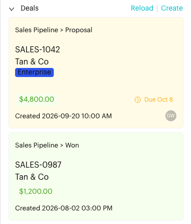

# Deals

## What is the Deals section?

The **Deals** section in the **Profile** tab of the [Contact Info](../../core-features/index/contact-info/README.md) panel shows every deal linked to the contact you're chatting with. You can check where each deal stands and create a new deal without leaving the conversation.

## When to use it?

* When a customer shows interest in buying and you want to track the sale.
* When you want to check whether the customer already has a deal before you reply.
* When you want to update a deal's stage, amount or due date while you chat.

## How to use (Step by Step)



#### Open contact info

In `Inbox`, open the conversation and click the **Contact Info** icon in the conversation header. The **Deals** section is in the **Profile** tab, below **Tags**.

Each deal card shows:

* The pipeline and stage, for example *Sales > Proposal Sent*
* The deal number and company
* The deal's tags
* The deal amount, if it is more than 0
* The due date. It turns orange when due within a week and red when overdue.
* The created date, priority and collaborators (shown when the deal has collaborators)

The card colour shows the stage type: green for *Won*, red for *Lost*, and yellow for open deals.

If the contact has no deals, you'll see **No deals yet**.

<figure><figcaption>
Deals in Contact Info (sample data)
</figcaption></figure>



#### Create a deal

Click **Create** at the top of the section (or **Create a Deal** if the contact has none yet). The contact is filled in for you.

Choose the **Deal Pipeline** and **Stage**, and add any other details such as company, deal amount, deal owner, priority or due date. Click **Create Deal**.

See [The Deal Form](../../deals/board.md#the-deal-form) for every field.

📸 Screenshot placeholder:

> \[Screenshot: Create a Deal window opened from Contact Info, with the contact filled in and Deal Pipeline and Stage selected]



#### Open or update a deal

Click a deal card to open it. You can change its stage, amount and other details and click **Save Changes**, or click **Archive Deal** to remove it from the board.



## What happens after it triggers?

The deal is linked to the contact and appears on the Deals [Board](../../deals/board.md) and [List](../../deals/list.md). Click **Reload** to refresh the section if a teammate has just changed a deal.

## Important behavior to know

* You need access to Deals to see this section.
* Archived deals no longer appear here. Find them from **Archived Deals** in the [List](../../deals/list.md) view.
* A deal's pipeline can only be chosen when you create it.
* The conversation header also shows the contact's newest deal with its stage. Click the stage to move the deal to another stage, click the arrow to move it to the next stage, or click the **+1 more** link (the number changes with the number of deals) to open Contact Info and see all deals. If the contact has no deal, the header shows a **Create a Deal** button.

## Common issues & solutions

* **Can't create a deal**: Make sure a deal pipeline exists. The **Create Deal** button is hidden until there is at least one pipeline. You also need to choose a Stage.
* **Deal not showing**: Click **Reload**, or check whether the deal was archived or linked to a different contact.
* **Deals section is missing**: Your plan or role does not include Deals. Ask your admin.

## Best practice 💡

* Create the deal as soon as the customer shows buying interest, so your pipeline stays complete.
* Always enter an amount so the board totals and the Deals Report are accurate.
* Set a due date and deal owner so the follow-up isn't missed.
* Use [Add to Deal Stage](../../automations/logics/actions/add-deal-stage.md) to create deals automatically from your message flows.

## Related Documentation

* [Deals: Board](../../deals/board.md)
* [Deals: List](../../deals/list.md)
* [Contact Info](../../core-features/index/contact-info/README.md)
