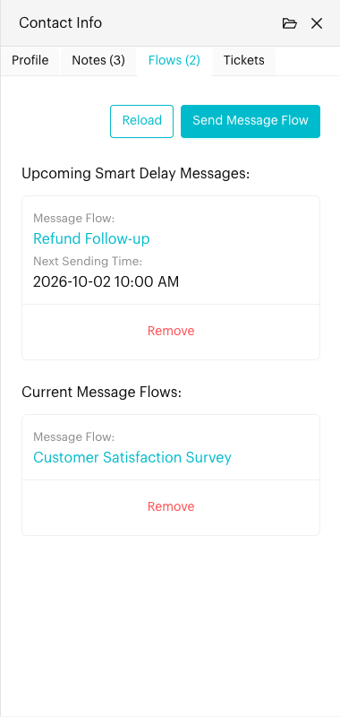

# Flows

## What is the Flows tab?

The **Flows** tab in the [Contact Info](../../core-features/index/contact-info/README.md) panel shows the automations running for this contact:

* **Upcoming Smart Delay Messages**: Messages from a message flow that are waiting to be sent later.
* **Current Message Flows**: Message flows the contact is in right now.

You can also send a message flow to the contact from here, and remove a flow or delayed message if it should not continue.

The tab title shows how many items are running, for example **Flows (2)**.

## When to use it?

* When you want to check what automation the contact is in before you reply.
* When a contact should not receive a scheduled follow-up any more.
* When you want to send a ready-made message flow to the contact by hand.

## How to use (Step by Step)



#### Open the Flows tab

In `Inbox`, open the conversation, click the **Contact Info** icon in the conversation header and select the **Flows** tab.

Each smart delay card shows the **Message Flow** name and the **Next Sending Time**. Each current flow card shows the **Message Flow** name. Click a flow name to open it in a new tab.

If nothing is running, you'll see **No active flows**.

<figure><figcaption>
Flows tab (sample data)
</figcaption></figure>



#### Send a message flow

Click **Send Message Flow**. In the window:

1. Choose a **Message Flow**. Click **Preview** to check it first.
2. To send it later, turn on **Do you want to schedule sending out this message flow?** and choose the sending date and time. This option is only available on the Pro Plan.
3. Click **Submit**.

📸 Screenshot placeholder:

> \[Screenshot: Send Message Flow window with a flow selected, the Preview button and the schedule switch]



#### Remove a flow or smart delay

Click **Remove** on the card and confirm. The flow stops for this contact, or the delayed message is cancelled.

Click **Reload** to see the latest status.



## What happens after it triggers?

* A flow you send now starts straight away for the contact and appears in the **Flows** tab while it runs.
* A scheduled flow is sent at the time you chose.
* A removed flow or smart delay stops for this contact only. The flow itself is not changed.

## Important behavior to know

* Only active message flows can be sent. Inactive flows are greyed out in the list.
* In group conversations, only flows that allow group conversations (marked **Group**) are listed.
* **WhatsApp Cloud**: If the contact's 24-hour customer service window has closed, the first step of the flow must be a "Send Message Template" step, or the message will not be sent.
* You can also send a message flow from the message editor.

## Common issues & solutions

* **Flow not in the list**: Make sure the flow is active. In a group chat, make sure the flow allows group conversations.
* **Flow was sent but the contact got nothing**: Check that your channel is connected. On WhatsApp Cloud, check the 24-hour window and start the flow with a message template.
* **Can't schedule a flow**: Scheduling is a Pro Plan feature.
* **Flows tab looks out of date**: Click **Reload**.

## Best practice 💡

* Check the **Flows** tab before replying, so you don't send something the automation is about to send.
* Remove pending smart delays when a customer has already bought or asked to stop.
* Use **Preview** before sending a flow you don't use often.

## Related Documentation

* [Message Flows](../../automations/message-flows.md)
* [Smart Delay](../../automations/logics/smart-delay.md)
* [Contact Info](../../core-features/index/contact-info/README.md)
