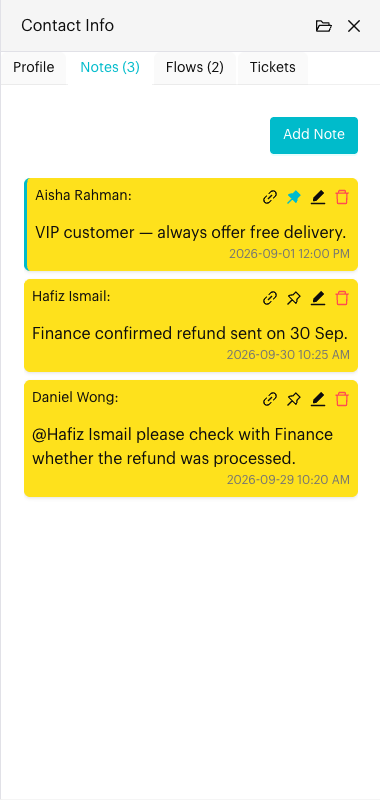

# Notes

## What is the Notes tab?

The **Notes** tab in the [Contact Info](../../core-features/index/contact-info/README.md) panel lists every internal note left on this conversation. Notes are for your team only. The contact never sees them.

The tab title shows how many notes there are, for example **Notes (3)**.

## When to use it?

* When you want to leave context for teammates, such as follow-ups or decisions.
* When you take over a conversation and want to catch up on what your team already knows.
* When you want to keep an important note at the top so nobody misses it.

## How to use (Step by Step)



#### Open the Notes tab

In `Inbox`, open the conversation, click the **Contact Info** icon in the conversation header and select the **Notes** tab.

Notes are listed newest first. Each note shows who wrote it, the note text and the date and time. Pinned notes stay at the top.

If there are no notes yet, you'll see **No notes yet**.

<figure><figcaption>
Notes tab (sample data)
</figcaption></figure>



#### Add a note

Click **Add Note** (or **Add your first note** if there are none yet). Type your note in the **Note** window.

Type **@** to mention a teammate. Click **Submit**.

<figure><figcaption>
Adding a note (sample data)
</figcaption></figure>



#### Pin, edit, delete or find a note

Use the icons at the top right of each note:

* **Go to Note**: Jump to the note in the conversation.
* **Pin Note** / **Unpin Note**: Keep the note at the top of the list.
* **Edit Note**: Change the note text.
* **Delete Note**: Remove the note. Click **Yes** to confirm.

📸 Screenshot placeholder:

> \[Screenshot: A note with the Go to Note, Pin Note, Edit Note and Delete Note icons highlighted]



## What happens after it triggers?

The note is saved to the conversation and shows in the chat as an internal note. Your teammates see it in the chat and in the **Notes** tab. Teammates you mention with **@** get a notification.

## Important behavior to know

* Notes are never sent to the contact.
* You can also add a note from the message editor, or add a note about a specific message in the chat. See [Add a Note](../internal-note.md). A note about a message shows that message above the note text.
* A deleted note stays in the list as "deleted this note", so your team knows something was removed. Deleted notes can't be pinned or edited.
* Pinning only changes the order in the **Notes** tab.

## Common issues & solutions

* **Teammate wasn't notified**: Pick their name from the list that appears after you type **@**, so the name matches exactly.
* **Note not showing**: Close and reopen the **Notes** tab, or switch to another conversation and back.

## Best practice 💡

* Keep notes short: what happened, what's next, and who's doing it.
* Pin notes that everyone must see, such as "VIP customer" or "Do not offer discount".
* Mention the teammate who needs to act, instead of hoping they read the note.

## Related Documentation

* [Add a Note](../internal-note.md)
* [Contact Info](../../core-features/index/contact-info/README.md)
