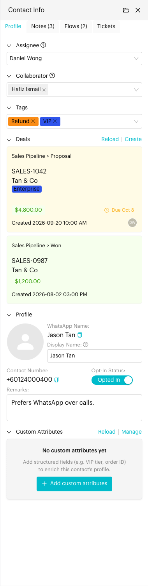
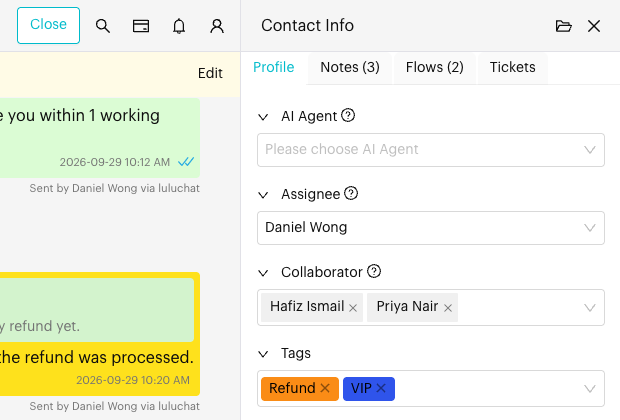
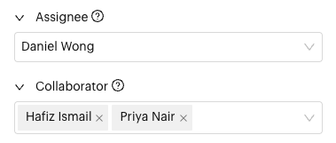
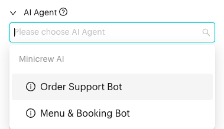
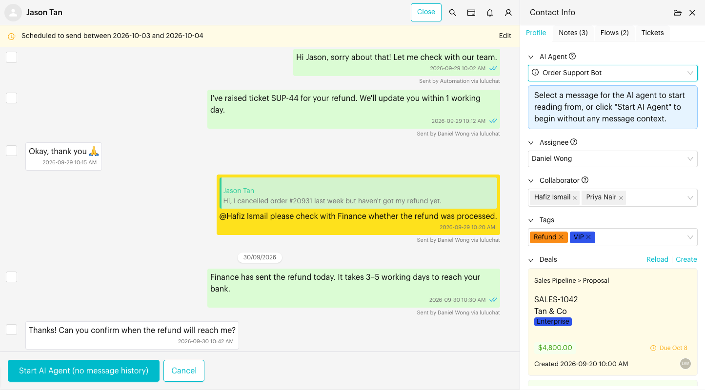
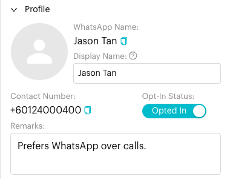
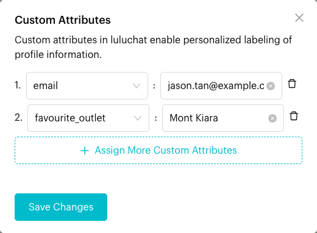
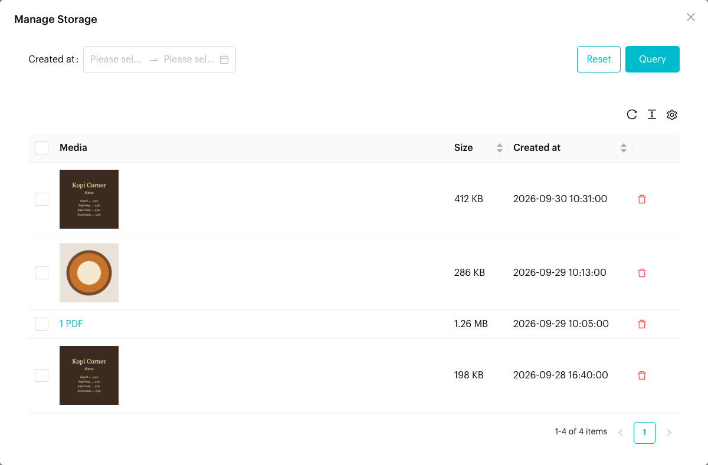

# Profile

## What is the Profile tab?

The **Profile** tab is the first tab in the [Contact Info](../../core-features/index/contact-info/README.md) panel. It lets you manage who handles the conversation, tag the contact, see their deals, and update their profile details and custom attributes while you chat.

The tab is made up of these sections. Click a section's title to collapse or expand it.

| Section | What it's for |
| --- | --- |
| **AI Agent** | Let an AI agent handle the conversation for you. Only shown if you have connected an AI app. |
| **Assignee** | The one teammate responsible for this conversation. |
| **Collaborator** | Other teammates who get notifications and have access to this conversation. |
| **Tags** | Labels for grouping and filtering contacts. |
| **Deals** | Deals linked to this contact. Only shown if you have access to Deals. See [Deals](deals.md). |
| **Profile** | Name, display name, contact number, opt-in status and remarks. |
| **Group Participants** | Members of a WhatsApp group. Only shown for group conversations. |
| **Custom Attributes** | Extra fields such as VIP tier or order ID. |

<figure><figcaption>
Profile tab
</figcaption></figure>

## When to use it?

* When you need to hand the conversation to a teammate, or bring in extra teammates.
* When you want an AI agent to reply to the contact for you.
* When you want to tag the contact, correct their name or add remarks.
* When the contact asks to stop (or start) receiving messages.
* When you want to save extra details about the contact, such as their order ID.

## How to use (Step by Step)



#### Open the Profile tab

In `Inbox`, open a conversation and click the **Contact Info** icon in the conversation header. The **Profile** tab opens first.

<figure><figcaption>
Contact Info panel on the Profile tab
</figcaption></figure>



#### Set the Assignee

Under **Assignee**, choose the teammate responsible for this conversation. The assignee is the key contact person who manages the conversation. A conversation has only **one** assignee.

To remove the assignee, click the clear (x) icon in the box.

Teammates whose accounts were deleted are shown with an **Account Deleted** tag and can't be picked.



#### Add Collaborators

Under **Collaborator**, pick one or more teammates. Collaborators receive notifications and have access to this conversation, but the assignee stays the person in charge.

Use collaborators when other teammates need to follow or help with the conversation, for example a manager or a specialist.

<figure><figcaption>
Assignee and Collaborator sections
</figcaption></figure>



#### Assign an AI Agent (optional)

The **AI Agent** section only appears if you have connected **Minicrew AI** in [Integrations](../../settings/account/integration.md). The AI agent will handle this conversation automatically.

1. Choose one of your Minicrew AI agents from the list. Hover the info icon to read an agent's description.
2. The chat switches to a selection mode. Tick a message in the chat for the AI agent to start reading from, or skip this step.
3. Click **Start AI Agent** below the chat. The button shows the time of the message you picked, or **(no message history)** if you didn't pick one. Click **Cancel** to go back.

<figure><figcaption>
AI Agent dropdown
</figcaption></figure>

<figure><figcaption>
Start AI Agent and Cancel buttons below the chat
</figcaption></figure>



#### Add Tags

Under **Tags**, choose one or more tags. The tag is saved as soon as you pick it.

To create a tag on the spot, open the list, click **New Tag**, enter a **Tag Name**, choose a **Tag Color** and click **Add Tag**. See [Tags](../../settings/data/tags.md) to manage all tags.



#### Update the profile details

The **Profile** section shows:

* **WhatsApp Name**: The name the contact uses on WhatsApp. You can't edit it, but you can copy it. (Other channels show **Name**.)
* **Username**: Shown only if the contact has one.
* **Display Name**: The name your team sees in Luluchat. It overrides the WhatsApp Name. Type a new name (up to 100 characters) and click outside the box to save.
* **Contact Number**: The contact's phone number, which you can copy. Messenger contacts show a **Page-Scoped User ID** and Instagram contacts show an **IG-Scoped User ID** instead.
* **Opt-In Status**: Switch between **Opted In** and **Opted Out**.
* **Remarks**: Free-text notes about the contact. Click outside the box to save.

Group conversations don't show the contact number or opt-in status. They show a **Group Participants** section with each member's name and number instead.

<figure><figcaption>
Profile section
</figcaption></figure>



#### Manage Custom Attributes

The **Custom Attributes** section lists the contact's attributes and their values.

1. Click **Manage** (or **Add custom attributes** if the contact has none yet).
2. In the **Custom Attributes** window, choose an attribute and enter its value. The value box changes to match the attribute type, such as text, number, date or time.
3. Click **Assign More Custom Attributes** to add another row.
4. Click **Save Changes**.

If the attribute you need doesn't exist yet, type its name in the attribute list, choose a data type and click **Add attribute**. Click **Reload** to fetch the latest values.

<figure><figcaption>
Custom Attributes window
</figcaption></figure>



#### Manage Storage

Click the **Manage Storage** icon (the folder icon) at the top of the Contact Info panel. A window lists every media file in this conversation with its **Size** and **Created at** date.

* Filter by **Created at** date range, or sort by size or date.
* Click the delete icon to delete one file, or tick several files and click **Delete**.

<figure><figcaption>
Manage Storage window
</figcaption></figure>



## What happens after it triggers?

Each change is saved straight away. There is no Save button for the Profile tab (except inside the Custom Attributes window). You'll see a message such as "Assignee updated successfully." when a change is saved.

* The new assignee, collaborators, tags and display name show for all teammates and in `Contacts`.
* When an AI agent starts, a banner at the top of the chat says **This conversation is being handled by AI**, and the chat shows an **AI Agent** tag in the chat list.
* Contacts that are **Opted Out** are marked as unsubscribed.

## Important behavior to know

* **Assignee vs Collaborator**: The **Assignee** is the one key person responsible for the conversation. **Collaborators** are extra teammates who get notifications and have access to it. A conversation can have one assignee and many collaborators.
* **Stopping the AI agent**: Click **Stop** on the "This conversation is being handled by AI" banner. If you send a message yourself while the AI is handling the chat, Luluchat asks you to confirm with **Stop AI & Send**. The AI agent then stops and you need to start it again yourself.
* **Text fields save when you click away**: Display Name and Remarks are saved when you click outside the box, not while you type.
* **Restricted editing**: If your admin has restricted your access, you'll see "Your permission to edit the contact profile has been restricted by the admin." and the fields are greyed out.
* **Deleting media is permanent**: Files deleted in **Manage Storage** can't be recovered. See [Inbox Settings](../../settings/tools/inbox.md) to check your total storage.

## Common issues & solutions

* **AI Agent section is missing**: Connect Minicrew AI in [Integrations](../../settings/account/integration.md) and make sure you have at least one agent set up there.
* **Can't pick a teammate**: Teammates marked **Account Deleted** can't be assigned. Choose an active teammate.
* **Display Name or Remarks didn't save**: Click outside the box after typing. If nothing changes, check that you have permission to edit contacts.
* **Custom attributes look out of date**: Click **Reload** in the Custom Attributes section.

## Best practice 💡

* Set the assignee as soon as a conversation starts, so everyone knows who owns it.
* Add collaborators instead of changing the assignee when you just need help or a second opinion.
* Use a clear **Display Name** (for example, "Jane Tan - ABC Sdn Bhd") so the contact is easy to find.
* Keep tags and custom attribute values consistent, so filters, broadcasts and automations work well.

## Related Documentation

* [Contact Info](../../core-features/index/contact-info/README.md)
* [Deals](deals.md)
* [Tags](../../settings/data/tags.md)
* [Custom Attributes](../../settings/data/custom-attributes.md)
* [Integrations](../../settings/account/integration.md)
