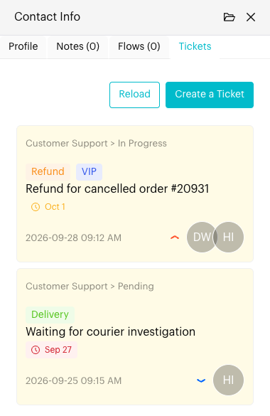

# Tickets

## What is the Tickets tab?

The **Tickets** tab in the Contact Info panel shows every ticket linked to the contact you're chatting with. You can check their open requests and create a new ticket without leaving the conversation.

## When to use it?

* When a customer reports a problem or request that needs follow-up.
* When you want to check whether the customer already has an open ticket before replying.

## How to use (Step by Step)



#### Open contact info

In `Inbox`, open the conversation and select the `Tickets` tab in the Contact Info panel.

Each ticket shows its pipeline and stage, summary, due date, created date, priority and collaborators. The due date is highlighted when it is due within a week or has passed.

<figure><figcaption>
Tickets tab
</figcaption></figure>



#### Create a ticket

Click **Create a Ticket** (or **Create first ticket** if the contact has none yet). The contact is filled in for you.

Choose the **Ticket Pipeline** and **Stage**, enter a **Summary**, and add any other details such as collaborators, category, priority or due date. Click **Create Ticket**.

See [The Ticket Form](../../tickets/board.md#the-ticket-form) for every field.



#### Open or update a ticket

Click a ticket to open it. You can change its stage, add comments and attachments, or archive it.



## What happens after it triggers?

The ticket is linked to the contact and appears on the Tickets [Board](../../tickets/board.md) and [List](../../tickets/list.md). Click **Reload** to refresh the tab if a teammate has just changed a ticket.

## Important behavior to know

* You need access to Tickets to see this tab.
* Archived tickets no longer appear here. Find them from **Archived Tickets** in the [List](../../tickets/list.md) view.
* A ticket's pipeline can only be chosen when you create it.

## Common issues & solutions

* **Can't create a ticket**: Make sure a ticket pipeline exists and that you have entered a Summary and chosen a Stage.
* **Ticket not showing**: Click **Reload**, or check whether the ticket was archived or linked to a different contact.

## Best practice 💡

* Copy the key details from the conversation into the Description so teammates don't need to read the whole chat.
* Set a priority and due date so the ticket is handled on time.
* Use [Add to Ticket Stage](../../automations/logics/actions/add-ticket-stage.md) to create tickets automatically for common requests.
