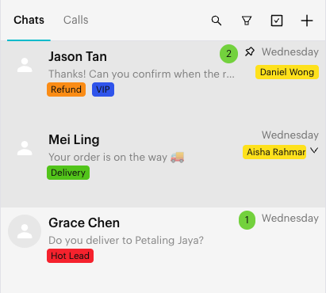
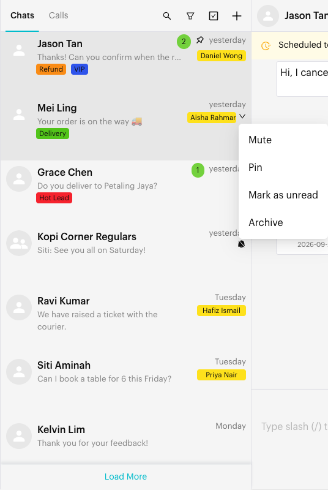
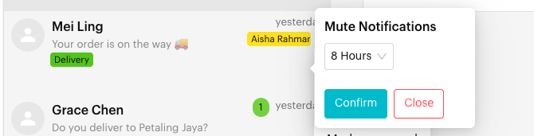

# Conversation Controls (Pin, Mute, Unread, Archive)

## What are Conversation Controls?

Conversation controls are quick actions on each chat in the chat list. They help you keep important chats in view and quiet the rest:

* **Pin** / **Unpin**: Keep a chat at the top of your chat list.
* **Mute** / **Unmute**: Stop new-message sounds for one chat.
* **Mark as unread** / **Mark as Read**: Change the chat's read status.
* **Archive** / **Unarchive**: Move a chat out of your active lists, or bring it back.

To apply these to many chats at once, use [Bulk Actions](bulk-actions.md).

## When to use it?

* **Pin** the few chats you are working on right now.
* **Mute** busy chats (for example, large groups) that you don't need to hear.
* **Mark as unread** to remind yourself to come back to a chat.
* **Archive** chats you don't need in your daily view.

## How to use it (Step by Step)



#### Find the chat in the chat list

In the Inbox, hover over the chat row. A small down arrow (⌄) appears at the bottom right of the row, next to the assignee.

<figure><figcaption>
Down arrow on a hovered chat row
</figcaption></figure>



#### Open the menu

Click the down arrow. The menu shows the options that fit the chat's current state:

* **Mute** or **Unmute**
* **Pin** or **Unpin**
* **Mark as unread** (if the chat has no unread messages) or **Mark as Read** (if it does)
* **Archive** or **Unarchive**

<figure><figcaption>
Chat row menu
</figcaption></figure>



#### Choose an action

Click the option you need. For **Mute**, a small **Mute Notifications** window opens. Choose how long to mute: **8 Hours**, **1 Week** or **Always**, then click **Confirm**.

<figure><figcaption>
Mute Notifications
</figcaption></figure>



#### Check the chat row

The chat row updates to show its new state:

* Pinned chats show a pin icon and stay at the top of the list.
* Muted chats show a bell-with-a-slash icon.
* Unread chats show a green badge with the number of unread messages, or a small blue badge if marked as unread.
* Archived chats show an **Archived** label (for example, in search results or the **Archived** list).

<figure><figcaption>
Pinned, unread and muted chats in the chat list
</figcaption></figure>



## What happens after it triggers?

* **Pin**: The chat stays at the top of your chat list until you unpin it.
* **Mute**: The Inbox does not play a sound for new messages in this chat until the mute ends or you unmute it.
* **Mark as unread / Mark as Read**: The chat's unread badge updates for everyone on the team.
* **Archive**: The chat is removed from your lists (such as **All**, **Unread** and **Need Reply**) and appears in the **Archived** list. **Unarchive** brings it back.

## Important behavior to know

* **Pin limit**: You can pin up to **3** chats per channel. To pin another, unpin one first.
* **Mute is for WhatsApp Personal channels.** Mute is not supported on WhatsApp Cloud (WABA), Messenger or Instagram channels.
* **Mute vs Sound Settings**: Mute is per chat. [Sound Settings](sound-settings.md) turn all Inbox sounds on or off for your browser.
* **Archive is not Close.** Archiving does not close the conversation or delete any messages. To close a conversation, see [Close Conversation](close-conversation.md).
* **Search still finds archived chats.** You can find them with [Search](search.md) or in the **Archived** list.
* **Changes are shared.** Pin, mute, read status and archive apply to the chat for the whole team on that channel. For WhatsApp Personal channels, these changes are also synced to the WhatsApp app.
* **Opening a chat marks it as read**, unless [Incognito Mode](incognito-mode.md) is on.

## Common issues & solutions

* **I can't see the down arrow**: Hover over the chat row. The arrow only appears on hover. If you are in **Bulk Change** mode, click the **Bulk Change** icon again to leave it.
* **"You can only pin up to 3 chats."**: Unpin another chat first.
* **Mute is missing or fails**: Mute only works on WhatsApp Personal channels.
* **Change doesn't show yet**: Changes on WhatsApp Personal channels can take a few seconds. If the chat list shows **Chat List Updated**, click **Reload**.
* **Can't find an archived chat**: Open the **Archived** list, or search for the contact.

## Best practice 💡

* Pin only the chats you are actively working on. The limit of 3 keeps the top of your list focused.
* Use **Mark as unread** as a quick "come back later" reminder. For a timed reminder, use [Remind Me](remind-me.md).
* Mute large or noisy group chats instead of muting the whole Inbox.
* Archive chats you don't need to see daily, and close chats that are finished.

## Related Documentation

* [Inbox Overview](index.md)
* [Bulk Actions](bulk-actions.md)
* [Close Conversation](close-conversation.md)
* [Sound Settings](sound-settings.md)
* [Custom Lists](custom-lists.md)
