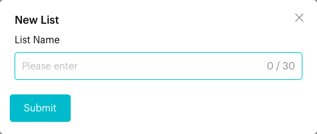
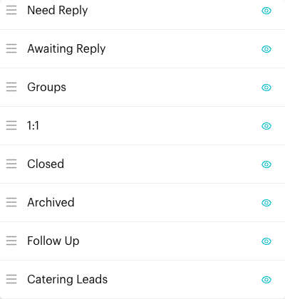
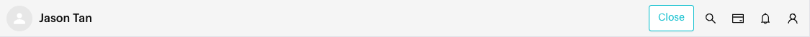
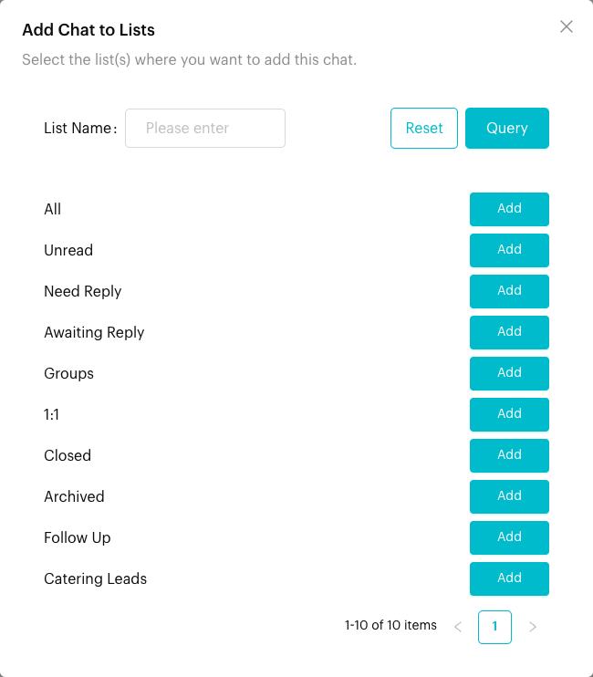
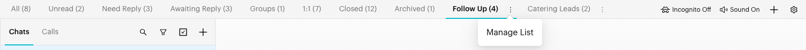
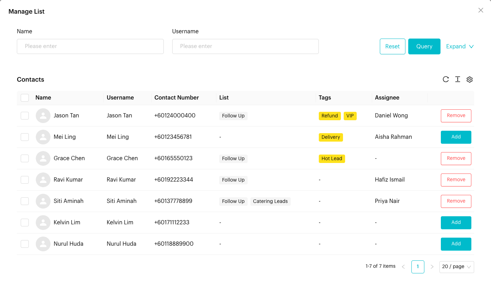
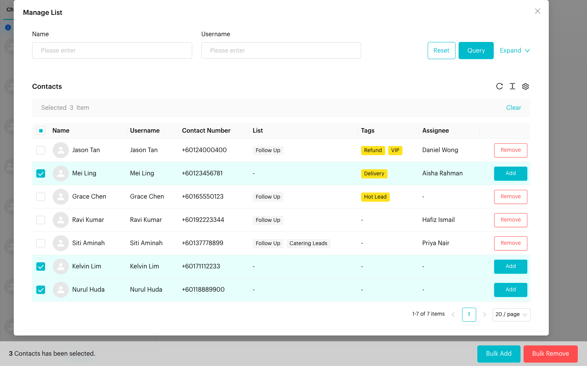

# Custom Lists

## What is Custom Lists?

Lists are the tabs across the top of the Inbox, such as **All**, **Unread** and **Need Reply**. Each list shows a group of chats, with the number of chats next to its name.

Luluchat includes a set of default lists that sort chats automatically. **Custom lists** are lists you create yourself, such as "VIP Customers", "Pending Orders" or "Follow-up Needed". You choose which chats go into them.

## Default Lists

Default lists update automatically based on each chat's status. They cannot be renamed or deleted, but you can reorder them and hide the ones you don't use.



| List Name | Shows | When to Use |
| --- | --- | --- |
| **All** | All chats that are not Closed or Archived | Your main working view. |
| **Unread** | Chats with unread messages | Find chats you haven't read yet. |
| **Need Reply** | Chats where the last message came from the contact | Make sure no customer is left waiting. |
| **Awaiting Reply** | Chats where the last message came from you or your team | Track chats where you are waiting for the customer. |



| List Name | Shows | When to Use |
| --- | --- | --- |
| **Closed** | Chats that have been closed | Review finished conversations. When a closed chat gets a new message, it reopens and returns to your active lists. See [Close Conversation](close-conversation.md). |
| **Archived** | Chats that have been archived | Find chats you archived. Archived chats are hidden from all other lists. See [Conversation Controls](conversation-controls.md). |



| List Name | Shows | When to Use |
| --- | --- | --- |
| **Groups** | Group chats | Work on group chats separately. |
| **1:1** | One-to-one chats | Focus on chats with individual contacts. |



**All**, **Unread**, **Need Reply**, **Awaiting Reply**, **Groups** and **1:1** do not include closed chats. None of the lists except **Archived** include archived chats.


**Need Reply looks wrong?** When **Need Reply** is open, a **Clean Up** link appears in the bar above the chat list. Click it to ask Luluchat to re-check the last messages and correct the list. It can take a few minutes, and you are notified when it is done.


New teams also get one example custom list called **Work**. You can rename or delete it.

## When to use it?

* **Priority**: A list for high-value or urgent customers.
* **Projects or campaigns**: Group chats for a promotion or event.
* **Stages**: Lists such as "Quotation Sent" or "Waiting for Payment".
* **Team workflows**: A list per department or teammate.

## How to create a custom list (Step by Step)



#### Click New List

In the Inbox, click the **+** icon (**New List**) at the top right of the list tabs, next to the **List Settings** gear icon.

<figure><figcaption>
New List (+) and List Settings (gear) are at the top right of the list tabs
</figcaption></figure>



#### Enter a list name

In the **New List** window, type a **List Name** (up to 30 characters).

<figure><figcaption>
New List window
</figcaption></figure>



#### Save

Click **Submit**. You see "List created successfully." The new list appears in the tabs and opens.



## How to manage lists (Step by Step)

All list management is in **List Settings**: click the gear icon at the top right of the list tabs. A panel opens with every list (default and custom) and these controls:

| Control | What it does | Available for |
| --- | --- | --- |
| Drag handle (☰) | Drag to change the order of the tabs | All lists |
| Delete (🗑) | Delete the list, after you confirm "Are you sure to delete this tab?" | Custom lists |
| Edit (✏️) | Rename the list in the **Edit List** window | Custom lists |
| Add contacts (👤+) | Open **Manage List** to add or remove contacts | Custom lists |
| Eye icon | Hide or show the list in the tabs. A crossed-out eye means the list is hidden. | All lists |

<figure><figcaption>
List Settings
</figcaption></figure>

When you reorder or hide lists, you see "List sequence updated successfully."

**Note**: Deleting a list does not delete any chats or contacts. They are just no longer grouped in that list.

## How to add chats to a list (Step by Step)

### Method 1: From the conversation



#### Open the chat

Click a chat in the chat list to open it.



#### Click List Assignment

Click the **List Assignment** icon in the conversation header (on small screens, open the **⋮** menu and choose **List Assignment**).

<figure><figcaption>
List Assignment is the card icon in the conversation header
</figcaption></figure>



#### Add or remove

The **Add Chat to Lists** window shows your custom lists. Click **Add** to put the chat in a list, or **Remove** to take it out. You can search lists by name.

<figure><figcaption>
Add Chat to Lists window
</figcaption></figure>



### Method 2: From Manage List (many contacts at once)



#### Open Manage List

Hover over a custom list tab, click its **⋮** icon and choose **Manage List**. You can also click the add contacts icon (👤+) in **List Settings**.

<figure><figcaption>
Open Manage List from the list tab's ⋮ menu
</figcaption></figure>



#### Find contacts

The **Manage List** window shows your contacts. Use search and filters to find the ones you need. Contacts already in the list show a **Remove** button; others show an **Add** button.

<figure><figcaption>
Manage List window
</figcaption></figure>



#### Add or remove one by one

Click **Add** or **Remove** on a contact row.



#### Bulk Add or Bulk Remove

Tick the checkboxes of several contacts, then click **Bulk Add** or **Bulk Remove** in the bar that appears at the bottom of the screen.

<figure><figcaption>
Selecting several contacts for Bulk Add or Bulk Remove
</figcaption></figure>



#### Close the window

Close **Manage List**. The chat list reloads to show the changes.



## What happens after you add or remove chats?

* The change applies right away. Open the custom list tab to see only the chats in it.
* The count next to the list name updates.
* Removing a chat from a list does not delete the chat or the contact.
* A chat can be in several custom lists at the same time.

## Important behavior to know

* **Only custom lists can be filled by hand.** Default lists are filled automatically and cannot be edited, renamed or deleted. They can be reordered and hidden.
* **List names** can be up to 30 characters.
* **Lists are shared with your team.** Creating, renaming, deleting, hiding and reordering lists changes them for everyone on the team.
* **Lists work with filters.** You can open a list and then apply [Filters](filters.md) to narrow it further. Saved filters can also use **List (Tab)** as a condition.
* **Search ignores lists.** [Search](search.md) looks across the whole channel.
* **Automations** can add contacts to a list. See [Assign Inbox Tab](../automations/logics/actions/assign-inbox-tab.md).
* When you open any list other than **All**, a bar above the chat list shows "*List name* List Conversations".

## Common issues & solutions

* **I can't find List Settings**: It is the gear icon at the top right of the list tabs.
* **My list is missing from the tabs**: It may be hidden. Open **List Settings** and click the crossed-out eye icon to show it.
* **I can't delete or rename a list**: Only custom lists can be deleted or renamed.
* **Add Chat to Lists shows no lists**: Only custom lists appear there. Create one first.
* **Need Reply shows the wrong chats**: Open **Need Reply** and click **Clean Up**.

## Best practice 💡

* Use clear, short names like "VIP Customers" or "Pending Orders".
* Hide default lists you never use to keep the tabs tidy.
* Put the lists you use most on the left.
* Review custom lists regularly and remove chats that no longer belong.
* Use lists for broad groups and tags for details.

## Related Documentation

* [Inbox Overview](index.md)
* [Filters](filters.md)
* [Conversation Controls](conversation-controls.md)
* [Close Conversation](close-conversation.md)
* [Assign Inbox Tab (automation action)](../automations/logics/actions/assign-inbox-tab.md)
