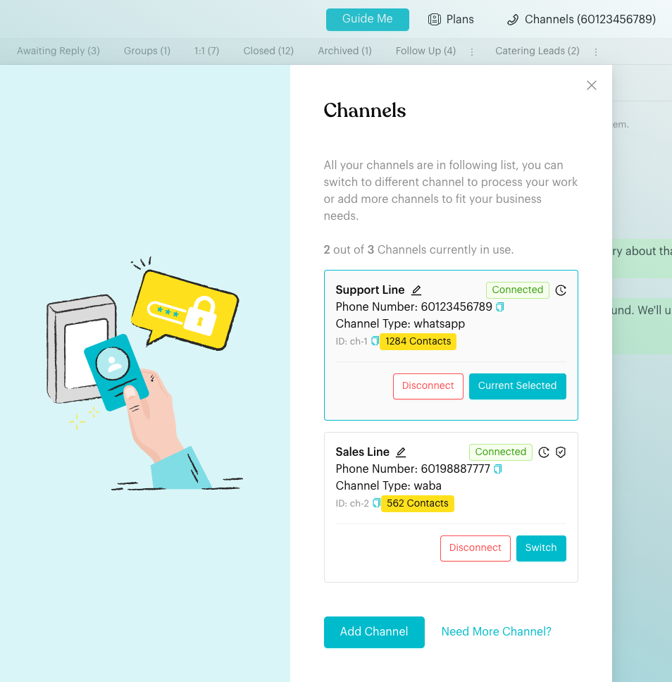
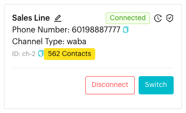
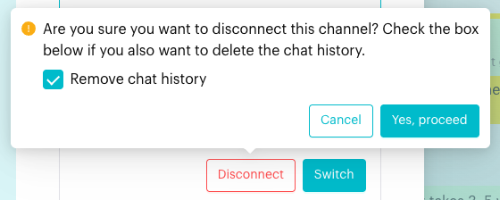

# Delete Chat History

## What is Delete Chat History?

When you disconnect a channel, you can also choose to delete its chat history. This permanently removes the conversations stored in Luluchat for that channel. It is an option inside the **Disconnect** step. There is no separate "delete history" button.

## When to use it?

* **Starting fresh**: You want to reconnect the number later without the old conversations.
* **Removing data**: You no longer want old messages stored in Luluchat (check your data retention rules first).
* **Closing a channel for good**: You are retiring a number and do not need its history.

## How to use it (Step by Step)



#### Open Channels

Click **Channels** in the top bar (it shows your current channel's number or name). The **Channels** window lists all your channels.

<figure><figcaption>
Channels button and Channels window
</figcaption></figure>



#### Click Disconnect

On the channel card, click **Disconnect**.

<figure><figcaption>
Channel card with the Disconnect button
</figcaption></figure>



#### Tick Remove chat history

A confirmation appears: *"Are you sure you want to disconnect this channel? Check the box below if you also want to delete the chat history."* Tick **Remove chat history**.

Leave the box unticked if you only want to disconnect and keep the history.

<figure><figcaption>
Disconnect confirmation with Remove chat history ticked
</figcaption></figure>



#### Confirm

Click **Yes, proceed**. You'll see *"Channel Disconnect. Page is refreshing in 3 seconds..."* and the page reloads.



## What happens after it triggers?

* The channel is disconnected from Luluchat.
* With **Remove chat history** ticked, the channel's chat history is deleted as well.
* Without the tick, the channel is disconnected and its history is kept.

## Important behavior to know

* **This cannot be undone.** Deleted chat history cannot be recovered.
* It affects everyone on the team who uses this channel.
* **Disconnect** is only shown when the channel can be disconnected. It is hidden while a channel is pending, being set up, disconnecting or already disconnected.
* **WhatsApp Coexistence** channels normally can't be disconnected from Luluchat (the button is greyed out, unless the channel shows a contact or history sync error). Disconnect from the WhatsApp Business app instead: **Settings** > **Account** > **Business Platform**, tap LuluChat, then **Disconnect**.
* You cannot delete history for a channel while keeping it connected.

## Common issues & solutions

* **Disconnect button is missing**: The channel may be pending, being set up, or already disconnected.
* **Disconnect button is greyed out**: This is a Coexistence channel. Disconnect it from the WhatsApp Business app (see above).
* **History is still there after disconnecting**: The **Remove chat history** box was not ticked.
* **I deleted history by mistake**: It cannot be restored.
* **I want to clear history but keep the channel**: This isn't available in the app. Contact Luluchat support.

## Best practice 💡

* Export or save any important conversations before you tick **Remove chat history**.
* Tell your team before you disconnect a shared channel.
* Check any legal or company rules about how long you must keep customer messages.

## Related Documentation

* [Connect your Channel](connect-channel.md)
* [WhatsApp Coexistence](connect-whatsapp-coexistence.md)
* [Inbox Overview](index.md)
