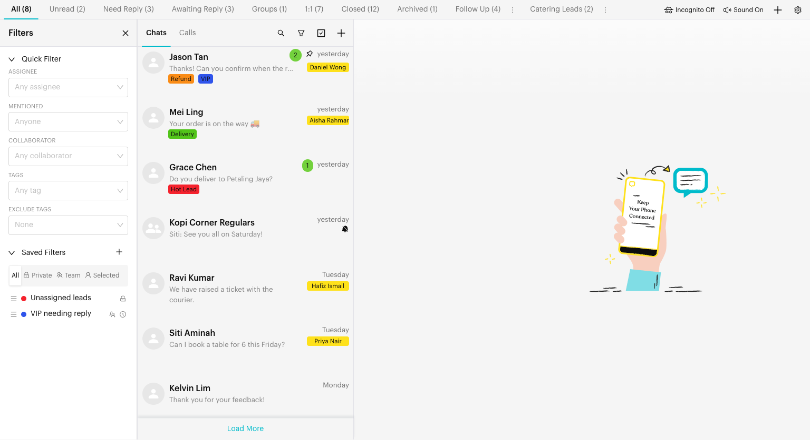
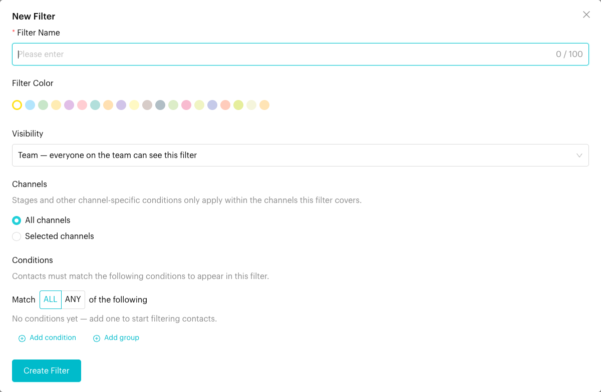

# Filters

## What are Filters?

The **Filters** panel narrows down the chat list so you only see the chats you care about. It has two parts:

* **Quick Filter**: Pick an assignee, mentioned team member, collaborator, tags or excluded tags. The chat list updates straight away.
* **Saved Filters**: Build reusable filters with detailed conditions (tags, lists, assignee, last reply time, custom attributes, deal stages and more), save them with a name and colour, and share them with your team.

Filters work together with the list (tab) you have selected, such as **All** or **Unread**.

## When to use it?

* **My chats**: Show only chats assigned to you.
* **Unassigned chats**: Find chats that nobody owns yet.
* **By tag**: Show "VIP" chats, or hide chats tagged "Spam".
* **Follow-up views**: Save a filter such as "Customer replied in the last 2 hours" or "No reply from us for more than 1 day".
* **Sales views**: Show contacts in a specific deal stage.

## How to use it (Step by Step)



#### Open the Filters panel

In the Inbox, on the **Chats** tab, click the **Filters** icon (funnel) at the top of the chat list. The **Filters** panel opens on the left.

<figure><figcaption>
Filters panel (sample data)
</figcaption></figure>



#### Use Quick Filter

Under **Quick Filter**, choose one or more values in any of these fields:

* **Assignee**: Team members the chat is assigned to. Includes **Unassigned** and yourself ("(You)").
* **Mentioned**: Team members who were mentioned in the chat.
* **Collaborator**: Team members added as collaborators.
* **Tags**: Show chats with these tags.
* **Exclude Tags**: Hide chats with these tags.

The chat list updates as soon as you change a field. Click **Clear** next to **Quick Filter** to remove all quick filters.

📸 Screenshot placeholder:

> \[Screenshot: Quick Filter section with Assignee set to "(You)" and one tag selected in Tags, and the Clear link visible]



#### Apply a saved filter

Under **Saved Filters**, click a filter to apply it. It is highlighted while active. Click it again to turn it off.

Use the **All**, **Private**, **Team** and **Selected** tabs to show filters by who can see them.

📸 Screenshot placeholder:

> \[Screenshot: Saved Filters list with one filter highlighted as active, showing its colour dot, visibility icon and the clock icon for a time-sensitive filter]



#### Create a saved filter

Click the **+** (**New Filter**) icon next to **Saved Filters**. In the **New Filter** window, fill in:

* **Filter Name** (required, up to 100 characters).
* **Filter Color**: Pick a colour to recognise it in the list.
* **Visibility**:
  * **Team** — everyone on the team can see this filter (default).
  * **Private** — only you can see this filter.
  * **Selected members** — you and the members you choose. Pick them in **Share With**.
* **Channels**: **All channels**, or **Selected channels** (then choose them in **Apply To**). Stages and other channel-specific conditions only apply within the channels the filter covers.
* **Conditions**: See the next step.

<figure><figcaption>
New Filter window (sample data)
</figcaption></figure>



#### Add conditions

Choose **Match ALL** or **Match ANY of the following**, then click **Add condition**. For each condition, select a field, an operator and a value:

| Field | Operators |
| --- | --- |
| **Tag** | contains, does not contain |
| **List (Tab)** (custom lists) | contains, does not contain |
| **Assignee** | is, is not, is assigned, is unassigned |
| **Collaborators** | includes, does not include |
| **AI Handling** | is true, is false |
| **Opt In Status** | Opted In, Opted Out |
| **Last Replied By Me**, **Last Replied By Contact**, **Last Conversed** | has past, in last (a number of minutes, hours or days), is known, is unknown |
| **Custom Attributes** (each attribute) | is, is not, greater than, lesser than, after, before, in between, is today, in upcoming, in last, has past, after time, before time, in between time, is known, is unknown |
| **Deal** (each pipeline) | in pipeline, stage is, stage is not |

For user fields, you can pick **Me (current user)** so the filter works for whoever uses it. For **Assignee**, you can also pick **Unassigned**.

To mix ALL and ANY, click **Add group**. Each group has its own **Match ALL / ANY of these** setting.

📸 Screenshot placeholder:

> \[Screenshot: Conditions builder with Match ALL selected, a "Tag contains VIP" condition, a "Last Replied By Contact in last 2 hours" condition, and a group set to Match ANY]



#### Save the filter

Click **Create Filter**. The new filter appears under **Saved Filters**.



#### Edit, remove or reorder saved filters

* Hover over a filter and click the **⋮** icon, then choose **Edit** or **Remove**. Removing asks you to confirm: "Remove this filter? This action cannot be undone."
* On the **All** tab, drag a filter by its handle (☰) to change the order.



## What happens after it triggers?

* The chat list only shows chats that match your list (tab), your quick filters and your active saved filter.
* A **Filters Applied** bar appears above the chat list, and the Filters icon shows a dot. Click **Reload** in the bar to refresh the list, or **Clear** to remove all quick filters and the saved filter.
* Filters stay active while you move between lists in the Inbox. They are cleared when you leave the Inbox.

## Important behavior to know

* **Time-sensitive filters**: A saved filter with a clock icon (tooltip: **Time-sensitive filter**) uses a time-based condition such as **in last**, **has past**, **in upcoming** or **is today**. Its results change as time passes, even if no chat changes, and are refreshed regularly. Click **Reload** in the **Filters Applied** bar to get the latest results.
* **Who can edit**: Only the person who created a saved filter, or the team owner, can edit or remove it. Other people can still use it if they can see it.
* **Channel scope**: A filter scoped to selected channels shows a channel icon (tooltip: "Scoped to N channel(s)").
* **Conditions must be complete**: You can't save a filter with no conditions, or with a condition that is missing a value.
* **Search ignores filters**: When you search, results come from the whole channel. See [Search](search.md).
* Quick Filter and a saved filter can be used at the same time.

## Common issues & solutions

* **The chat list is empty**: Your filters may be too narrow. Click **Clear** in the **Filters Applied** bar, or check which list (tab) you are on.
* **"Please add at least one condition."**: Add a condition before saving.
* **"Condition 1 is incomplete — please finish selecting a value."**: Fill in the highlighted condition's value.
* **"Please select at least one team member to share with."**: You chose **Selected members**. Pick at least one person in **Share With**.
* **"Please select at least one channel for this filter."**: You chose **Selected channels**. Pick at least one channel in **Apply To**.
* **I can't edit a saved filter**: The **⋮** menu only appears if you created the filter or you are the team owner.
* **Results of a time-based filter look out of date**: Click **Reload** in the **Filters Applied** bar.

## Best practice 💡

* Use **Quick Filter** for one-off checks, and **Saved Filters** for views you use every day.
* Use **Me (current user)** in conditions so one shared filter works for every teammate.
* Give filters clear names and colours, such as "Needs follow-up (24h)".
* Keep personal filters **Private** so the team list stays tidy.
* Combine filters with lists: for example, open **Unread** and apply a "My VIP chats" filter.

## Related Documentation

* [Custom Lists](custom-lists.md)
* [Search](search.md)
* [Bulk Actions](bulk-actions.md)
* [Inbox Overview](index.md)
