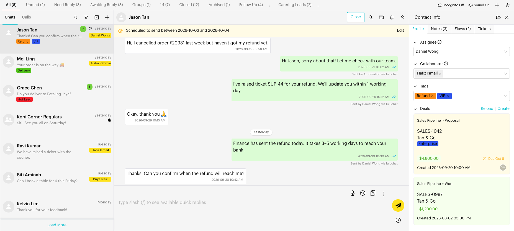
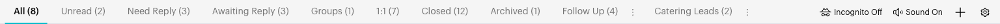

# Inbox

## What is Inbox?

The Inbox is where you and your team read and reply to customer conversations from your connected channel (WhatsApp, Messenger or Instagram). From here you can open chats, reply, assign teammates, add tags and notes, and close conversations.

The Inbox has four main areas:

1. **List tabs (top)**: Your lists, such as **All**, **Unread**, **Need Reply** and your own custom lists, with the number of chats in each. On the right are the **Incognito** and **Sound** buttons, **New List** (+) and **List Settings** (gear).
2. **Chat list (left)**: The chats in the selected list. On WhatsApp channels it has two tabs, **Chats** and **Calls**, and these icons: **Search**, **Filters**, **Bulk Change** and **New Chat**.
3. **Conversation area (middle)**: The messages of the open chat, the message editor, and header actions such as **Close**, **Search Messages**, **List Assignment**, **Remind me** and **Contact Info**.
4. **Contact info panel (right)**: The contact's profile, tags, assignee, deals, tickets, flows and notes. Open it with the **Contact Info** icon or by clicking the contact's name.

<figure><figcaption>
The Inbox layout (sample data)
</figcaption></figure>

## When to use it?

* Every day, to answer new messages from customers.
* To follow up on chats that need a reply, using lists and filters.
* To start new WhatsApp conversations.
* To organise, assign and close conversations as a team.

## How to use it (Step by Step)



#### Open Inbox

Click `Inbox` in the left menu. If your channel is not connected yet, you see the channel setup screen instead. See [Connect your Channel](connect-channel.md).



#### Pick a list

Click a list tab at the top, such as **All** or **Need Reply**. See [Custom Lists](custom-lists.md) for what each list shows and how to create your own.

<figure><figcaption>
List tabs (sample data)
</figcaption></figure>



#### Find the chat you need

Scroll the chat list, or use the icons at the top of it:

* **Search**: Find chats, contacts and messages. See [Search](search.md).
* **Filters**: Narrow the list by assignee, tags, saved filters and more. See [Filters](filters.md).
* **Bulk Change**: Select many chats and act on them at once. See [Bulk Actions](bulk-actions.md).
* **New Chat**: Start a chat with a new phone number. See [New Chat](new-chat.md).

Each chat row shows the contact name, last message, time, unread count, tags and assignee. Hover over a row and click the down arrow for quick actions such as **Pin**, **Mute**, **Mark as unread** and **Archive**. See [Conversation Controls](conversation-controls.md).

<figure><figcaption>
Chat list (sample data)
</figcaption></figure>



#### Open the chat and reply

Click a chat to open it. Type your reply in the message editor and send it. See [Send Messages](send-messages.md), [Quick Reply](quick-reply.md) and [Scheduled Messages](scheduled-messages.md).



#### Update the contact

Open the contact info panel to assign a teammate, add tags, update deals or tickets, or add a note. See [Profile](contact-info/profile.md) and [Add a Note](internal-note.md).



#### Close the conversation

When the conversation is finished, click **Close** in the conversation header. See [Close Conversation](close-conversation.md).



## What happens after it triggers?

* Your replies are sent right away through the connected channel.
* Opening an unread chat marks it as read for the team, unless [Incognito Mode](incognito-mode.md) is on.
* Assignments, tags, list changes and closing apply to the conversation for everyone on the team.
* New messages update the chat list live. If you have scrolled down, a **Chat List Updated** bar appears. Click **Reload** to see the latest chats.

## Important behavior to know

* **One channel at a time.** The Inbox shows the channel you have selected. Switch channel to see other conversations.
* **Restricted access.** If your role only allows assigned chats, you see a **Restricted Contact Access** bar and only chats assigned to you.
* **Bars above the chat list** tell you what you are looking at: the selected list (for example, "**Need Reply** List Conversations"), **Filters Applied** (with **Reload** and **Clear**), and **Restricted Contact Access**.
* **Calls tab.** On WhatsApp channels, the **Calls** tab lists your WhatsApp calls. See [Calls](calls.md).
* **Incognito** and **Sound** settings are saved per browser. See [Incognito Mode](incognito-mode.md) and [Sound Settings](sound-settings.md).
* **Load More** at the bottom of the chat list loads older chats.

## Common issues & solutions

* **Can't find a chat**: Check which list you are on and whether filters are applied (the Filters icon shows a dot). Try [Search](search.md), which looks across the whole channel, including archived chats.
* **I only see some chats**: You may have restricted access. Ask your account owner to assign you to more chats.
* **The chat list looks out of date**: Click **Reload** in the **Chat List Updated** or **Filters Applied** bar.
* **Message not sent**: Check that your channel is connected. See [Connect your Channel](connect-channel.md).

## Best practice 💡

* Start your day on **Need Reply** to answer waiting customers first.
* Save the filters you use daily, such as "Assigned to me". See [Filters](filters.md).
* Assign or tag chats as you reply, so the team knows who owns what.
* Close finished conversations to keep **All** short.

## Inbox subpages

* [Connect your Channel](connect-channel.md)
  * [WhatsApp Personal](connect-whatsapp-personal.md)
  * [WhatsApp Cloud](connect-whatsapp-cloud.md)
  * [WhatsApp Coexistence](connect-whatsapp-coexistence.md)
* [New Chat](new-chat.md)
* [Search](search.md)
* [Filters](filters.md)
* [Bulk Actions](bulk-actions.md)
* [Custom Lists](custom-lists.md)
* [Conversation Controls (Pin, Mute, Unread, Archive)](conversation-controls.md)
* [Send Messages](send-messages.md)
* [Scheduled Messages](scheduled-messages.md)
* [Quick Reply](quick-reply.md)
* [Add a Note](internal-note.md)
* [Remind Me](remind-me.md)
* [Close Conversation](close-conversation.md)
* [Calls](calls.md)
* [Incognito Mode](incognito-mode.md)
* [Sound Settings (Mute/Unmute)](sound-settings.md)
* [Delete Chat History](delete-chat-history.md)
* Contact Info
  * [Profile](contact-info/profile.md)
  * [Deals](contact-info/deals.md)
  * [Flows](contact-info/flows.md)
  * [Tickets](contact-info/tickets.md)
  * [Notes](contact-info/notes.md)
