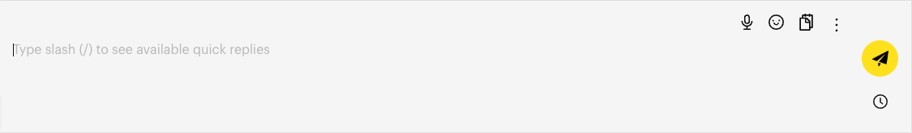
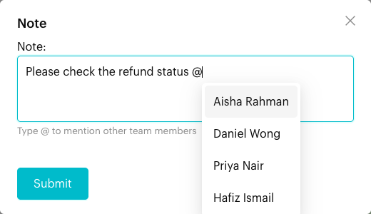

# Add a Note

## What is a Note?

A note is an internal message that only your team can see. It appears inside the conversation with a different style, but it is never sent to the customer. Use notes to share context, hand over a chat, or flag something to a teammate.

## When to use it?

* **Handover**: Tell the next person what has been done and what is still needed.
* **Context on a message**: Attach a note to a specific customer message (for example, "Refund approved for this order").
* **Ask a teammate**: Mention a team member with **@** so they know the note is for them.

## How to use it (Step by Step)



#### Open the conversation

In **Inbox**, click the chat where you want to leave a note.



#### Click the Note icon

Above the message box, click the **Note** icon. The **Note** window opens.

<figure><figcaption>
The Note (clipboard) icon in the composer toolbar (sample data)
</figcaption></figure>



#### Write the note

Type your note. To mention a teammate, type **@** and pick their name from the list (*"Type @ to mention other team members"*).

<figure><figcaption>
Writing a note with @mention (sample data)
</figcaption></figure>



#### Submit

Click **Submit**. The note appears in the conversation and in the **Notes** tab of [Contact Info](contact-info/notes.md).



### Add a note to a specific message



#### Hover over the message

Move your mouse over any message in the chat. A small action menu appears beside it.



#### Click Note

Click **Note**. The **Note** window opens with the selected message quoted at the top. Click the **x** next to the quote if you want a normal note instead.



#### Write and submit

Type your note and click **Submit**. The note shows the quoted message, so everyone knows which message it refers to.

📸 Screenshot placeholder:

> \[Screenshot: Note in the conversation thread showing a quoted customer message above the note text]



## What happens after it triggers?

* The note appears in the conversation thread, styled differently from normal messages.
* The note is listed in the **Notes** tab of Contact Info, where you can **Pin Note**, **Edit Note**, **Delete Note** or **Go to Note** (jump to it in the chat).
* The customer does not receive anything.

## Important behavior to know

* Notes are internal only. Customers never see them.
* When you hover over your own note in the chat, you can **Copy**, **Edit** or **Delete** it. Like messages, the **Edit** option in the chat only shows for about 15 minutes after posting. You can still edit it later from the **Notes** tab. On WhatsApp Cloud channels, **Edit** and **Delete** are not shown in the chat, so use the **Notes** tab instead.
* When a note is deleted, the chat shows *"... deleted this note."* so the team can see something was removed.
* Pinned notes stay at the top of the **Notes** tab.

## Common issues & solutions

* **I typed a note in the message box by mistake**: The main message box sends to the customer. Always use the **Note** icon for internal notes.
* **My teammate can't find the note**: Ask them to open the **Notes** tab in Contact Info, or use **Go to Note**. Make sure they can access this chat and channel.
* **The @mention list is empty**: Only team members of the current team appear. Check that the person has been invited to your team.

## Best practice 💡

* Keep notes short: what happened, what is needed, and who should act.
* Use **@** mentions when you need a specific person to follow up.
* Pin important notes (such as special pricing or VIP details) so they are easy to find.
* Leave a note before you reassign or close a chat.

## Related Documentation

* [Notes (Contact Info)](contact-info/notes.md) - View, pin, edit and delete notes
* [Send Messages](send-messages.md) - The message composer and message actions
* [Close Conversation](close-conversation.md)
