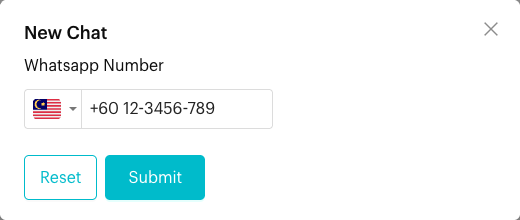
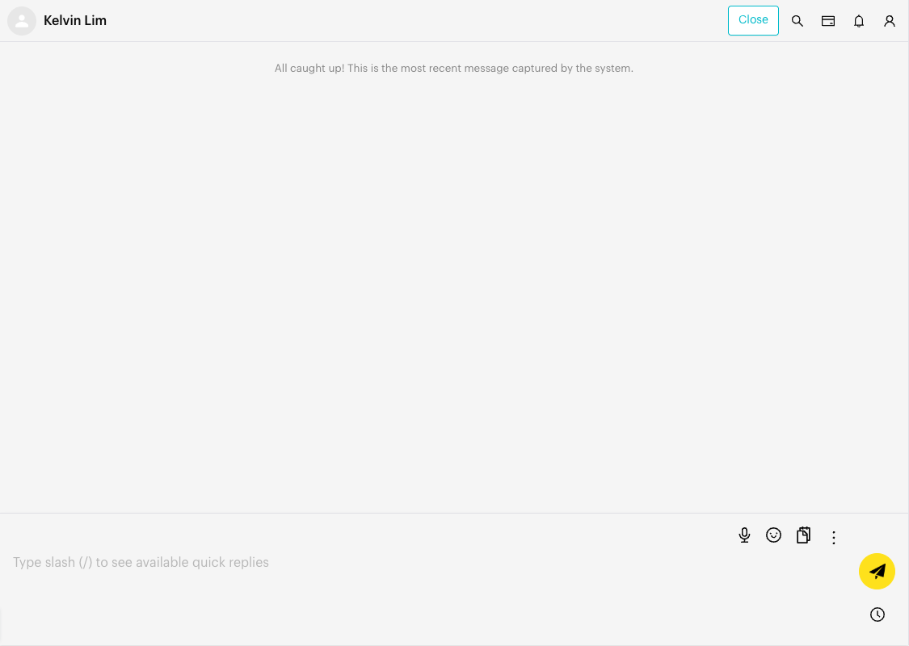

# New Chat

## What is New Chat?

**New Chat** lets you start a WhatsApp conversation with a phone number straight from the Inbox. If the number is not yet a contact, Luluchat creates the contact for you and opens an empty chat so you can send the first message.

## When to use it?

* **Reaching out first**: Message a customer who has not messaged you yet.
* **Follow-ups**: Contact someone who gave you their number by phone, email or in person.
* **Finding an existing chat by number**: If the number already exists, Luluchat opens that chat for you.

## How to use it (Step by Step)



#### Click New Chat

In the Inbox, on the **Chats** tab, click the **+** icon (**New Chat**) at the top right of the chat list.

<figure><figcaption>
The New Chat (+) icon is on the far right of the chat list header
</figcaption></figure>



#### Enter the WhatsApp number

In the **New Chat** window, pick the country from the flag dropdown and type the number in **Whatsapp Number**. The country is pre-selected based on your channel's own number. Malaysia, Singapore, Indonesia and China are listed first.

**Tip**: For Malaysian numbers, you can paste a number starting with `0` or `60` and Luluchat converts it to the `+60` format for you.

<figure><figcaption>
New Chat window
</figcaption></figure>



#### Submit

Click **Submit** (or press Enter). Luluchat checks the number and opens the chat.

* **New number**: A new contact is created and an empty chat opens.
* **Existing contact**: You see "This contact has already been added previously. Redirecting you to the conversation." and the existing chat opens.



#### Send your first message

Type your message in the message box and send it. See [Send Messages](send-messages.md).

<figure><figcaption>
Empty chat ready for the first message
</figcaption></figure>



## What happens after it triggers?

* For a new number, Luluchat creates a contact with that phone number (no name, tags or assignee yet). You can fill these in from the contact info panel. See [Profile](contact-info/profile.md).
* The chat opens in the conversation area, ready for your first message.

## Important behavior to know

* **WhatsApp channels only.** The **New Chat** icon is shown for WhatsApp Personal and WhatsApp Cloud channels. It is not available for Messenger or Instagram.
* **WhatsApp Cloud (WABA) rules apply.** On WhatsApp Cloud channels, you can only send a free-form message within 24 hours of the customer's last message. To start a new conversation, you usually need to send an approved template message. See [Send Messages](send-messages.md).
* **Restricted access.** If the contact already exists but you are not its assignee or a collaborator (and your role only lets you see assigned chats), you see "Failed to Add New Chat" with a note to ask the account owner for access.

## Common issues & solutions

* **"This contact is not on WhatsApp. Please invite them to WhatsApp."**: The number is not registered on WhatsApp. Check the number with the customer.
* **"This number format is invalid"**: Check the country code and remove extra digits.
* **"Failed to Add New Chat" (no permission)**: Ask your account owner to assign you to the contact or add you as a collaborator.
* **I can't see the New Chat icon**: Make sure your current channel is a WhatsApp channel, you are on the **Chats** tab, and search is closed.

## Best practice 💡

* Always pick the right country before typing the number.
* After starting the chat, add the contact's name and tags right away so it is easy to find later.
* On WhatsApp Cloud channels, prepare an approved template for first-contact messages.

## Related Documentation

* [Send Messages](send-messages.md)
* [Search](search.md)
* [Profile](contact-info/profile.md)
* [Inbox Overview](index.md)
