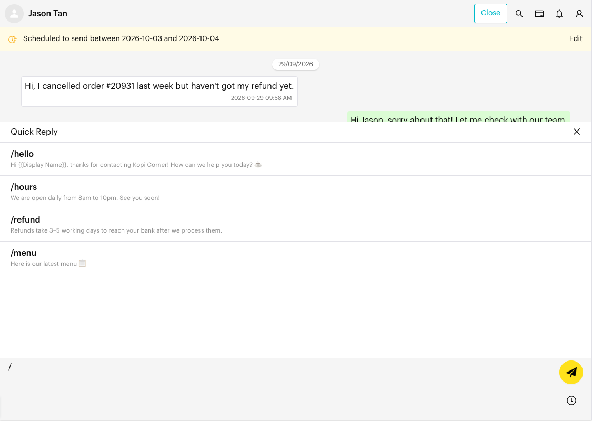
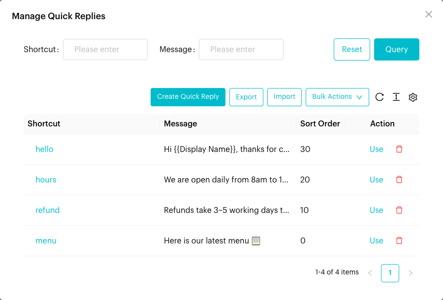
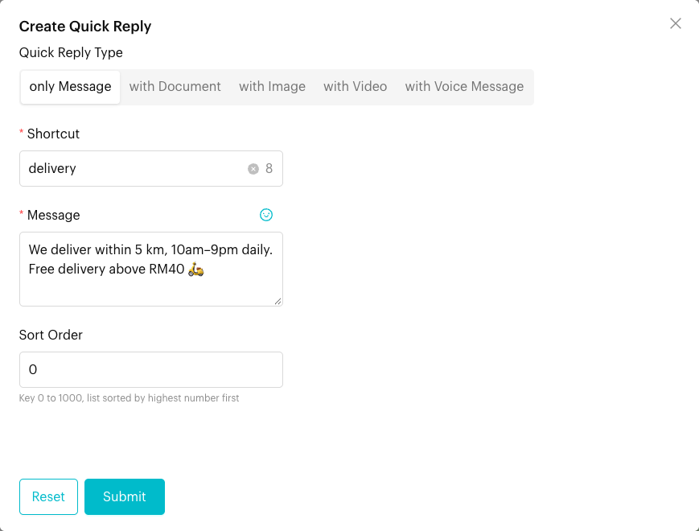
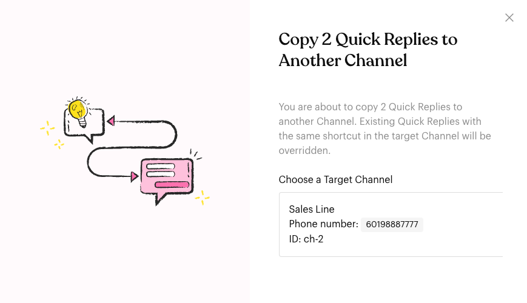

# Quick Reply

## What is Quick Reply?

Quick Replies are saved messages you can drop into a chat in seconds. Each Quick Reply has a short **Shortcut** (for example `price`) and can include text, documents, images, videos or a voice message. Type **/** in the message box to see them.

Quick Replies are saved per channel, so everyone on the team using that channel sees the same list.

## When to use it?

* **Common questions**: Prices, opening hours, delivery times, payment details.
* **Standard files**: Send your price list PDF or product photos without uploading them each time.
* **Consistent answers**: Make sure every team member replies with the same wording.

## How to use it (Step by Step)



#### Type / in the message box

Open a conversation and type **/** in the message box (the placeholder says *"Type backslash (/) to see available quick replies"*). The **Quick Reply** panel opens above the box.

<figure><figcaption>
Quick Reply panel
</figcaption></figure>



#### Filter by shortcut

Keep typing after the **/** to filter. For example, `/pri` shows Quick Replies whose shortcut contains "pri".



#### Pick a Quick Reply

Click a Quick Reply. Its text is placed in the message box, and any documents, images or videos are attached. Image and document counts are shown next to the shortcut.



#### Edit and send

Change anything you need (such as the customer's name), then press **Enter** or click the send button.




A Quick Reply **with Voice Message** is sent straight away when you pick it. There is no chance to edit it first.


To close the panel without choosing, press **Esc**, type **/** again, or click the **x** on the panel.

## How to manage Quick Replies (Step by Step)



#### Open Manage Quick Replies

In the message composer, click **More Actions** (⋮) > **Quick Replies**. The **Manage Quick Replies** window opens with columns **Shortcut**, **Message**, **Sort Order** and **Action**.

<figure><figcaption>
Manage Quick Replies
</figcaption></figure>



#### Create a Quick Reply

Click **Create Quick Reply** and fill in:

* **Quick Reply Type**: **only Message**, **with Document**, **with Image**, **with Video** or **with Voice Message**.
* **Shortcut** (required): Up to 20 characters. This is what you type after **/**.
* **Message**: Required for **only Message**. Optional caption for documents, images and videos. Use the smiley icon to add emoji.
* **Document / Image / Video**: Upload at least one file for these types.
* **Audio**: For **with Voice Message**, record using **Voice Record**, then click **Upload Voice Message**.
* **Sort Order**: A number from 0 to 1000. The list is sorted by the highest number first.

Click **Submit** to save.

<figure><figcaption>
Create Quick Reply form
</figcaption></figure>



#### Edit, use or delete

* Click a **Shortcut** to open **Edit Quick Reply**.
* Click **Use** to put it into the message box (or **Send** for voice messages).
* Click the bin icon (**Delete Quick Reply**) and confirm to delete one.



### Export and Import

* **Export** downloads all Quick Replies for this channel as an Excel (.xlsx) file.
* **Import** uploads an .xlsx file. The easiest way is to **Export** first, edit the file, then **Import** it back. The file uses the columns **Shortcut**, **Priority** (Sort Order), **Type**, **Message**, **Attachment** and **Info**.
* The import runs in the background. You'll see *"Quick replies imported successfully."* when done, and a message in your notifications (bell icon). If some rows fail, the notification includes a result file you can download (available for 24 hours).


If an imported row has the same **Shortcut** as an existing Quick Reply, the existing one is **overwritten**.


### Bulk Actions: Copy to Another Channel and Delete



#### Choose a bulk action

Click **Bulk Actions** and choose **Copy to Another Channel** or **Delete Quick Replies**. Checkboxes appear next to each row.



#### Select Quick Replies

Tick the Quick Replies you want. A bar at the bottom shows how many are selected.



#### Run the action

* **Copy to Another Channel**: Click the button, then choose a target channel under **Choose a Target Channel**. Existing Quick Replies with the same shortcut in the target channel are overwritten.
* **Delete Selected**: Click the button and confirm with **Yes**.

Click **Cancel Copy** / **Cancel Delete** (or **Cancel**) to leave bulk mode.

<figure><figcaption>
Copy Quick Replies to Another Channel window
</figcaption></figure>



## What happens after it triggers?

* Picking a Quick Reply fills the message box and attachments. Nothing is sent until you press send (except voice messages).
* Changes in **Manage Quick Replies** apply to everyone using this channel straight away.

## Important behavior to know

* Quick Replies belong to a channel. To reuse them on another channel, use **Copy to Another Channel** or **Export**/**Import**.
* **with Document** is not available on Instagram channels.
* Upload limits in the Quick Reply form: documents up to 100MB, images up to 16MB, videos (MP4) up to 32MB.
* Picking a Quick Reply replaces anything already typed in the message box and clears current attachments.

## Common issues & solutions

* **Typing / does nothing**: Click inside the message box first. If no Quick Replies exist yet, the panel shows *"Quick Reply has not been set up yet."*
* **Can't find a Quick Reply**: The filter matches the **Shortcut**, not the message text. Check you are on the right channel.
* **Import didn't change anything**: Wait for the notification, and check the result file for failed rows. Make sure the column headers match the exported file.
* **"Please upload at least one ..."**: Document, image, video and voice types need at least one file.

## Best practice 💡

* Use short, easy shortcuts like `hours`, `price`, `bank`.
* Give your most-used replies a higher **Sort Order** so they appear first.
* Keep a master list in Excel and use **Export**/**Import** to update many replies at once.
* After copying to another channel, check the target channel for overwritten shortcuts.

## Related Documentation

* [Send Messages](send-messages.md) - The message composer and More Actions menu
* [Scheduled Messages](scheduled-messages.md)
