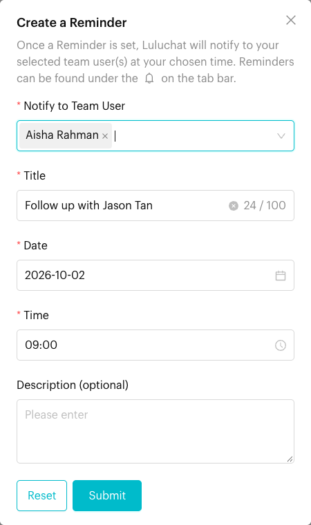
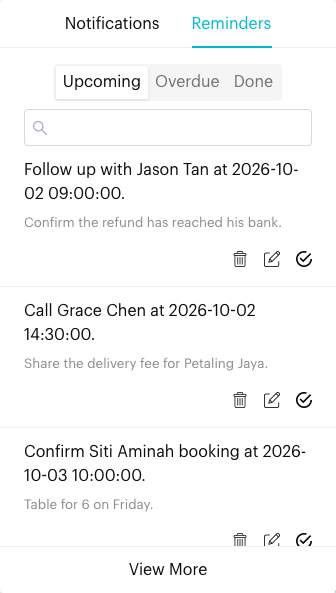

# Remind Me

## What is Remind Me?

Remind Me lets you set a reminder on a conversation. At the date and time you choose, Luluchat notifies the team members you selected. Your reminders live under the bell icon (🔔) in the top bar, in the **Reminders** tab.

## When to use it?

* **Follow-ups**: "Call back on Monday about the quotation."
* **Check-ins**: Come back to a chat that is waiting on the customer.
* **Team tasks**: Remind a teammate to act on a conversation at a set time.


**Remind me** is available on WhatsApp Personal, Facebook Messenger and Instagram channels. It is not shown on WhatsApp Cloud (WABA) channels.


## How to use it (Step by Step)

### Create a reminder



#### Open a conversation

In **Inbox**, click the chat you want a reminder for.



#### Click Remind me

In the conversation header, click the bell icon (**Remind me**). On a small screen, tap the three-dot menu (⋮) and choose **Remind me**.

<figure><figcaption>
Remind me is the bell icon in the conversation header
</figcaption></figure>



#### Fill in the reminder

The **Create a Reminder** window opens:

* **Notify to Team User** (required): One or more team members to notify. You are selected by default.
* **Title** (required, up to 100 characters): Pre-filled with *"Follow up with \[contact name]"*.
* **Date** (required): Tomorrow by default.
* **Time** (required): 09:00 by default. Times are in 15-minute steps.
* **Description (optional)**: Extra details.

<figure><figcaption>
Create a Reminder
</figcaption></figure>



#### Save

Click **Submit**. You'll see *"A Reminder has been created for "\[title]" at \[date and time]."*



### View and manage reminders



#### Open Reminders

Click the bell icon (🔔) in the top bar, then click the **Reminders** tab.

<figure><figcaption>
Reminders tab in the Notifications panel
</figcaption></figure>



#### Filter and search

Choose **Upcoming**, **Overdue** or **Done**. Use the search box to find a reminder by keyword. Click **View More** to load older reminders.



#### Take action

* Click a reminder to open its details, then click **Go to Chat** to jump to the conversation.
* **Mark as Done**: Moves it to **Done** (asks you to confirm).
* **Edit**: Change the reminder (only reminders you created).
* **Delete**: Remove it (only reminders you created).



## What happens after it triggers?

* At the chosen date and time, each selected team member gets a notification in Luluchat.
* The reminder stays in **Upcoming** until its time passes. If it isn't marked as done by then, it shows in **Overdue**.
* Once marked as done, it moves to **Done**.

## Important behavior to know

* Only the person who created a reminder can **Edit** or **Delete** it. Others can still view it and **Mark as Done**.
* Reminders in **Done** cannot be edited.
* Each reminder is linked to the conversation it was created from. Use **Go to Chat** to return to it.
* Times are set in 15-minute steps (for example 09:00, 09:15, 09:30).

## Common issues & solutions

* **No Remind me button**: You are on a WhatsApp Cloud (WABA) channel, where this option is hidden. Open a conversation first if you are only looking at the chat list.
* **Can't find my reminder**: Check the other filters (**Upcoming**, **Overdue**, **Done**) and clear the search box.
* **No Edit or Delete icons**: Someone else created the reminder.
* **Didn't get notified**: Check that you were selected in **Notify to Team User**, and that your browser allows notifications from Luluchat.

## Best practice 💡

* Write titles that say what to do ("Send revised quote"), not just the customer's name.
* Pick a time when you are actually working.
* Review **Overdue** every morning.
* Mark reminders as done so your list stays useful.

## Related Documentation

* [Inbox Overview](index.md)
* [Send Messages](send-messages.md) - Other conversation header actions
* [Close Conversation](close-conversation.md)
