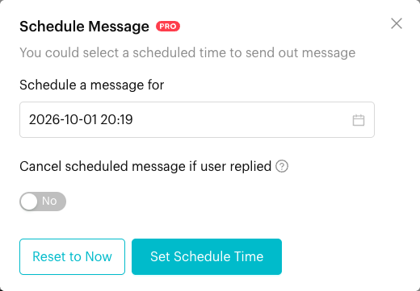
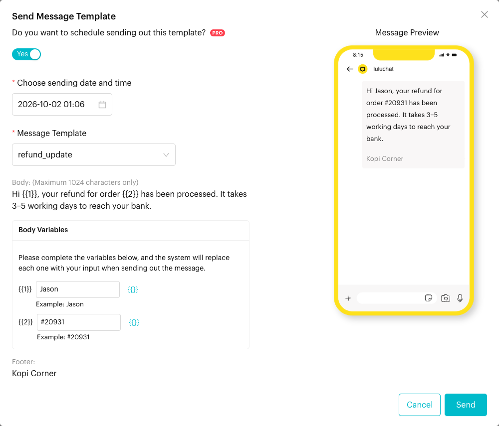
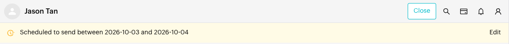
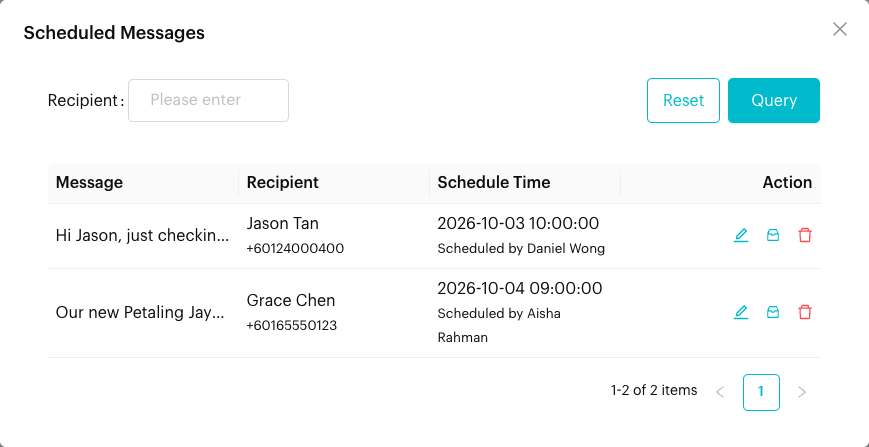

# Scheduled Messages

## What is Scheduled Messages?

Scheduled Messages let you write a message now and have Luluchat send it later, at a date and time you choose. You can schedule text, photos, videos, documents, voice messages, Message Flows and (on WhatsApp Cloud and Messenger) message templates. All upcoming scheduled messages for the channel are listed in one place, where you can edit or delete them.


Scheduling is a **Pro Plan** feature. On other plans the scheduling options are shown but disabled, with the note *"This feature is exclusively available to Pro Plan subscribers."*


## When to use it?

* **Time zones**: Reply at a good time for the customer, not just for you.
* **Planned follow-ups**: "Your appointment is tomorrow" sent the evening before.
* **Outside working hours**: Prepare messages today and send them first thing tomorrow.
* **Only if they're quiet**: Send a follow-up only if the customer hasn't replied by then.

## How to use it (Step by Step)

### Schedule a normal message (WhatsApp Personal, Messenger, Instagram)



#### Click the clock icon

In the message composer, click the clock icon next to the send button (tooltip **Schedule a message**). The **Schedule Message** window opens.

<figure><figcaption>
The clock icon below the send button schedules a message
</figcaption></figure>



#### Pick a date and time

* **Schedule a message for**: Choose the date and time. It starts 2 minutes from now, and past times can't be picked.
* **Cancel scheduled message if user replied**: Turn on (**Yes**) to cancel the message automatically if the customer replies before it is sent.

Click **Set Schedule Time**. (**Reset to Now** clears the schedule so messages send immediately again.)

<figure><figcaption>
Schedule Message window
</figcaption></figure>



#### Write and send

The clock icon now shows the chosen date and time. Type your message, and add attachments or a voice message if you like. Click send. The message is scheduled instead of being sent now.



### Schedule a message template or Message Flow



#### Open the template or flow window

In the composer, click **More Actions** (⋮) > **Message Template** (WhatsApp Cloud), **Messenger Template** (Messenger) or **Send Message Flow**. When the customer service window is closed, use the **Send Message Template** or **Send Message Flow** button shown instead of the message box.



#### Turn on scheduling

Switch on **Do you want to schedule sending out this template?** (or **...this message flow?**) and choose a time under **Choose sending date and time**.

<figure><figcaption>
Scheduling a message template
</figcaption></figure>



#### Send

Fill in the rest of the template or flow and click **Send**. It will go out at the chosen time.



### View, edit and delete scheduled messages



#### Open Scheduled Messages

Click **More Actions** (⋮) > **Scheduled Messages**. Or, in a chat with scheduled messages, click **Edit** on the banner at the top of the conversation (this opens the list filtered to that contact).

<figure><figcaption>
Scheduled message banner
</figcaption></figure>



#### Find the message

The **Scheduled Messages** list shows **Message**, **Recipient**, **Schedule Time** (with *"Scheduled by \[name]"*) and **Action**. Search by **Recipient** to narrow it down.

<figure><figcaption>
Scheduled Messages
</figcaption></figure>



#### Take action

* **Edit Scheduled Time** (pencil icon): Opens **Edit Schedule Message**. Change the **Schedule Time**, the **Cancel scheduled message if user replied** switch, and the message text or attachment. Click **Submit**.
* **Go to Conversation** (inbox icon): Opens the chat with that contact.
* **Delete Scheduled Message** (bin icon): Click **Yes** to confirm. You'll see *"Successfully deleted."*



## What happens after it triggers?

* At the scheduled time, Luluchat sends the message to the customer, just like a normal message.
* If **Cancel scheduled message if user replied** is on and the customer replies first, the message is not sent.
* While messages are waiting, the chat shows a banner such as *"Scheduled to send 1 message at 2026-10-02 09:00"*.

## Important behavior to know

* **WhatsApp Cloud (WABA)**: The clock icon is not shown, because free-form messages can only be sent inside the 24-hour customer service window. Schedule a **Message Template** or **Message Flow** instead. See [Service Window](../whatsapp-business-app-waba/service-window.md).
* For scheduled WhatsApp Cloud templates, only times between 08:00 and 22:59 can be picked.
* The clock icon is hidden while you are replying to (quoting) a message. Clear the quote to schedule.
* Scheduling applies to everything you send in that one go (text plus attachments). After sending, the composer goes back to sending immediately.
* The **Scheduled Messages** list shows unsent messages for the whole channel, not just the open chat.

## Common issues & solutions

* **The clock icon is missing**: You are on a WhatsApp Cloud channel, or you are replying to a message.
* **Scheduling options are greyed out**: Scheduling needs the Pro Plan.
* **A scheduled message didn't go out**: Check whether **Cancel scheduled message if user replied** was on and the customer replied.
* **Can't find a scheduled message**: Clear the **Recipient** search in the **Scheduled Messages** list. Make sure you are on the right channel.

## Best practice 💡

* Turn on **Cancel scheduled message if user replied** for follow-ups, so customers don't get a reminder right after they answer.
* Check the **Scheduled Messages** list at the end of each day.
* Keep scheduled messages short and timely. Avoid scheduling far into the future, when details may change.

## Related Documentation

* [Send Messages](send-messages.md)
* [Quick Reply](quick-reply.md)
* [Message Templates](../message-templates.md)
* [Service Window](../whatsapp-business-app-waba/service-window.md)
