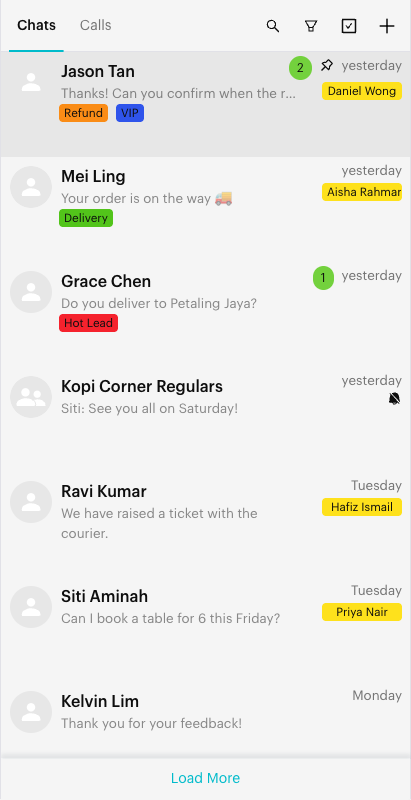
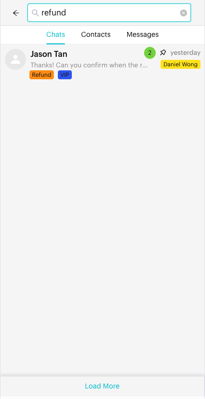
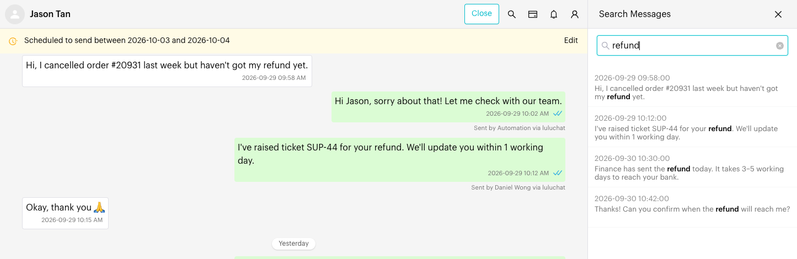

# Search

## What is Search?

Search helps you find chats, contacts and messages in the Inbox. After you type a keyword, results are shown in three tabs:

* **Chats**: Chats whose contact name, WhatsApp name, username or phone number matches.
* **Contacts**: Saved contacts that match your keyword.
* **Messages**: Messages that contain your keyword, across all chats in the current channel.

You can also search inside one open conversation with the **Search Messages** icon in the conversation header.

## When to use it?

* **Find a customer quickly**: Search by name or part of a phone number.
* **Find an old message**: Look for an order number, address or keyword someone mentioned.
* **Find archived chats**: Search also returns chats that are archived.

## How to use it (Step by Step)



#### Open the search box

In the Inbox, on the **Chats** tab, click the **Search** icon (magnifying glass) at the top of the chat list. A search box opens.

For Messenger and Instagram channels, the search box is always shown at the top of the chat list.

<figure><figcaption>
The Search icon is the magnifying glass in the chat list header
</figcaption></figure>



#### Type your keyword

Type a name, phone number or word. Results appear after you stop typing for a moment.

**Tip**: When you paste a phone number, Luluchat removes `+`, `-` and spaces so it matches the saved number.

<figure><figcaption>
Search results
</figcaption></figure>



#### Switch between Chats, Contacts and Messages

Use the tabs under the search box:

* **Chats**: Shows matching chats in the usual chat-row style. Click one to open it.
* **Contacts**: Shows matching contacts with their phone number. Click one to open the chat with that contact.
* **Messages**: Shows matching messages with the chat name, date and your keyword highlighted. Click one to open the chat and jump to that message.

Click **Load More** at the bottom of a tab to see more results.

<figure><figcaption>
Messages tab of the search results
</figcaption></figure>



#### Close search

Click the back arrow (←) at the left of the search box to clear the search and return to your chat list.



### Search inside one conversation



#### Open Search Messages

Open a chat, then click the **Search Messages** icon (magnifying glass) in the conversation header. A **Search Messages** panel opens on the right.

<figure><figcaption>
Search Messages panel
</figcaption></figure>



#### Type at least 2 characters

Matching messages from this chat are listed. Click a result to jump to that message in the conversation. Click **X** to close the panel.



## What happens after it triggers?

* While a search is active, the chat list shows search results instead of your current list.
* Clicking a result opens that chat. For message results, the conversation scrolls to the message you clicked.
* When you close search, your chat list reloads with your current list and filters.

## Important behavior to know

* **Search covers the whole channel.** Chat search is not limited to the list (tab) or filters you have selected, and it includes archived chats.
* **Current channel only.** Search looks in the channel you have selected. Switch channel to search another one.
* **Filters and Bulk Change are hidden during search.** Close search to use them again.
* **In-conversation search** needs at least 2 characters and only searches the open chat.

## Common issues & solutions

* **No results for a phone number**: Try the number without the country code, or only the last few digits.
* **"No messages found."**: Check the spelling, or try a shorter keyword.
* **I can't find the Search icon**: Switch from the **Calls** tab to the **Chats** tab.
* **My list looks empty after searching**: Click the back arrow to close search and return to your list.

## Best practice 💡

* Use a short, unique keyword, such as an order number or the last 4 digits of a phone number.
* Use **Messages** search to find what was said, and **Chats** search to find who said it.
* Use the in-conversation **Search Messages** panel for long chats with one customer.

## Related Documentation

* [Filters](filters.md)
* [Custom Lists](custom-lists.md)
* [Inbox Overview](index.md)
