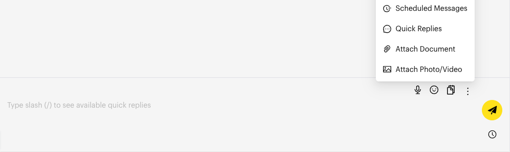
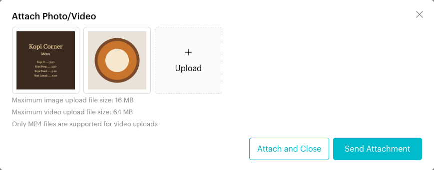
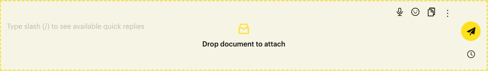
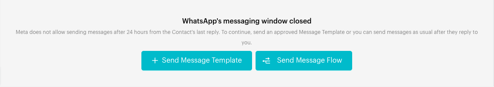
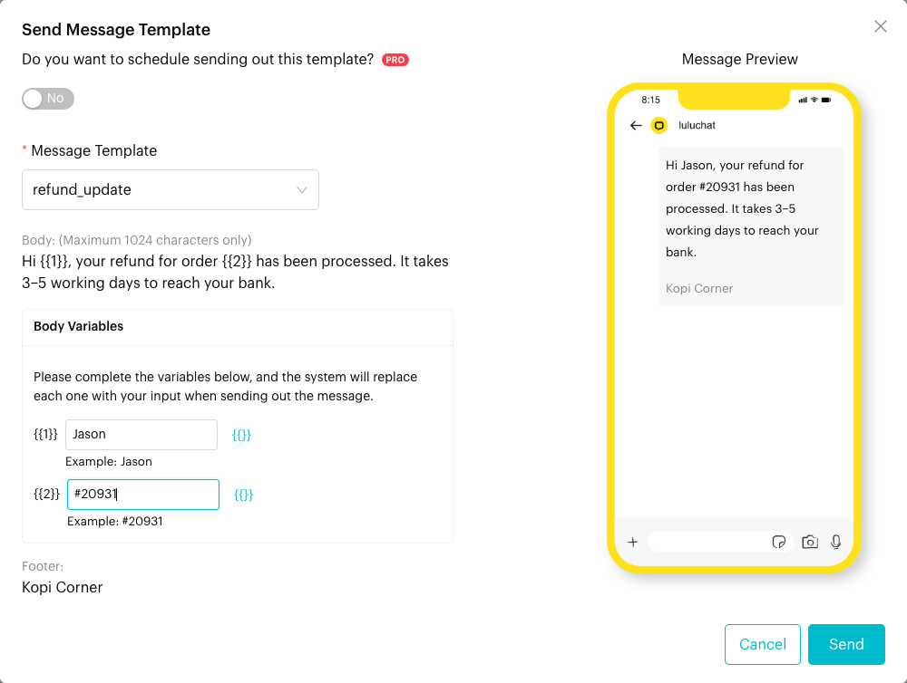
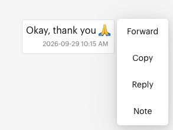

# Send Messages

## What is Send Messages?

When you open a conversation in **Inbox**, you see three parts:

* **Conversation header** (top): the contact's name and quick actions such as **Close**, **Search Messages** and **Contact Info**.
* **Messages** (middle): the chat history. Hover over a message to reply, copy, forward and more.
* **Message composer** (bottom): where you type and send text, emoji, files, voice messages, templates and Message Flows.

This page explains how to send messages and use these tools.

## When to use it?

* **Reply to customers** with text, photos, videos, documents or voice messages.
* **Restart a WhatsApp Cloud chat** with an approved message template after the 24-hour window has closed.
* **Work with existing messages**: reply to a specific message, forward it, translate it, or add a team note.
* **Manage the conversation** from the header: close it, add it to lists, search it, or open the contact's details.

## How to use it (Step by Step)

### Send a text message



#### Open the conversation

In **Inbox**, click a chat in the chat list.



#### Type your message

Click the message box and type. Press **Shift + Enter** for a new line.

* Click the smiley icon (**Emoticons**) to add emoji.
* Type **/** to insert a [Quick Reply](quick-reply.md).
* In group chats, type **@** to mention a group member.

<figure><figcaption>
Message composer
</figcaption></figure>



#### Send

Press **Enter** or click the paper-plane send button. To send later instead, click the clock icon first (see [Scheduled Messages](scheduled-messages.md)).



### Send photos, videos and documents



#### Open More Actions

Click **More Actions** (⋮) and choose **Attach Photo/Video** or **Attach Document**.

<figure><figcaption>
More Actions menu
</figcaption></figure>



#### Upload your files

Add one or more files. Photos and MP4 videos can be up to 16MB each. Documents can be up to 100MB on WhatsApp Cloud and 2GB on other channels.



#### Send or attach

* **Send Attachment** sends the files now.
* **Attach and Close** keeps the files ready in the composer (a tag shows "1 attachment", "2 attachments", ...). Type a caption, then click send. Click the **x** on the tag to remove all attachments.

<figure><figcaption>
Attach Photo/Video
</figcaption></figure>



**Other ways to attach:**

* **Drag and drop**: Drag files onto the composer. When you see **Drop document to attach**, let go. Dropped files are always sent as documents.
* **Paste**: Paste an image from your clipboard into the composer to attach it.

<figure><figcaption>
Dragging a file onto the message box
</figcaption></figure>

### Send a voice message



#### Start recording

Click the microphone icon (**Record Voice Message**) and allow microphone access if asked.



#### Send or discard

When you finish, click **Send out Voice Message** to send it, or **Delete Voice Message** to throw it away.



### Send a message template (WhatsApp Cloud and Messenger)

Meta only lets you send free-form messages for a limited time after the customer's last message: **24 hours** on WhatsApp Cloud, **7 days** on Messenger and Instagram. After that, the message box is replaced with a notice such as *"WhatsApp's messaging window closed"*.



#### Open the template window

* **Window closed**: Click **Send Message Template**, or **Send Message Flow** to send a flow that starts with a template.
* **Window open**: Click **More Actions** (⋮) > **Message Template** (WhatsApp Cloud) or **Messenger Template** (Messenger).

<figure><figcaption>
Messaging window closed (WhatsApp Cloud)
</figcaption></figure>



#### Choose a template and fill it in

Pick a template under **Message Template**. Templates that aren't approved yet show their status in brackets, for example *\[PENDING]*. Fill in any **Header Variables**, **Body Variables** and **Button Variables**, and upload header media if needed. A preview shows on the right.

<figure><figcaption>
Send Message Template
</figcaption></figure>



#### Send

Click **Send**. To send it later, turn on **Do you want to schedule sending out this template?** first.



Instagram has no templates. You can message the customer again after they reply.

### Act on an existing message

Hover over any message to see its actions:

| Action | What it does |
| --- | --- |
| **Reply** | Quotes the message in the composer, so your reply is linked to it. |
| **Copy** | Copies the message text. |
| **Forward** | Starts forward mode. Tick the messages you want, click **Forward (n)**, then pick up to 5 contacts in **Forward message to**. Not available on WhatsApp Cloud. |
| **Edit** | Edit your own text message within 15 minutes of sending. Not available on WhatsApp Cloud. |
| **Note** | Adds an [internal note](internal-note.md) linked to this message. |
| **Translate** | Shows a translation under the message, in **English**, **Chinese**, **Malay** or **Indonesian**. |
| **Delete** | Deletes your own message after you confirm. Not available on WhatsApp Cloud. |

<figure><figcaption>
Message actions
</figcaption></figure>

Under each message you send, you can see who sent it (*"Sent by \[name] via luluchat"* or *"Sent via WhatsApp device"*) and its status ticks. A message that failed shows a red error.

### Use the conversation header

<figure><figcaption>
Conversation header (WhatsApp Personal channel)
</figcaption></figure>

| Control | What it does |
| --- | --- |
| **Contact name** | Click to open Contact Info. Group chats also show the number of members. |
| Clock countdown (**Remaining Customer Service Window**) | WhatsApp Cloud only. Time left in the 24-hour window. See [Service Window](../whatsapp-business-app-waba/service-window.md). |
| **FEP** countdown (**Remaining Free Entry Point Window**) | WhatsApp Cloud only. Shown when the customer came from a free entry point (such as a Click-to-WhatsApp ad). Time left in that free window. |
| Deal stage | Shows the contact's newest deal and its stage. Click to change the stage, use the arrow to move to the next stage, or the pencil to **Edit deal**. Shows **Create a Deal** if there's no deal yet. **+N more** (**View all deals for this contact**) opens Contact Info. See [Deals](contact-info/deals.md). |
| **Close** | Closes the conversation. See [Close Conversation](close-conversation.md). |
| Phone icon | WhatsApp Cloud with calling enabled. **Request call permission** or **Start call**. See [Calls](calls.md). |
| **Search Messages** | Search this chat. Type at least 2 characters, then click a result to jump to it. |
| **List Assignment** | Opens **Add Chat to Lists** to add or remove this chat from lists. See [Custom Lists](custom-lists.md). |
| **Remind me** | Set a reminder for this chat (not on WhatsApp Cloud). See [Remind Me](remind-me.md). |
| **Contact Info** | Opens the contact panel. |

On a small screen, **Remind me**, **List Assignment**, **Close Conversation** and **Contact Info** are in the three-dot menu (⋮) in the header.

## What happens after it triggers?

* Your message appears in the chat with a clock icon while it is being sent, then grey ticks, then blue ticks when read (where the channel supports it).
* If you are replying to a message, your message is shown with the quoted message above it.
* After sending, the composer is cleared, ready for the next message.

## Important behavior to know

* **AI agent chats**: If a chat shows *"This conversation is being handled by AI."*, sending a message asks **Stop AI agent and send message?** Click **Stop AI & Send** to stop the AI agent and send your message, or **Cancel**. You'll need to restart the AI agent yourself afterwards. You can also click **Stop** on the banner.
* **Captions**: With one attachment, the text you typed is sent as its caption. With several photos or videos, your text is sent as a separate message after them. With several documents, the text goes with the first one.
* **Drafts**: If you switch to another chat before sending, your typed text is kept and comes back when you return (in the same browser tab).
* **AI Assistant**: The AI Assistant icon appears only when the [ChatGPT integration](../settings/account/chatgpt-integration.md) is connected. Use it to improve, shorten, lengthen, change the tone of, or translate your draft.
* **Instagram**: **Attach Document** and drag-and-drop are not available.
* **Pasted images**: Some image formats can't be viewed by customers. If you paste one, you'll be asked to convert it to JPEG or PNG first.

## Common issues & solutions

* **The message box is gone**: The messaging window has closed (WhatsApp Cloud, Messenger, Instagram). Send a template or Message Flow, or wait for the customer to reply.
* **Send button is greyed out**: Type a message or add an attachment first. Wait for uploads to finish.
* **"File must smaller than ...MB!"**: The file is over the size limit. Compress it, or send a link.
* **No Edit, Delete or Forward option**: These are not available on WhatsApp Cloud. **Edit** is only shown for your own text messages for 15 minutes.
* **Message failed**: Read the red error under the message. On WhatsApp Cloud, use the **Click here** link to look up the error code.

## Best practice 💡

* Keep an eye on the **Remaining Customer Service Window** countdown and reply before it runs out.
* Use **Reply** in busy chats so the customer knows which question you are answering.
* Save answers you send often as [Quick Replies](quick-reply.md).
* Use **Note** instead of a message for anything the customer shouldn't see.

## Related Documentation

* [Quick Reply](quick-reply.md)
* [Scheduled Messages](scheduled-messages.md)
* [Add a Note](internal-note.md)
* [Calls](calls.md)
* [Close Conversation](close-conversation.md)
* [Message Templates](../message-templates.md)
* [Service Window](../whatsapp-business-app-waba/service-window.md)
* [Deals](contact-info/deals.md)
