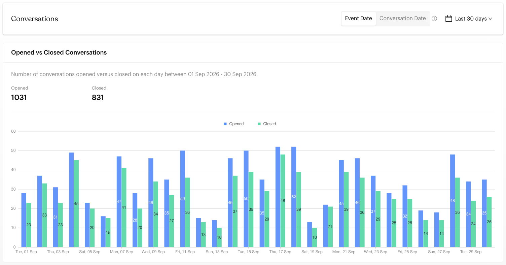
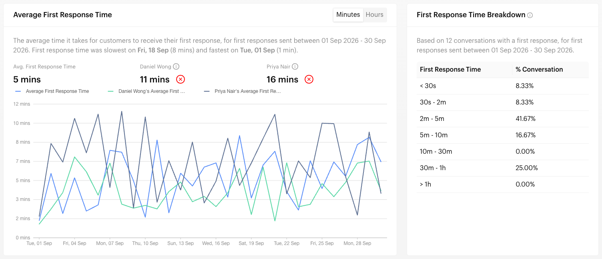
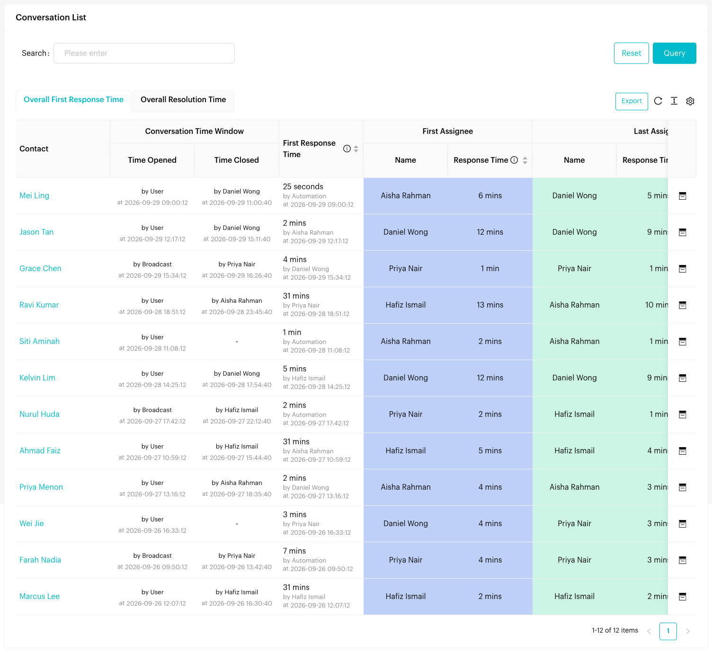

# Conversations

## What is the Conversations Report?

The Conversations Report shows how quickly your business responds to and resolves customer conversations. It tracks conversation volume, first response time, assignee response time and resolution time, and lists every conversation with its full timeline. Use it to understand how long customers wait and how efficiently conversations are closed.


The screenshots on this page use sample data.


## When to use it?

* **Performance Review**: Analyse response times and find areas for improvement.
* **Workload Analysis**: See who handles which conversations.
* **Customer Experience**: Track how long customers wait for a response and a resolution.
* **Trend Analysis**: Follow conversation volume and response times over time.

## How to use it (Step by Step)



#### Open the Conversations Report

Go to `Reports` > `Conversations` from the left menu.



#### Choose Event Date or Conversation Date

Use the toggle at the top right to choose which date the report uses:

* **Event Date** (default): The day each metric was recorded, e.g. the day the first response was sent, or the day the conversation was closed.
* **Conversation Date**: The day the conversation started (opened).

See [Event Date vs Conversation Date](#event-date-vs-conversation-date) below for an example. Your choice is remembered and also applies to the [Team Users Report](team-users.md).



#### Choose a date range

Click the date menu at the top right. Choose **Last 30 days** (the default), **Last 14 days**, **Last 7 days**, **Today**, **This Week**, **This Month**, **This Year**, or **Custom Date**.



#### Review Opened vs Closed Conversations

<figure><figcaption>
Opened vs Closed Conversations
</figcaption></figure>

This chart shows the total **Opened** and **Closed** conversations in the period, and a column chart of both for each day.



#### Review response and resolution times

Three charts follow, each with a breakdown table beside it:

| Chart | What it measures | Breakdown |
| --- | --- | --- |
| **Average First Response Time** | Time from when a conversation opens to your first reply | **First Response Time Breakdown**: % of conversations answered within each time bucket, from *< 30s* to *> 1h* |
| **Average First Assignment to First Response Time** | Time from when a conversation is first assigned to the assignee's first reply | The same buckets, for assignee responses |
| **Average Resolution Time** | Time from when a conversation opens to when it's closed | % of conversations closed within each time bucket, from *< 1h* to *> 7d* |

Each chart shows the average for the period, a daily line, and a note on the slowest and fastest days. Use **Minutes** / **Hours** at the top right of a chart to change the scale.

<figure><figcaption>
Average First Response Time comparing two team members
</figcaption></figure>



#### Compare team members (Optional)

Under **Select an assignee to compare** on any of the three charts, pick a team member. Their average appears next to the overall average, and their line is added to the chart. You can compare up to two team members. Click the red **x** next to a name to remove them.



#### Review the Conversation List

<figure><figcaption>
Conversation List
</figcaption></figure>

Scroll down to **Conversation List**. Use the tabs to choose which conversations to show:

* **Overall First Response Time**: Conversations that got a first response.
* **Overall Resolution Time**: Conversations that were closed.
* **[Team member]'s First Response Time** / **[Team member]'s Resolution Time**: Extra tabs that appear for each team member you're comparing.

Use **Search** to find a contact, and click a column heading with arrows to sort.



#### Export (Optional)

Click **Export** above the list to download the conversations in the current tab as an Excel file.



## Event Date vs Conversation Date

The two options show the same conversations from two different perspectives. The difference is **which date decides whether a conversation belongs to your date range**, and which day it's plotted on in the charts.

| | **Event Date** | **Conversation Date** |
| --- | --- | --- |
| **Date used** | The day the metric was recorded: first response sent, first assignee's response sent, or conversation closed | The day the conversation was opened |
| **Question it answers** | "How did my team perform **during** this period?" | "How were the conversations that **started** in this period handled?" |
| **Plotted on** | The day the response was sent or the conversation was closed | The day the conversation opened |
| **Past periods** | Numbers stay the same once the period is over | Numbers can still change, because conversations opened in the period may be answered or closed later |

### Example

A customer messages you on **30 September at 11:00 PM**. Your team replies on **1 October at 9:00 AM** (first response time: 10 hours) and closes the conversation on **2 October**.

| Date range | **Event Date** | **Conversation Date** |
| --- | --- | --- |
| **September** | Not counted in response or resolution time, because the reply and close happened in October | Counted: first response time 10 hours, and its resolution time |
| **October** | Counted: first response time on 1 Oct, resolution time on 2 Oct | Not counted, because the conversation started in September |

### Which one should I use?

* **Use Event Date** for day-to-day team performance, weekly reviews and staff targets. It shows the work your team actually did in the period, and past periods don't change.
* **Use Conversation Date** to review the customer experience of conversations that started in a period, e.g. "How fast did we respond to everyone who messaged us during the September campaign?" Check again later: recent numbers fill in as open conversations are answered and closed.


The toggle applies to the three time charts, their breakdowns, the Conversation List and the export. The **Opened vs Closed Conversations** chart always counts each conversation on the day it was opened or closed.


## Conversation List columns

| Column | Description |
| --- | --- |
| **Contact** | The customer. Click to open their contact profile. |
| **Conversation Time Window** | **Time Opened** and **Time Closed**, with who opened and closed it |
| **First Response Time** | How long the first reply took, who sent it, and when |
| **First Assignee** | The first team member assigned (**Name**) and how long they took to respond (**Response Time**) |
| **Last Assignee** | The last team member assigned (**Name**), their **Response Time**, and their **Resolution Time** |
| **Total Resolution Time** | **Overall Duration** (open to close) and **Assignee-Involved Duration** (first assignment to close) |
| **Last Assigned List** | The inbox list (tab) the conversation was last assigned to |
| **Tagging Activity** | Tags added or removed during the conversation. Hover to see the timeline. |
| **Custom Attributes** | The contact's custom attribute values |
| **Inbox** icon | Open the conversation in the Inbox |

## Understanding Conversation Metrics

### Conversation Lifecycle Events

Every conversation goes through key lifecycle events that are tracked in the report:

* **Conversation Opened**:
  * **When**: The time of the first message, from either the customer or your team, that starts a new conversation.
  * **Who**: The person or system that sent the first message.
  * **Note**: A new conversation is only opened when there is no ongoing conversation. If a customer sends a message while a conversation is still open, it continues that conversation.
* **Conversation Closed**:
  * **When**: The time someone closes the conversation with the **Close Conversation** button.
  * **Who**: The team member who closed the conversation.
  * **Note**: Conversations must be closed manually to be tracked. Open conversations are not included in resolution time.
* **First Response**:
  * **When**: The first message sent from your side (team member, automation or system) after the conversation opens.
  * **Who**: Whoever sent it: a team member, automation, workflow or other system.
* **First Assignee**:
  * **When**: When the first team member is assigned, and when they first responded after being assigned.
  * **Who**: The first human team member assigned to the conversation.
  * **Note**: Only human team members count as assignees. Automations and workflows do not.
* **Last Assignee**:
  * **When**: When the most recent team member is assigned (if the conversation was handed off), and when they first responded after being assigned.
  * **Who**: The most recent human team member assigned.
  * **Note**: If a conversation is reassigned several times, only the most recent assignee is shown.

### Time Calculations

**Standard time (24 hours)**:

* **First Response Time**: From when the conversation opened to the first response.
* **Overall Duration**: From when the conversation opened to when it was closed.
* **Assignee-Involved Duration**: From when the first assignee was assigned to when the conversation was closed.
* **First Assignee Response Time**: From when the first assignee was assigned to their first response.
* **Last Assignee Response Time**: From when the last assignee was assigned to their first response.

**Working hours time**:

* Used instead of standard time when working hours are set up.
* **For team members**: Uses the team member's own working hours, or the team's working hours if they have none.
* **For automated senders**: Always uses 24-hour time.
* **Whose working hours apply**: The person who did the action. For example, if Assignee A sent the first response, Assignee A's working hours are used; if Assignee B closed the conversation, Assignee B's working hours are used for the close.

### Who Can Respond to Conversations?

The report shows who opened, responded to or closed each conversation:

* **User**: The customer or contact messaging you.
* **WA Owner**: Anyone using the WhatsApp number outside Luluchat, e.g. the WhatsApp mobile app or a linked device.
* **Team member name**: Your team members.
* **Automation**: Message flows.
* **Workflow**: Workflows.
* **Webhook**: Messages sent through your webhook API calls.
* **Broadcast**: Broadcasts.

**Important**: Only human team members count as assignees. Automated senders can send the first response but never count as assignees.

### Conversation Timeline Example

1. **Customer sends the first message** → the conversation is **Opened**.
2. **Your team or an automation replies** → **First Response Time** is calculated.
3. **Team member A is assigned** → A becomes the **First Assignee**.
4. **A replies** → **First Assignee Response Time** is calculated.
5. **The conversation is reassigned to team member B** → B becomes the **Last Assignee**.
6. **B replies** → **Last Assignee Response Time** is calculated from B's assignment.
7. **B closes the conversation** → the conversation is **Closed** and resolution times are calculated.

## Important behavior to know

* **Close conversations**: Resolution time only counts conversations closed with **Close Conversation** in the Inbox.
* **Event Date vs Conversation Date**: The same period can show different numbers depending on the toggle. Event Date counts what happened in the period; Conversation Date follows the conversations that started in the period. See [Event Date vs Conversation Date](#event-date-vs-conversation-date).
* **Working hours first**: Times use working hours when set up, and 24-hour time otherwise.
* **Reassignment**: When a conversation is reassigned, the last assignee's response time starts from the new assignment.
* **Tab-specific lists**: The Conversation List and its export depend on the selected tab.

## Common issues & solutions

* **No data showing**: Check the date range and the **Event Date** / **Conversation Date** toggle, and make sure you're on the right tab.
* **Resolution time is empty**: Conversations weren't closed. Ask your team to use **Close Conversation** in the Inbox.
* **Can't compare team members**: Pick a team member under **Select an assignee to compare**. They need activity in the selected period.
* **Export file is empty**: The export matches the current tab and date range. Check both.

## Best practice 💡

* **Review regularly**: Check this report weekly or monthly.
* **Use the breakdowns**: Aim to get most conversations into the fastest response buckets.
* **Compare team members** to find top performers and people who need support.
* **Close conversations** so resolution times are accurate.

## Related Documentation

* [Close Conversation](../inbox/close-conversation.md) - Learn how to properly close conversations for accurate tracking
* [Team Users Report](team-users.md) - Compare team member performance
