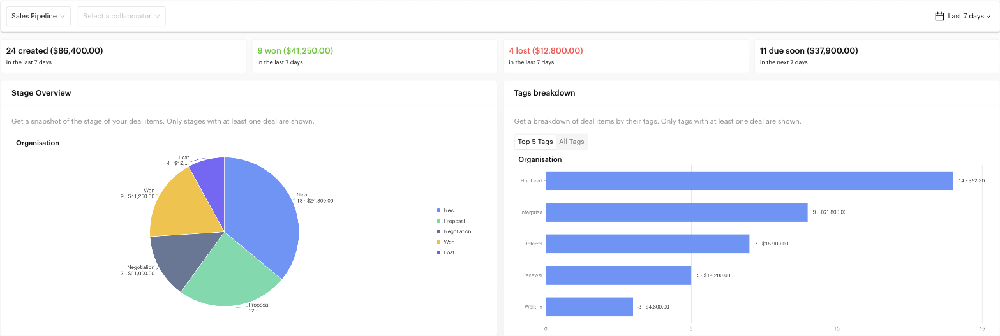
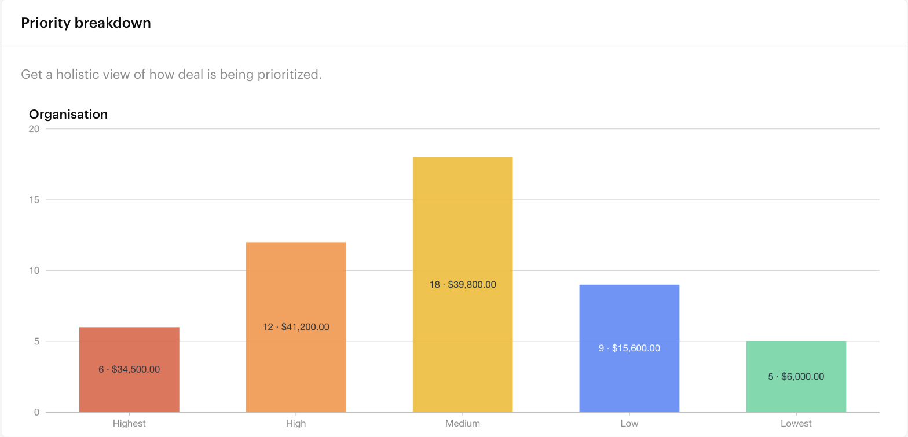
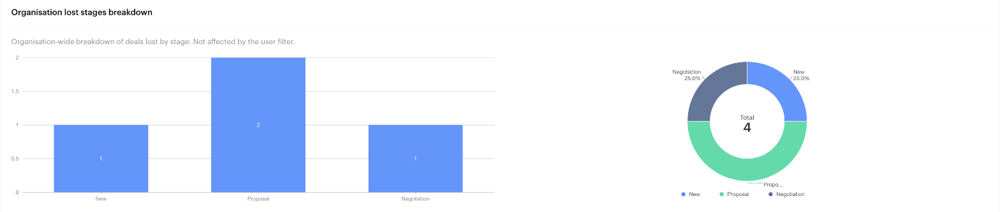
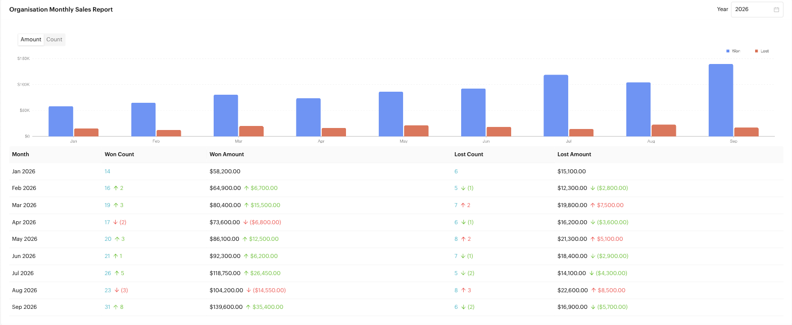

# Deals

## What is the Deals Report?

The Deals Report gives you a consolidated view of your sales performance. It shows how many deals were created, won and lost, where deals sit in your pipeline, how they break down by tag and priority, at which stages you lose them, and how your monthly sales compare month to month.

Use it to track sales goals, check the health of your pipeline, and find the deals that need attention.


The Deals Report used to be the **Summary** tab inside the Deals module. It now lives under `Reports` > `Deals`. The Deals module itself has the [Board](../deals/board.md) and [List](../deals/list.md) views.



The screenshots on this page use sample data.


## When to use it?

* **Weekly sales review**: See how many deals were won and lost, and their value, for the week.
* **Pipeline health**: Spot stages where deals pile up.
* **Rep performance**: Filter by a collaborator to compare their pipeline with the whole organisation.
* **Loss analysis**: See which stages deals were at when they were lost.
* **Monthly reporting**: Compare won and lost amounts month by month for the year.

## How to use it (Step by Step)



#### Open the Deals Report

Go to `Reports` > `Deals` from the left menu.



#### Select a pipeline

Choose the deal pipeline you want to analyse. The first pipeline is selected by default.



#### Filter by collaborator (optional)

Use **Select a collaborator** to see one team member's deals next to the organisation totals. Clear it to see the organisation only.



#### Choose a date range

Pick a preset (the default is the last 7 days) or a custom range. The date range applies to the overview cards and the stage, tag, priority and lost-stage charts. The Monthly Sales Report has its own **Year** picker.



#### Click through to the deals

Almost everything in the report is clickable. Click a card, a chart slice or a count in the sales table to open the [Deals List](../deals/list.md) in a new tab, already filtered to those deals.



## Report sections

### Overview cards

A row of cards summarising the selected period. Each card shows the number of deals and their total value.

| Card | What it counts |
| --- | --- |
| **Created** | Deals created in the period |
| **Won** | Deals moved to a *Won* stage in the period |
| **Lost** | Deals moved to a *Lost* stage in the period |
| **Due soon** | Deals with a due date coming up. The window follows your date preset: *Last 7 days* shows deals due in the next 7 days, *This month* shows deals due this month, and so on. |

### Stage Overview

A pie chart of how many deals are in each stage, labelled with the count and value of each stage. Only stages with at least one deal are shown. When a collaborator is selected, a second chart shows their deals next to the **Organisation** chart. Click a slice to open the deals in that stage.

### Tags breakdown

A bar chart of deals by tag, labelled with the count and value, e.g. `14 · $52,300.00`. Switch between **Top 5 Tags** and **All Tags**. Only tags with at least one deal are shown. Click a bar to open the deals with that tag.

<figure><figcaption>
Filters, overview cards, Stage Overview and Tags breakdown
</figcaption></figure>

### Priority breakdown

Shows how your deals are prioritised: **Highest**, **High**, **Medium**, **Low** and **Lowest**, each with its deal count and value. A *not set* bar appears only when some deals have no priority. Click a bar to open those deals.

<figure><figcaption>
Priority breakdown
</figcaption></figure>

### Organisation lost stages breakdown

Shows how many deals were lost at each stage, as a bar chart and a donut showing each stage's share of the total, so you can see where in the funnel you lose the most. This chart always covers the whole organisation and **is not affected by the collaborator filter**. Click a stage to open those deals.

<figure><figcaption>
Lost stages breakdown
</figcaption></figure>

### Organisation Monthly Sales Report

A column chart and table of won and lost deals for each month of the selected **Year**. Switch the chart between **Amount** and **Count**.

The table shows **Won Count**, **Won Amount**, **Lost Count** and **Lost Amount** for each month. Next to each value, an arrow shows the change from the previous month:

* **Green** means a good change (more won, or less lost).
* **Red** means a bad change (less won, or more lost).
* Decreases are shown in brackets, e.g. `(3)`. Hover the arrow to see the previous month's value.

Click a won or lost count to open those deals.

<figure><figcaption>
Monthly Sales Report
</figcaption></figure>

**Reading the example above:** September was the best month of the year, with 31 deals won, 8 more than August, and fewer losses. August's rise in lost deals (red) is worth a closer look; click the lost count to see which deals they were.

## Important behavior to know

* **Won and Lost come from stage types**: A deal counts as won or lost when it moves to a stage whose type is *Won* or *Lost*. Set stage types in the pipeline settings on the [Board](../deals/board.md).
* **Amounts**: All values are shown in the `$1,234.50` format. Deals with no amount are counted as `$0.00`.
* **Collaborator filter**: Applies to the overview cards and the stage, tag and priority charts. The lost stages breakdown is always organisation-wide.
* **Permissions**: Some users may only see deal data for themselves or their team, depending on their access role.

## Common issues & solutions

* **"No deal pipelines found"**: Create a deal pipeline on the [Board](../deals/board.md) first.
* **Values show $0.00**: The deals have no **Deal amount**. Add amounts to your deals so revenue is counted.
* **Won or Lost is always 0**: None of your stages has the *Won* or *Lost* stage type. Edit the stage and set its **Stage Type**.
* **Missing deals**: Check the date range, the selected pipeline, and whether a collaborator filter is applied.
* **A stage or tag is missing from a chart**: Only stages and tags with at least one deal are shown.

## Best practice 💡

* **Always enter a deal amount** so the report reflects your real pipeline value.
* **Review the lost stages breakdown monthly**: A stage where many deals are lost usually points to a step in your sales process that needs work.
* **Use the collaborator filter in 1:1s** to compare a rep's pipeline with the organisation's.
* **Watch the red arrows** in the Monthly Sales Report and click through to understand what changed.

## Related Documentation

* [Deals](../deals/index.md) - Overview of the Deals module
* [Board](../deals/board.md) - Manage deals, pipelines and stages
* [List](../deals/list.md) - Filter and sort all deals in a table
* [Add to Deal Stage](../automations/logics/actions/add-deal-stage.md) - Create or move deals from a message flow
