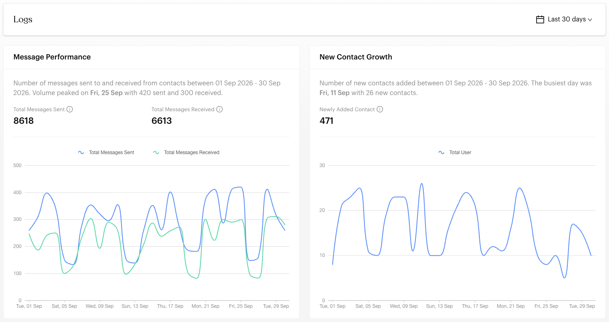
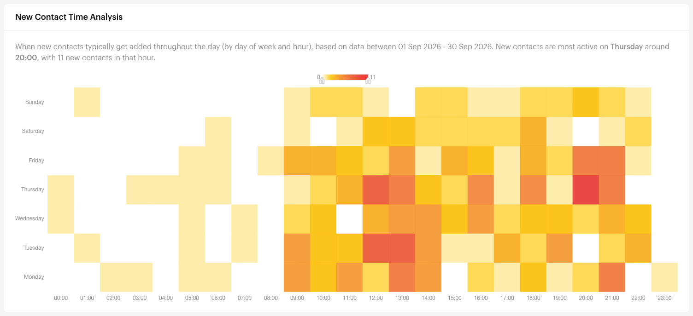

# Logs

## What is the Logs Report?

The Logs Report gives you an overview of message activity and new contact growth over time. Use it to track message volume, spot busy days, and see how your contact base is growing.

`Reports` opens on this page by default.


The screenshots on this page use sample data.


## When to use it?

* **Activity Monitoring**: Track how many messages you send and receive over time.
* **Growth Analysis**: See how many new contacts you're getting.
* **Pattern Recognition**: Find the days and hours when new contacts usually arrive.
* **Performance Overview**: Get a quick, high-level view of your account activity.

## How to use it (Step by Step)



#### Open the Logs Report

Go to `Reports` > `Logs` from the left menu.



#### Choose a date range

Click the date menu at the top right. Choose **Last 30 days** (the default), **Last 14 days**, **Last 7 days**, **Today**, **This Week**, **This Month**, **This Year**, or **Custom Date** to pick your own range.



#### Review Message Performance and New Contact Growth

<figure><figcaption>
Message Performance and New Contact Growth
</figcaption></figure>

**Message Performance** shows:

* **Total Messages Sent**: Messages sent from your business in the period.
* **Total Messages Received**: Messages received from contacts in the period.
* A line chart of messages sent and received each day.

**New Contact Growth** shows:

* **Newly Added Contact**: New contacts added in the period.
* A line chart of new contacts each day.

The text above each chart summarises the period and points out the busiest day.



#### Find peak times with New Contact Time Analysis

<figure><figcaption>
New Contact Time Analysis
</figcaption></figure>

The heatmap shows when new contacts are added:

* **Rows**: Days of the week.
* **Columns**: Hours of the day (00:00 to 23:00).
* **Colour**: Darker cells mean more new contacts in that hour.

The text above the heatmap names the busiest day and hour.



## Important behavior to know

* **Date range**: Every number and chart reflects only the selected date range.
* **Daily or monthly**: Charts show one point per day. With **This Year**, they show one point per month.
* **Message counts**: "Messages Sent" includes all outbound messages (manual, automated and broadcasts). "Messages Received" includes all inbound messages from contacts.
* **Empty heatmap**: If no contacts were added in the period, the heatmap shows an empty state.

## Common issues & solutions

* **No data showing**: Check that the date range includes days with activity, or choose a longer range.
* **Heatmap is empty**: No new contacts were added in the selected period. Try a longer range.
* **Numbers seem high**: Message counts include automated and broadcast messages, not only messages from your team.

## Best practice 💡

* **Check weekly**: Review this report every week to track overall activity and growth.
* **Plan around peaks**: Use the heatmap to schedule staff and campaigns for the times new contacts arrive.
* **Track campaigns**: Watch **New Contact Growth** after a campaign to see its effect.

## Related Documentation

* [Conversations Report](conversations.md) - View detailed conversation analytics
* [Contacts](../contacts/index.md) - Learn how to manage your contact list
* [Broadcasts](../broadcasts.md) - Understand how broadcasts contribute to message volume
