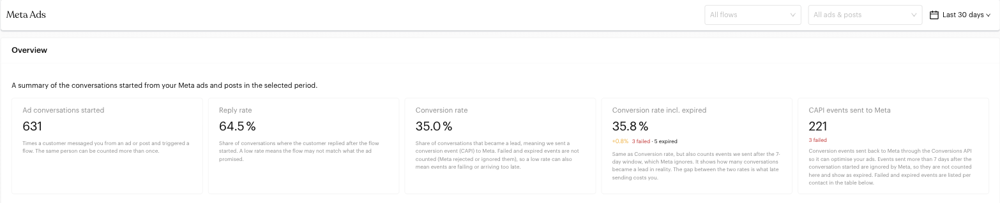
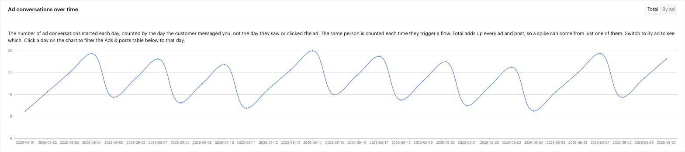
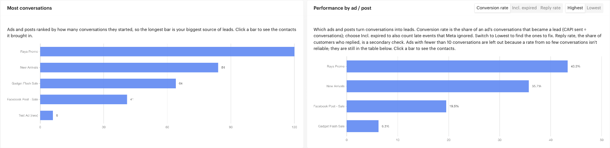
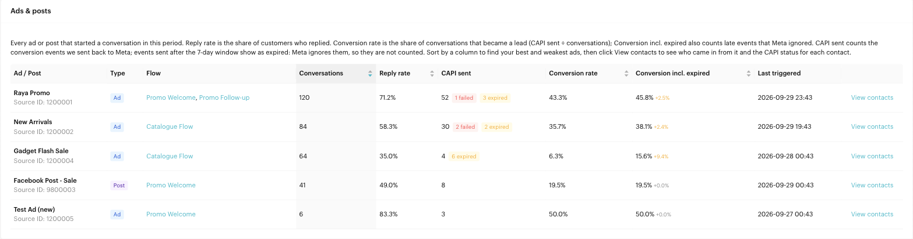
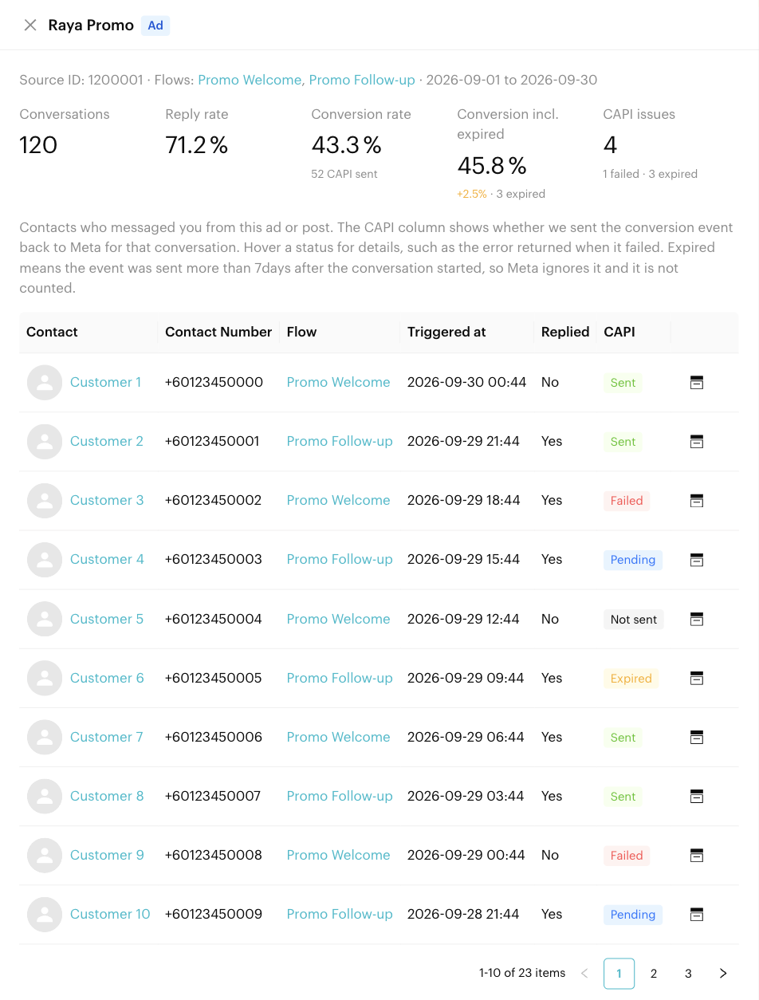

# Meta Ads

## What is the Meta Ads Report?

The Meta Ads Report shows how well your Click-to-WhatsApp, Messenger and Instagram ads and posts turn into real conversations and leads. For every ad or post that started a conversation, you can see how many conversations it brought in, how many customers replied, and how many became a lead, meaning a conversion event was sent back to Meta through the [Conversions API (CAPI)](../automations/logics/actions/send-conversions-api-event.md).

Use it to find your best ads, fix the weak ones, and spot conversion events that failed or reached Meta too late.


The screenshots on this page use sample data.


## When to use it?

* **Compare ads**: See which ad or post brings in the most conversations, and which ones actually convert.
* **Check your flows**: A low reply rate often means the flow doesn't match what the ad promised.
* **Monitor CAPI health**: Find conversion events that Meta rejected (failed) or ignored because they were sent too late (expired).
* **Follow up on leads**: Open the list of contacts that came in from a specific ad and jump straight to their conversation.

## How to use it (Step by Step)



#### Open the Meta Ads Report

Go to `Reports` > `Meta Ads` from the left menu.



#### Choose your filters

Use the bar at the top of the page to narrow the report:

* **All flows**: Show only conversations started in one message flow.
* **All ads & posts**: Show only one ad or post. The list shows each ad's name and whether it is an **Ad** or a **Post**. When a flow is selected, this list only shows ads and posts used in that flow.
* **Date range**: Pick a preset (the default is the last 30 days) or a custom range.

Flows that have been turned off or deleted still appear in the filters, so you can review past campaigns.



#### Read the Overview

The **Overview** cards summarise the selected period. See [Overview metrics](#overview-metrics) below for what each card means.

<figure><figcaption>
Filters and Overview cards
</figcaption></figure>



#### Check the trend

The **Ad conversations over time** chart shows how many ad conversations started each day.

* Switch between **Total** (all ads added together) and **By ad** (one line per ad or post) to find which ad caused a spike.
* **Click a day** on the chart to filter the **Ads & posts** table to that day. A blue *Selected day* tag appears; close it to go back to the full period.

<figure><figcaption>
Ad conversations over time
</figcaption></figure>



#### Compare ad performance

Two bar charts rank your ads and posts:

* **Most conversations**: Ads ranked by how many conversations they started. The longest bar is your biggest source of leads.
* **Performance by ad / post**: Ads ranked by **Conversion rate**, **Incl. expired** or **Reply rate**. Switch to **Lowest** to find the ads that need fixing.

Click any bar to open that ad's contacts.

<figure><figcaption>
Most conversations and Performance by ad / post
</figcaption></figure>



#### Review the Ads & posts table

The **Ads & posts** table lists every ad or post that started a conversation in the period. Click a column header to sort, then click **View contacts** on a row to see who came in from that ad.

<figure><figcaption>
Ads &#x26; posts table
</figcaption></figure>



#### Drill into the contacts

The ad detail panel shows the ad's numbers and a list of every conversation it started, with the CAPI status for each one. Hover a status to see details, such as the error Meta returned. Click a contact's name to open their profile, or the inbox icon to open the conversation.

<figure><figcaption>
Ad detail panel
</figcaption></figure>



## Overview metrics

| Card | What it means |
| --- | --- |
| **Ad conversations started** | Times a customer messaged you from an ad or post and triggered a flow. The same person can be counted more than once. |
| **Reply rate** | Share of those conversations where the customer replied after the flow started. |
| **Conversion rate** | Share of conversations that became a lead, meaning a CAPI event was sent to Meta and accepted. Failed and expired events are not counted. |
| **Conversion rate incl. expired** | Same as Conversion rate, but also counts events sent after Meta's 7-day window. The difference between the two rates (shown as `+x%`) is what late sending costs you. The number of failed and expired events is shown below it. |
| **CAPI events sent to Meta** | Conversion events Meta accepted, with the number that failed shown below. |


**How the rates are calculated**

* Conversion rate = CAPI sent ÷ Ad conversations started
* Conversion rate incl. expired = (CAPI sent + CAPI expired) ÷ Ad conversations started


**Reading the example above:** 631 conversations came from ads and 64.5% of customers replied. 35.0% of conversations were reported to Meta as leads. Counting the 5 events that were sent too late would lift that to 35.8%, so late sending cost 0.8 points. 3 events failed and should be checked in the contact list.

## Ads & posts table

| Column | What it shows |
| --- | --- |
| **Ad / Post** | The ad or post name and its Source ID |
| **Type** | **Ad** or **Post** |
| **Flow** | The flow(s) the ad or post triggered in the period |
| **Conversations** | Number of conversations it started |
| **Reply rate** | Share of customers who replied |
| **CAPI sent** | Events Meta accepted, with red *failed* and orange *expired* tags when there are any |
| **Conversion rate** | CAPI sent ÷ Conversations |
| **Conversion incl. expired** | Also counts expired events, with the gap they add (e.g. `+9.4%`) |
| **Last triggered** | When the ad last started a conversation |

**Reading the example above:**

* *Raya Promo* is both the biggest source of conversations (120) and the best converter (43.3%).
* *Gadget Flash Sale* converts at only 6.3%, but 15.6% when expired events are counted. Its 6 events were sent after the 7-day window, so the flow sends the CAPI event too late. Moving the event earlier would recover most of that gap.
* *Test Ad (new)* has only 6 conversations, so it doesn't appear in the *Performance by ad / post* chart yet.

## CAPI status per contact

In the ad detail panel, each conversation has one of these statuses:

| Status | Meaning |
| --- | --- |
| **Sent** | Meta accepted the event. Hover to see the event name (e.g. *Lead*) and when it was sent. |
| **Failed** | Meta rejected the event or the request errored. Hover to see the error. |
| **Pending** | The event is queued and not sent yet. |
| **Not sent** | Nothing to send, for example the flow has no Send Conversions API Event action, or the contact hasn't reached it yet. |
| **Expired** | The event was sent more than 7 days after the conversation started, so Meta ignores it. It is not counted as sent. |

When an ad has been used in more than one flow, the contact list shows a **Flow** column so you can see which flow each conversation started.

## Important behavior to know

* **Counted by conversation, not by person**: A contact who messages you from the same ad twice is counted twice.
* **Counted by the day the customer messaged you**: Not the day they saw or clicked the ad.
* **7-day window**: Meta only attributes CAPI events sent within 7 days of the conversation starting. Later events show as *expired*.
* **Ranking needs enough data**: The *Performance by ad / post* chart leaves out ads with fewer than 10 conversations, because a rate based on a handful of conversations isn't reliable. They still appear in the Ads & posts table.
* **Supported channels**: Only WhatsApp Business (WABA), Messenger and Instagram channels can send CAPI events.

## Common issues & solutions

* **No data showing**:
  * Make sure you have a message flow triggered by a Meta ad or post, and that it has started conversations in the selected date range.
  * Clear the flow and ad filters, or widen the date range.
* **Conversion rate is 0%**: The flow has no [Send Conversions API Event](../automations/logics/actions/send-conversions-api-event.md) action, or contacts haven't reached it yet. Add the action at the step where a conversation becomes a lead.
* **Many failed events**: Hover a *Failed* status to read Meta's error. Common causes are an incorrect dataset or missing customer information (email or phone number).
* **Many expired events**: The CAPI event is sent too late, for example from a deal stage that is usually reached after a week. Send a *Lead* event earlier in the flow.
* **An ad is missing from the Performance chart**: It has fewer than 10 conversations. Find it in the Ads & posts table instead.

## Best practice 💡

* **Check the gap between the two conversion rates**: A large gap means you're losing credit in Meta for real leads. Move the CAPI event earlier.
* **Use Lowest on the Performance chart** to find ads worth pausing or rewriting.
* **Look at reply rate together with conversion rate**: High replies but low conversions usually means the flow needs work; low replies usually means the ad and the first message don't match.
* **Review failed events weekly** so issues with your dataset or customer information are fixed quickly.

## Related Documentation

* [Send Conversions API Event](../automations/logics/actions/send-conversions-api-event.md) - Send conversion events to Meta from a flow
* [Trigger](../automations/steps/trigger.md) - Start a flow from a Meta ad, deal stage or booking event
* [Message Flows](../automations/message-flows.md) - Build the flows your ads start
