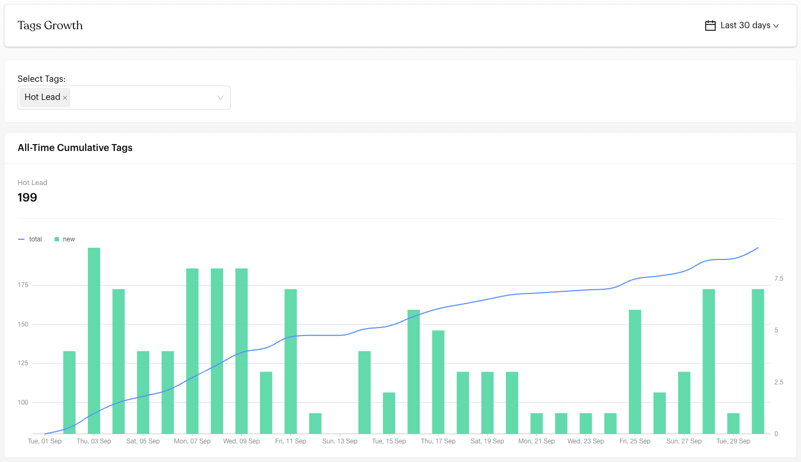
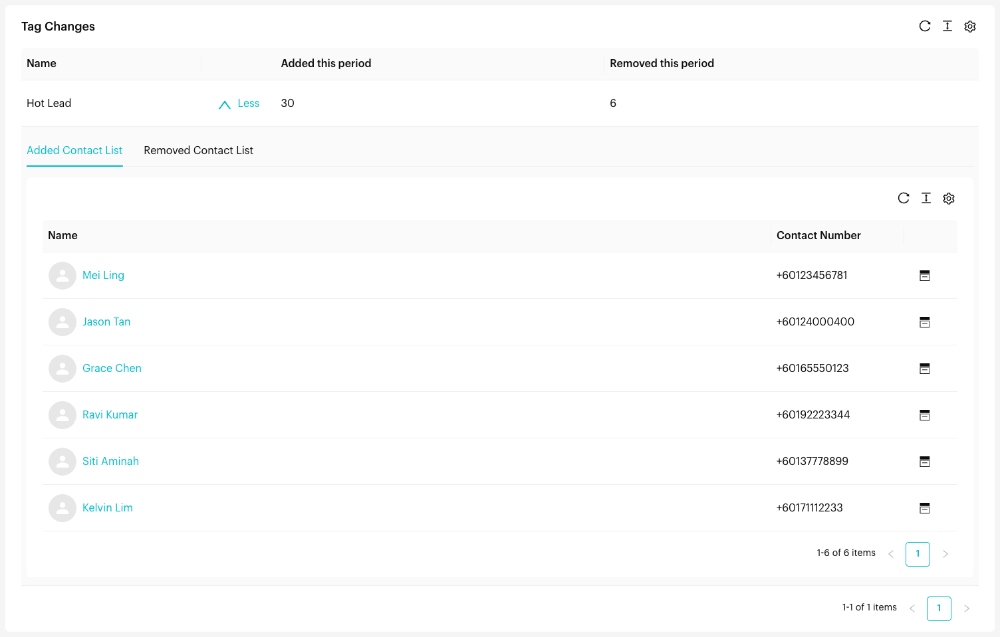

# Tags

## What is the Tags Report?

The Tags Report (**Tags Growth**) shows how your tags grow over time: how many contacts have each tag, and how many had it added or removed in a period. Use it to see how your contact segments are changing and which contacts were affected.


The screenshots on this page use sample data.


## When to use it?

* **Tag Strategy**: See which tags are growing fastest.
* **Contact Segmentation**: Follow how your segments change over time.
* **Campaign Analysis**: Check how many contacts a campaign tagged.
* **Quality Check**: See exactly which contacts had a tag added or removed.

## How to use it (Step by Step)



#### Open the Tags Report

Go to `Reports` > `Tags` from the left menu.



#### Choose a date range

Click the date menu at the top right. Choose **Last 30 days** (the default), **Last 14 days**, **Last 7 days**, **Today**, **This Week**, **This Month**, **This Year**, or **Custom Date**.



#### Select tags

Under **Select Tags**, choose one or more tags to compare. Your first tag is selected for you when the page opens.



#### Review All-Time Cumulative Tags

<figure><figcaption>
Tags Growth
</figcaption></figure>

The **All-Time Cumulative Tags** chart shows:

* **Line**: The total number of contacts with the tag, all-time.
* **Columns**: New contacts tagged on each day.

The number above the chart for each tag is how many contacts have that tag right now, regardless of the date range.



#### Review Tag Changes

The **Tag Changes** table shows, for each selected tag:

* **Name**: The tag name.
* **Added this period**: Contacts that got this tag in the selected period.
* **Removed this period**: Contacts that had this tag removed in the selected period.

Click **More** on a row to see the contacts in two tabs: **Added Contact List** and **Removed Contact List**. Click a name to open the contact, or the **Inbox** icon to open the conversation.

<figure><figcaption>
Tag Changes with the contact list expanded
</figcaption></figure>



## Important behavior to know

* **Cumulative line**: The line shows all-time totals, not only the selected period.
* **Period changes**: "Added this period" and "Removed this period" only count changes within the selected date range.
* **Paginated lists**: The Added and Removed contact lists are paginated, so you can browse every contact.

## Common issues & solutions

* **No data showing**: Make sure at least one tag is selected, and that the date range includes days when the tag was used.
* **Can't find a tag**: Only existing tags appear. Create it in [Settings > Tags](../settings/data/tags.md) first.
* **Contact lists are empty**: No contacts had that tag added or removed in the period. Try a longer range.

## Best practice 💡

* **Compare related tags**: Select tags from the same funnel (e.g. *Hot Lead* and *VIP*) to see how contacts move between them.
* **Check the contact lists**: Make sure tags are being applied to the right contacts.
* **Use consistent tag names** so the report is easy to read.

## Related Documentation

* [Tags Settings](../settings/data/tags.md) - Learn how to create and manage tags
* [Add Tags in Inbox](../inbox/contact-info/profile.md) - See how to tag contacts during conversations
