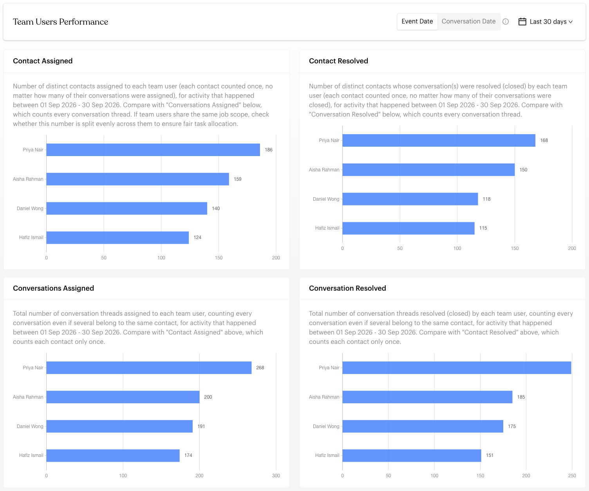
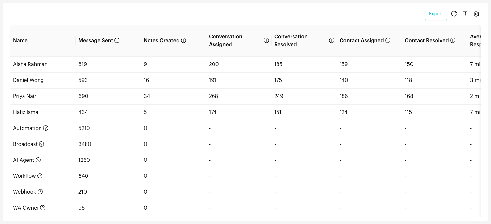

# Team Users

## What is the Team Users Report?

The Team Users Report (**Team Users Performance**) compares your team members, and automated senders, side by side: how many conversations and contacts they handled, and how quickly they responded and resolved them. Use it to review performance, balance workload and spot training needs.


The screenshots on this page use sample data.


## When to use it?

* **Performance Reviews**: Compare each team member's workload and speed.
* **Workload Balancing**: Check that work is shared fairly between people with the same job scope.
* **Training Needs**: Spot team members who respond or resolve more slowly.
* **Automation Share**: See how much work automations and broadcasts handle compared with your team.

## How to use it (Step by Step)



#### Open the Team Users Report

Go to `Reports` > `Team Users` from the left menu.



#### Choose Event Date or Conversation Date

Use the toggle at the top right to choose how the date range is applied:

* **Event Date** (default): Counts activity that happened within the date range, e.g. conversations closed in September.
* **Conversation Date**: Counts conversations opened within the date range, with their results even if the response or close happened later.

Your choice is remembered and also applies to the [Conversations Report](conversations.md).



#### Choose a date range

Click the date menu at the top right. Choose **Last 30 days** (the default), **Last 14 days**, **Last 7 days**, **Today**, **This Week**, **This Month**, **This Year**, or **Custom Date**.



#### Compare team members in the charts

<figure><figcaption>
Team Users Performance charts
</figcaption></figure>

Each chart compares your team members on one measure:

| Chart | What it shows |
| --- | --- |
| **Contact Assigned** / **Contact Resolved** | Distinct contacts assigned to or resolved by each person. Each contact counts once. |
| **Conversations Assigned** / **Conversation Resolved** | Every conversation assigned to or resolved by each person, even several from the same contact. |
| **Average First Response Time** | How long each person took to send the first response, from when the conversation opened. |
| **Average Resolution Time** | How long each person took to close a conversation, from when it opened. |
| **Average First Assignment to First Response Time** | How long each person took to respond after being assigned. |
| **Average Last Assignment to Resolution Time** | How long each person took to close a conversation after it was last assigned to them. |



#### Review the performance table

<figure><figcaption>
Performance table
</figcaption></figure>

The table below the charts lists every team member and automated sender. Scroll right to see all columns:

| Column | Description |
| --- | --- |
| **Name** | The team member or automated sender |
| **Message Sent** | Messages they sent |
| **Notes Created** | Internal notes they added |
| **Conversation Assigned** / **Conversation Resolved** | Every conversation assigned to or closed by them |
| **Contact Assigned** / **Contact Resolved** | Distinct contacts assigned to or resolved by them |
| **Average First Response Time** | Average time to send the first response in a newly opened conversation |
| **Average First Assignment to First Response Time** | Average time to respond after being assigned |
| **Average Response Time per Message** | Average time to reply to each message |
| **Average First Assignment to Resolution Time** | Average time to close, from when the conversation was first assigned |
| **Average Last Assignment to Resolution Time** | Average time to close, from when the conversation was last assigned |
| **Average Resolution Time** | Average time to close, from when the conversation opened |
| **Max Response Time** / **Max Resolution Time** | The single longest response and resolution |

Hover over a column heading's **?** icon for its definition.



#### Export (Optional)

Click **Export** above the table to download the data as an Excel file.



## Automated senders

Besides your team members, the report lists these automated senders. Hover over a name's **?** icon to see what it means.

| Name | What it represents |
| --- | --- |
| **AI Agent** | Messages sent by the AI Agent |
| **Broadcast** | Messages sent by broadcasts |
| **Automation** | Messages sent by message flows |
| **Workflow** | Messages sent by workflows |
| **Webhook** | Messages sent through your webhook API calls |
| **WA Owner** | Anyone using the WhatsApp number outside Luluchat, e.g. the WhatsApp mobile app or a linked device |

## Important behavior to know

* **Working hours first**: Times use working hours when they're set up, and fall back to total time otherwise.
* **Contacts vs conversations**: "Contact" columns count each contact once. "Conversation" columns count every conversation, so one contact can be counted several times.
* **Max times**: Max Response Time and Max Resolution Time show the single longest case, which may be an outlier.
* **"-" means no activity**: A dash means the person had no activity of that kind in the period.

## Common issues & solutions

* **Team member missing or all "-"**: They had no activity in the selected period. Try a longer range, or check they exist in [Settings > Users](../settings/account/users.md).
* **Resolution times are empty**: Conversations must be closed with **Close Conversation** in the Inbox to count as resolved.
* **Numbers differ from the Conversations Report**: Check both reports use the same **Event Date** / **Conversation Date** setting and date range.

## Best practice 💡

* **Review regularly**: Check this report weekly or monthly to follow trends.
* **Compare like with like**: Compare team members who share the same job scope.
* **Look at averages and maximums** together to find outliers.
* **Close conversations**: Make sure your team closes conversations so resolution times are accurate.

## Related Documentation

* [Users Settings](../settings/account/users.md) - Learn how to manage team members
* [Conversations Report](conversations.md) - View detailed conversation-level analytics
* [Close Conversation](../inbox/close-conversation.md) - Ensure conversations are properly closed for accurate tracking
