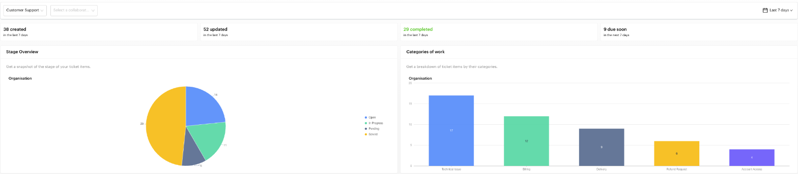
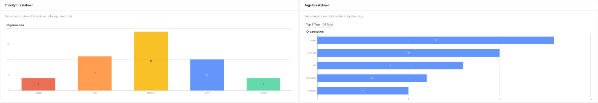

# Tickets

## What is the Tickets Report?

The Tickets Report gives you a high-level view of your ticketing work. It shows how many tickets were created, updated and completed, what is due soon, and how tickets break down by stage, category, priority and tag. Use it to spot bottlenecks, balance workload across your team and see what kind of requests are coming in.


The Tickets Report used to be the **Summary** tab inside the Tickets module. It now lives under `Reports` > `Tickets`. The Tickets module itself has the [Board](../tickets/board.md) and [List](../tickets/list.md) views.



The screenshots on this page use sample data.


## When to use it?

* **Weekly team review**: See how many tickets came in and how many were solved.
* **Find bottlenecks**: Spot stages where tickets pile up.
* **Balance workload**: Filter by a collaborator to compare their tickets with the whole organisation.
* **Spot trends**: See which categories or tags are rising, which may point to a product or delivery issue.

## How to use it (Step by Step)



#### Open the Tickets Report

Go to `Reports` > `Tickets` from the left menu.



#### Select a pipeline

Choose the ticketing pipeline you want to analyse. The first pipeline is selected by default. Reports are per pipeline, so switch pipelines to review each one.



#### Filter by collaborator (optional)

Use **Select a collaborator** to see one team member's tickets next to the **Organisation** totals. Clear it to see the organisation only.



#### Choose a date range

Pick a preset (the default is the last 7 days) or a custom range. The date range applies to every card and chart on the page.



#### Click through to the tickets

Click a card or a chart segment to open the [Tickets List](../tickets/list.md) in a new tab, already filtered to the tickets behind that number.



## Report sections

### Overview cards

A row of cards summarising the selected period.

| Card | What it counts |
| --- | --- |
| **Created** | Tickets created in the period |
| **Updated** | Tickets changed in the period |
| **Completed** | Tickets moved to the **Solved** stage in the period |
| **Due soon** | Tickets with a due date coming up. The window follows your date preset: *Last 7 days* shows tickets due in the next 7 days, *This month* shows tickets due this month, and so on. |

### Stage Overview

A pie chart of how many tickets are in each stage, such as *Open*, *In Progress*, *Pending* and *Solved*. Click a slice to open the tickets in that stage.

### Categories of work

A column chart of tickets by category, e.g. *Billing* or *Technical Issue*. Use it to see what kind of requests your team spends time on. Click a column to open those tickets.

<figure><figcaption>
Filters, overview cards, Stage Overview and Categories of work
</figcaption></figure>

**Reading the example above:** 38 tickets came in this week and 29 were solved. *Technical Issue* is the biggest category (17), so it is worth checking whether a product problem is driving it. 14 tickets are still *Open*.

### Priority breakdown

Shows how your tickets are prioritised: **Highest**, **High**, **Medium**, **Low** and **Lowest**. A *not set* column appears only when some tickets have no priority. Click a column to open those tickets.

### Tags breakdown

A bar chart of tickets by tag. Switch between **Top 5 Tags** and **All Tags**. Click a bar to open the tickets with that tag.

<figure><figcaption>
Priority breakdown and Tags breakdown
</figcaption></figure>

### Comparing a collaborator with the organisation

When you select a collaborator, each chart shows two views side by side: **Organisation** and the selected person. If the person has no tickets in the period, their side shows *No tickets in this period*. Try a wider date range to compare.

## Important behavior to know

* **Completed means Solved**: A ticket counts as completed when it is moved to the pipeline's **Solved** stage.
* **Per pipeline**: Every number on the page is for the selected pipeline only.
* **Collaborator filter**: Shows tickets where that person is the assignee or a collaborator.
* **Permissions**: Some users may only see ticket data for themselves or their team, depending on their access role.

## Common issues & solutions

* **"No ticketing pipelines found"**: Create a ticketing pipeline on the [Board](../tickets/board.md) first.
* **No data showing**: Check the selected pipeline and widen the date range.
* **Completed is always 0**: Tickets are closed without being moved to **Solved**. Move finished tickets to the Solved stage.
* **A category is missing**: Only categories used by tickets in the period appear. Set a category on your tickets so they are counted.

## Best practice 💡

* **Review weekly** and check that no stage is growing week after week.
* **Always set a category and priority** on new tickets so the breakdowns stay meaningful.
* **Use the collaborator filter in 1:1s** to see each person's workload against the team's.
* **Watch Due soon** and click it to plan the week's follow-ups.

## Related Documentation

* [Tickets](../tickets/index.md) - Overview of the Tickets module
* [Board](../tickets/board.md) - Manage tickets, pipelines and stages
* [List](../tickets/list.md) - Filter all tickets in a table
