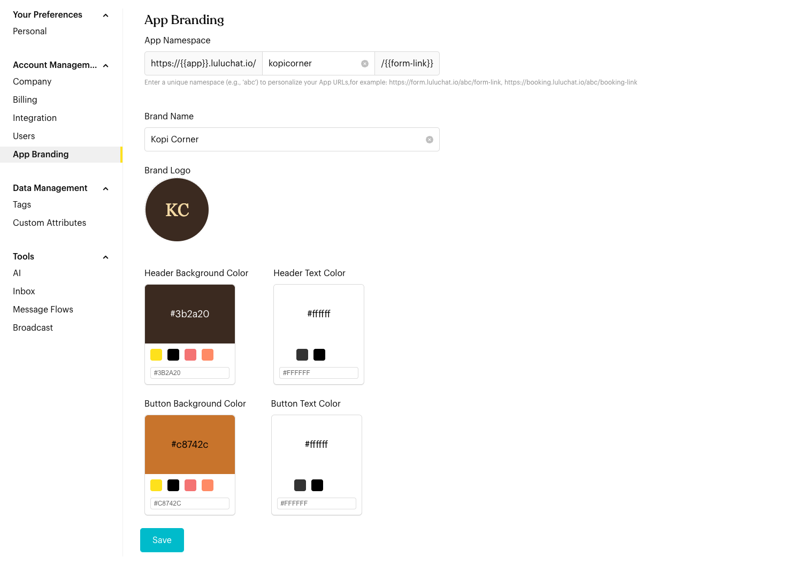

# App Branding

## What is App Branding?

Personalize the external-facing pages (e.g., Forms, Booking) with your company's identity.

## How to set it up (Step by Step)



#### Configure App Namespace

The App Namespace is a unique identifier used in your public URLs.

* Example: Setting it to `my-shop` changes your form URL to `https://form.luluchat.io/my-shop/form-name`.

<figure><figcaption>
App Branding (sample data)
</figcaption></figure>



#### Identity Branding

* Brand Name: Enter your company's public-facing name.
* Brand Logo: Upload your logo. This appears on headers and forms.



#### Visual Customization

Use the color pickers to match the interface to your brand:

* Header Background & Text: Colors for the top navigation bar.
* Button Background & Text: Primary colors for call-to-action buttons.



#### Save

Click `Save` to apply these changes to all your public app pages.



## Important behavior to know

* **Namespace Uniqueness**: Namespaces must be unique across the entire Luluchat platform.
* **Universal Application**: Branding changes apply to all mini-apps (Forms, Bookings, Tickets, etc.) simultaneously.

## Best practice 💡

* **High Contrast**: Ensure your text colors have high contrast against background colors for readability.
* **Transparent Logo**: Use a PNG with a transparent background for the best look on different header colors.
