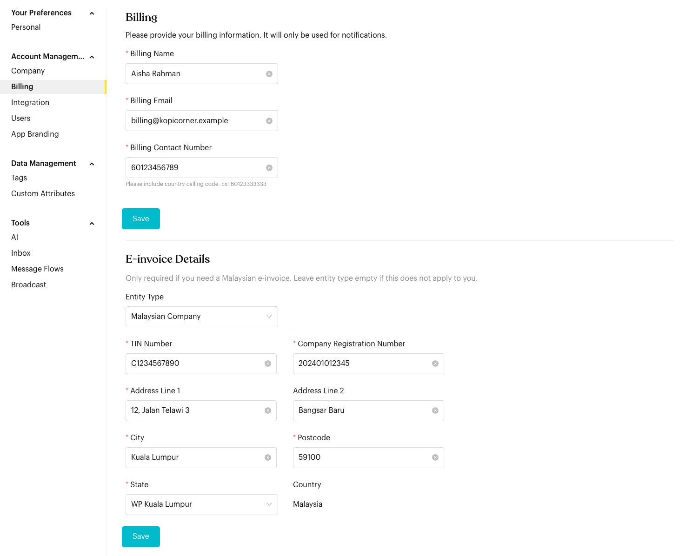
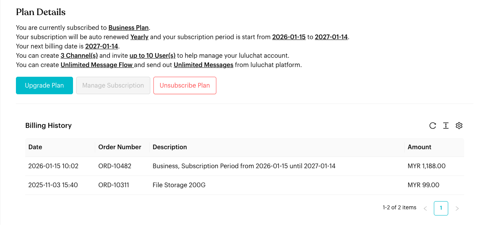

# Billing

## What is Billing?

Manage your billing contact details, e-invoice details, and subscription, and view your payment history.

Go to `Settings` > `Account Management` > `Billing`.


The screenshots on this page use sample data.


## How to set it up (Step by Step)



#### Update Billing Contact

Enter the **Billing Name**, **Billing Email** and **Billing Contact Number** (include the country code, e.g. `60123333333`). These details are only used for billing notifications. Click **Save**.

<figure><figcaption>
Billing contact and E-invoice Details
</figcaption></figure>



#### Add E-invoice Details (Malaysia only)

Only fill this in if you need a Malaysian e-invoice. Otherwise, leave **Entity Type** empty.

1. Choose an **Entity Type**: **Malaysian Company** or **Malaysian Individual**.
2. Enter your **TIN Number**, and your **Company Registration Number** (companies) or **NRIC** (individuals).
3. Enter your address: **Address Line 1** and **2**, **City**, **Postcode** and **State**. The **Country** is always Malaysia.
4. Click **Save**.

To stop receiving e-invoices, clear the **Entity Type** and click **Save**.



#### Review Plan Details

<figure><figcaption>
Plan Details and Billing History
</figcaption></figure>

**Plan Details** shows:

* The plan you're subscribed to, e.g. *Business Plan*.
* How it renews (e.g. *Yearly*), the current subscription period and your next billing date. On a free trial, it shows when the trial ends instead.
* Your limits: how many channels and users you can have, how many message flows you can create, and how many messages you can send.



#### Manage your subscription

* **Upgrade Plan**: See higher-tier plans.
* **Manage Subscription**: Open the billing portal to update your payment method.
* **Unsubscribe Plan**: Opens a pre-filled cancellation email to our billing team.



#### View Billing History

The **Billing History** table lists past orders with their **Date**, **Order Number**, **Description** (plan and subscription period) and **Amount**.




**Important behavior to know**

* **Auto-Renewal**: Plans renew automatically at the end of the subscription period.
* **Unsubscribe Process**: Clicking **Unsubscribe Plan** only drafts a cancellation email. Your subscription stays active until the cancellation is processed.
* **Manage Subscription**: Only users with billing access can open the billing portal.


## Best practice 💡

* **Check Limits Early**: Monitor your message and user limits to avoid service interruptions.
* **Up-to-Date Contact**: Make sure the billing email is monitored so you don't miss payment notifications.
* **E-invoice**: Fill in your e-invoice details before your next renewal so the invoice is issued correctly.
