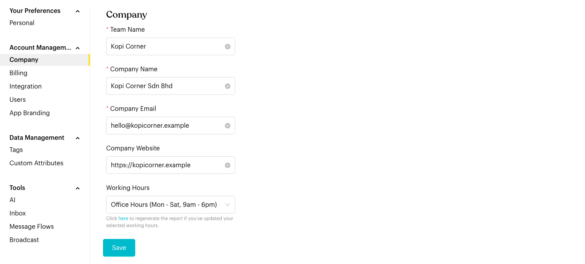
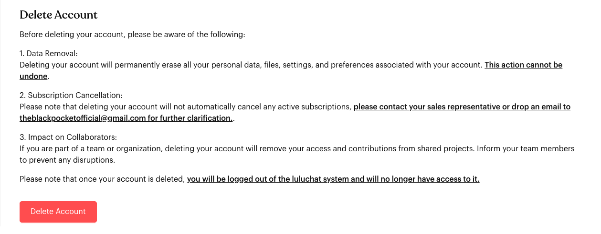

# Company

## What is Company Settings?

Manage your organization's identity, operational hours, and account lifecycle.

## How to set it up (Step by Step)

#### Update Identity

* Team Name: Internal name for your team workspace.
* Company Name: Your organization's official name.
* Company Email: Primary email for business communication.
* Company Website: Your official website URL.

<figure><figcaption>
Company settings
</figcaption></figure>

#### Set Working Hours

Select a **Working Hours** profile to define when your team is active. Reports use it to calculate response and resolution times within working hours. Click **Save** when you are done.

* Note: If you update working hours, click the here link in the description to regenerate your reports.

### Delete Account


**Danger Zone - Permanent Action**

Deleting your account will permanently erase all your personal data, files, settings, and preferences associated with your account. **This action cannot be undone.**

**Before proceeding, please be aware:**

* All your personal data, files, and settings will be permanently deleted
* This action cannot be undone
* Deleting your account does **not** automatically cancel active paid subscriptions. You must contact your sales representative or email theblackpocketofficial@gmail.com to cancel billing
* If you are part of a team, deleting your account will remove your access and contributions from shared projects
* You will be logged out automatically 5 seconds after deletion


If you need to permanently close your account, use the **Delete Account** section:

1. Scroll to the **Delete Account** section at the bottom of the Company settings page.
2. Read all the warnings and information carefully.
3. Enter your password in the confirmation field.
4. Click the **Delete Account** button.
5. Confirm the deletion in the popup dialog.

<figure><figcaption>
Delete Account section
</figcaption></figure>


**Important**: Deleting your account does **not** automatically cancel active paid subscriptions. Contact your sales representative or email theblackpocketofficial@gmail.com to cancel billing before or after account deletion.



**Collaborator Impact**: If you are part of a team or organization, deleting your account will remove your access and contributions from shared projects. Inform your team members before deleting your account to prevent disruptions.


## Common issues & solutions

* **Reports seem inaccurate**: If you recently changed working hours, ensure you triggered a "Regenerate Report" action.
