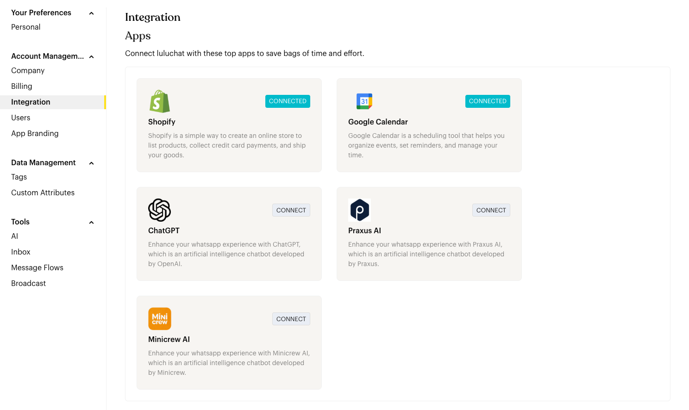
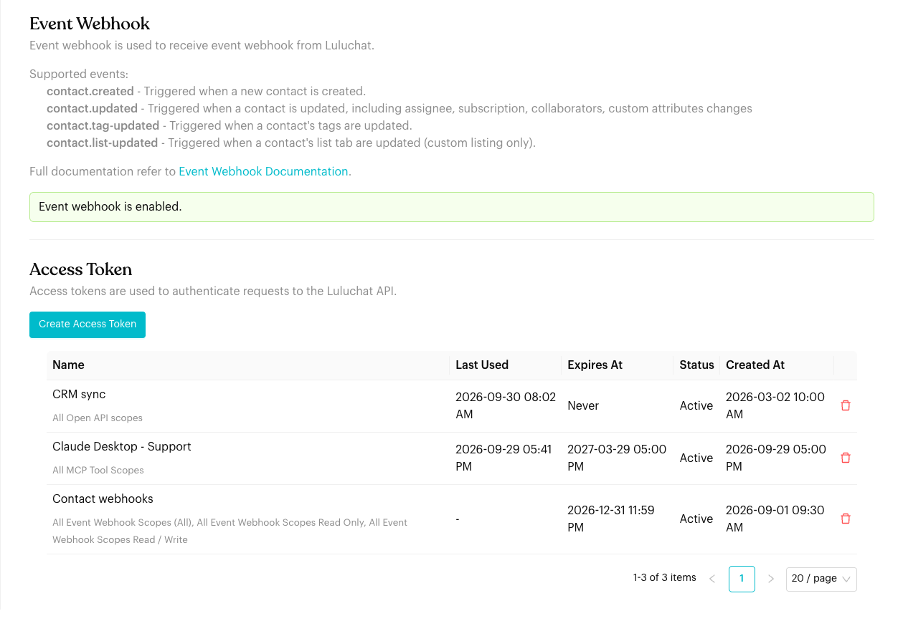

# Integration

## What is Integration?

Connect Luluchat with other apps, check your Event Webhook status, and manage access tokens for the Luluchat API and MCP.


The screenshots on this page use sample data.


## When to use it?

* When you want to connect apps like Shopify, Google Calendar, ChatGPT, Praxus AI or Minicrew AI.
* When you need an access token for the [Open API](../../developer-guide/open-api.md), [Event Webhooks](../../developer-guide/event-webhooks.md), [Webhook Trigger](../../developer-guide/webhook-trigger.md) or [MCP](../../mcp/connect.md).

## How to set it up (Step by Step)



#### Open Integration Settings

Go to `Settings` > `Account Management` > `Integration`.



#### Connect Apps

<figure><figcaption>
Apps
</figcaption></figure>

The **Apps** section lists the apps you can connect. Apps you've connected show **CONNECTED**. Click **CONNECT** on an app to set it up.

* [Shopify Integration](shopify-integration.md)
* [Google Calendar Integration](google-calendar-integration.md)
* [ChatGPT Integration](chatgpt-integration.md)
* **Praxus AI** and **Minicrew AI**: You'll be asked to agree that your message data may be shared with the app before connecting.



#### Check Event Webhook

<figure><figcaption>
Event Webhook and Access Token
</figcaption></figure>

The **Event Webhook** section lists the events Luluchat can send to your system, and shows whether Event Webhook is enabled for your team. It's not enabled by default: contact support to turn it on. See [Event Webhooks](../../developer-guide/event-webhooks.md) for how to register.



#### Manage Access Tokens

In the **Access Token** section you can see each token's name and scopes, when it was last used, when it expires, its status and when it was created.

* Click **Create Access Token**, enter a **Name**, choose an **Expiry**, and tick the scopes you need. Copy the token when it's shown: it is only shown once.
* Click the red **trash** icon to delete a token you no longer use.

<figure><figcaption>
Create Access Token
</figcaption></figure>

See [Open API](../../developer-guide/open-api.md#choosing-scopes) for which scopes to choose.




**WhatsApp Cloud (WABA) channels** also see a **WABA Permanent Access Token** field at the top of this page. Enter your permanent token there to keep your WhatsApp Business API connection working.


## Important behavior to know

* **Token security**: Treat access tokens like passwords. Never share them publicly or commit them to code repositories.
* **Authorization**: API requests send the token as a `Bearer` token in the `Authorization` header.
* **Deleting a token**: Deleting a token stops it working immediately. Any system using it needs a new token.

## Common issues & solutions

* **Token not working**: Check you're using the `Authorization: Bearer ...` format and that the token hasn't expired or been deleted.
* **"Event webhook is not enabled"**: Contact support to enable Event Webhook for your team.
* **Can't see the WABA token field**: It only appears when your current channel is a WhatsApp Cloud (WABA) channel.

## Best practice 💡

* **One token per integration**: Name tokens clearly (e.g. `CRM sync`) so you know which system uses which token.
* **Delete unused tokens**: Check **Last Used** regularly and delete tokens you no longer need.
* **Only tick the scopes you need** for each token.

## Related Documentation

* [Zapier Integration](zapier-integration.md) - Learn how to set up Zapier workflows with Luluchat
* [Shopify Integration](shopify-integration.md) - Learn how to connect your Shopify store
* [ChatGPT Integration](chatgpt-integration.md) - Learn how to connect ChatGPT for AI features
* [Google Calendar Integration](google-calendar-integration.md) - Learn how to connect Google Calendar for booking appointments
* [Open API](../../developer-guide/open-api.md) and [Event Webhooks](../../developer-guide/event-webhooks.md) - Build your own integration
