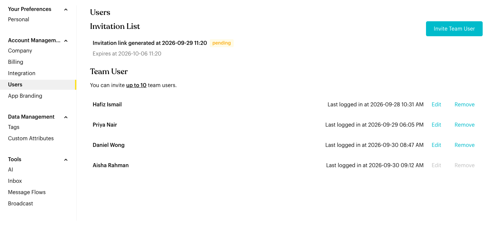
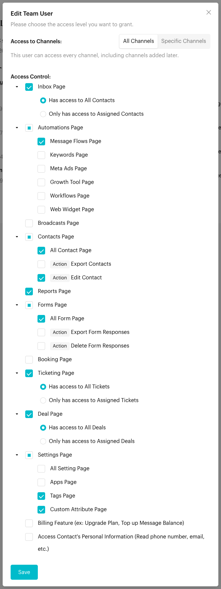
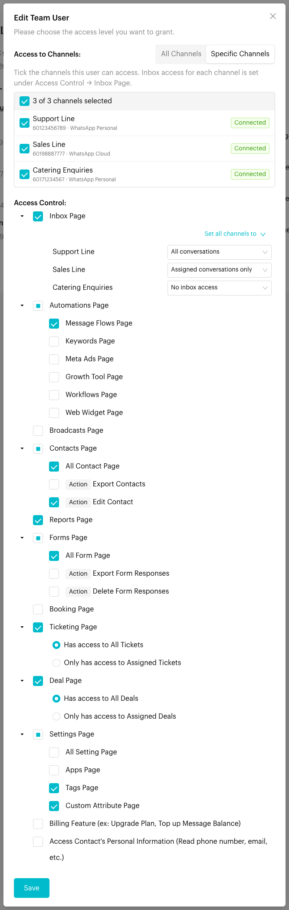
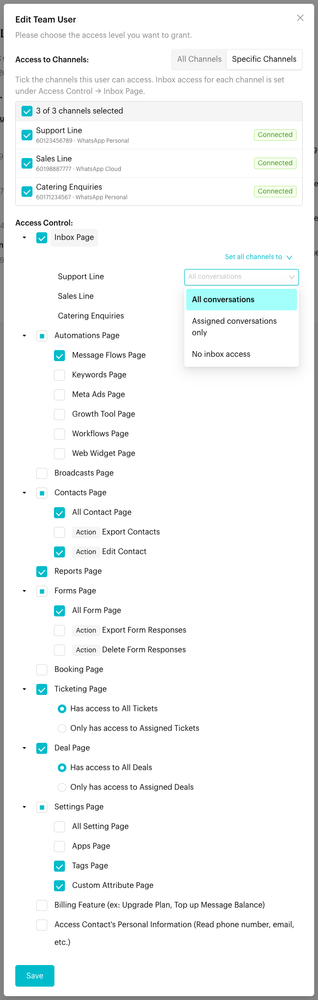

# Users

## What is Users?

Manage your team by inviting new members and controlling what they can access: which channels they can work on, what they see in the Inbox on each channel, and which pages and actions they can use.

Go to `Settings` > `Account Management` > `Users`.

<figure><figcaption>
Users
</figcaption></figure>

## How to set it up (Step by Step)

#### Invite team users

1. Click **Invite Team User**.
2. Choose the access level (see [Set a user's permissions](#set-a-users-permissions) below) and click **Generate Invite Link**.
3. Share the link with your teammate.

The **Invitation List** shows each invitation link, when it was generated, when it expires, and its status (e.g. *pending*). If an invitation has expired, click **Extend** to reactivate it.

#### View team members

The **Team User** list shows everyone in your workspace and when they last logged in. The line above the list shows how many team users your plan allows, e.g. *You can invite up to 10 team users*.

### Edit or Remove Users

* **Edit**: Change a user's channels, inbox access and permissions. The same form is used when you invite a new user.
* **Remove**: Remove a user from the workspace.


**Important**: You can't edit or remove yourself or the workspace owner. Their **Edit** and **Remove** options are greyed out.



**Remove User - Permanent Action**

Removing a user permanently removes them from the workspace. This action cannot be undone. The user will lose access to all shared projects and data immediately.


## Set a user's permissions

The **Edit Team User** (or **Invite Team User**) window has two parts: **Access to Channels** and **Access Control**.



#### Choose which channels the user can access

Under **Access to Channels**, pick one:

* **All Channels**: The user can open every channel in the team, including channels you add later.
* **Specific Channels**: A list of your channels appears. Tick the ones the user may access. Each row shows the channel's number, type and connection status. If you have many channels, use **Search channels** to find one. The header shows how many are selected, e.g. *2 of 3 channels selected*, and its checkbox ticks or unticks all the channels shown.

<figure><figcaption>
All Channels: one inbox setting for every channel
</figcaption></figure>



#### Set inbox access

Under **Access Control**, tick **Inbox Page** to give the user the Inbox. What appears under it depends on the choice above:

* **All Channels**: Pick one setting for every channel: **Has access to All Contacts** or **Only has access to Assigned Contacts**.
* **Specific Channels**: Each selected channel gets its own setting:
  * **All conversations**: The user sees every chat on that channel.
  * **Assigned conversations only**: The user only sees chats assigned to them on that channel.
  * **No inbox access**: The user can open the channel but not its Inbox, for example to work on Deals or Tickets only.

  Use **Set all channels to** to apply one setting to every selected channel, then change the exceptions.

<figure><figcaption>
Specific Channels: inbox access is set per channel
</figcaption></figure>

<figure><figcaption>
The three inbox access options
</figcaption></figure>



#### Choose the other pages and actions

Tick the pages the user can open, such as **Automations**, **Contacts**, **Reports** and **Settings**. Items marked **Action** control what they can do on a page, for example **Export Contacts**. **Ticketing Page** and **Deal Page** have their own *All* or *Assigned* choice, which applies to every channel.



#### Save

Click **Save** (or **Generate Invite Link** for a new user). You see "Permission has been updated." The user's access changes the next time their app refreshes.



## What the user sees

* On a channel with **All conversations**, the Inbox works as normal.
* On a channel with **Assigned conversations only**, the Inbox shows a **Restricted Contact Access** bar and only the chats assigned to the user.
* On a channel with **No inbox access**, the **Inbox** item is missing from the left menu while that channel is selected. The user can still use the other pages they have access to on that channel.
* Channels that are not ticked don't appear in the user's **Channels** list at all.


**Important behavior to know**

* **Inbox access can differ per channel**: Only with **Specific Channels**. With **All Channels**, the one *All* or *Assigned* setting applies everywhere.
* **At least one channel**: With **Specific Channels**, tick at least one channel. Otherwise you see "Please select at least 1 channel."
* **Untick Inbox Page to remove the Inbox everywhere**: The per-channel dropdowns are disabled and the user has no inbox access on any channel.
* **Users set up before per-channel inbox access existed**: When you open **Edit** for them, every channel shows the inbox setting they had before. Save to keep it, or change individual channels.
* **New channels**: A user on **Specific Channels** doesn't get new channels automatically. Edit the user and tick the new channel.
* **User Limits**: Your current plan determines how many teammates you can invite.
* **Account Deletion**: If a user deletes their own account, they will appear with an "Account Deleted" tag in this list.


## Common issues & solutions

* **A user can't see the Inbox on one channel**: Open **Edit** for the user. Under **Inbox Page**, that channel is probably set to **No inbox access**.
* **A user only sees some chats on one channel**: The channel is set to **Assigned conversations only**. Change it to **All conversations**, or assign them more chats.
* **A user can't find a channel in the Channels list**: They are on **Specific Channels** and the channel isn't ticked.
* **"Please select at least 1 permission."**: Tick at least one page under **Access Control**.

## Best practice 💡

* **Assign Channels**: When editing a user, only give them access to the specific channels they need to manage.
* **Match inbox access to the job**: Give sales agents **All conversations** on the sales channel and **No inbox access** on the support channel, so each team only sees its own customers.
* **Review access regularly**: Check permissions so teammates only have the access they need.

## Related Documentation

* [Inbox](../../inbox/index.md)
* [Switch Team and Channel](../../switch-team-channel.md)
* [Team Users report](../../reports/team-users.md)
