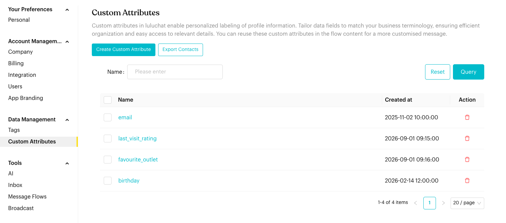
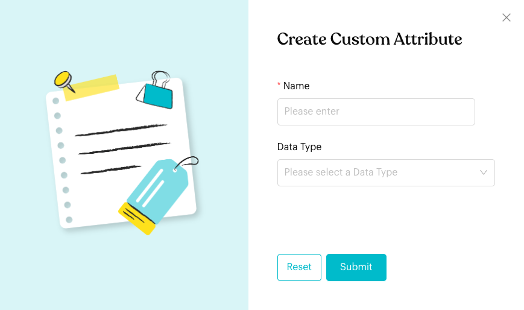

# Custom Attributes

## What is Custom Attributes?

Define personalized data fields to store contact information that matters to your business (e.g., "Last Purchase Date", "Preferred Language", "Account Manager").

## How to set it up (Step by Step)



#### Open Custom Attributes

Go to `Settings` > `Data Management` > `Custom Attributes`.

<figure><figcaption>
Custom Attributes (sample data)
</figcaption></figure>



#### Create an Attribute

Click `Create Custom Attribute`.

* Name: Choose a label that matches your terminology.
* Data Type: **Text**, **Number**, **Date**, **Time** or **Anniversal Date** (a day and month that repeats every year, e.g. a birthday).

Click **Submit**.

<figure><figcaption>
Create Custom Attribute
</figcaption></figure>



#### Organize and Export

* Edit: Click an attribute's name to change it.
* Export: Click `Export Contacts` to download your list of custom attributes as an Excel file.
* Bulk Actions: Select multiple attributes to delete them in one go.





**Important behavior to know**

* **Variable Reuse**: Once defined, custom attributes can be inserted into Message Flows using variables (e.g., `{{Last_Purchase}}`) for personalized automation.
* **Searchable**: You can filter your contact directory using these custom fields to create targeted lists.
* **Bulk Deletion**: When deleting multiple custom attributes at once, ensure you're not removing attributes that are actively used in your Message Flows or contact profiles.


## Best practice 💡

* **Clean Terminology**: Avoid duplicate attributes by checking the list before creating new ones.
* **Integration Mapping**: Match attribute names to your external CRM or Shopify fields for seamless data syncing.
