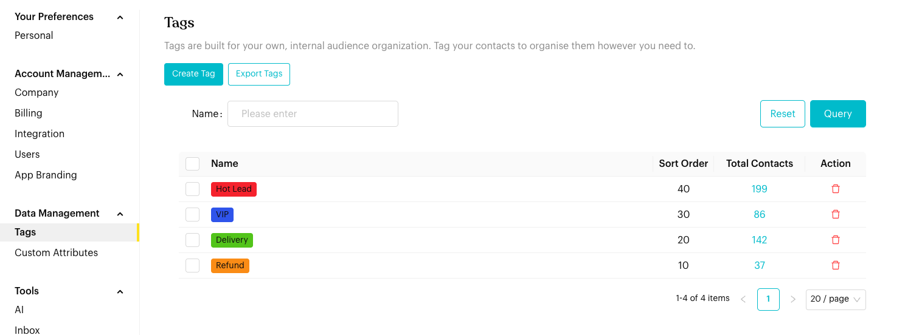
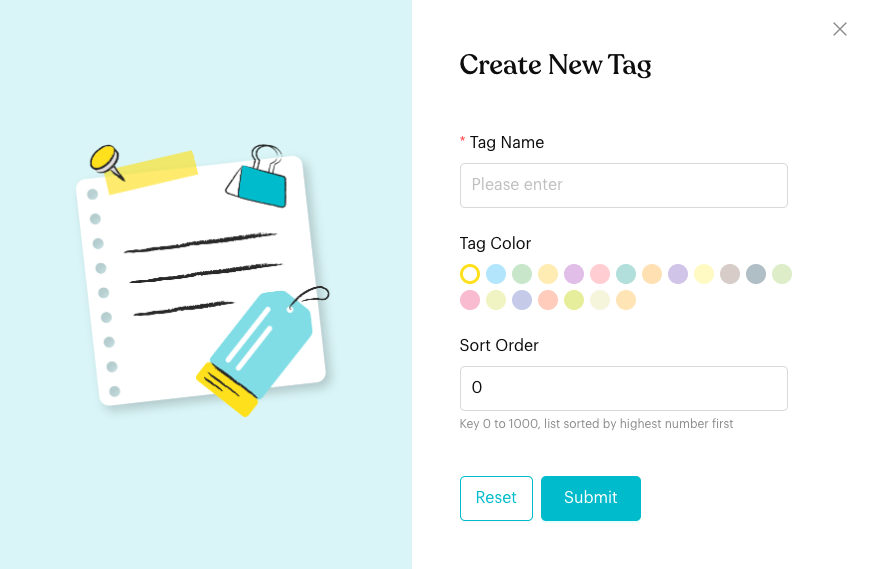

# Tags

## What is Tags Settings?

Manage the internal labels used to organize and segment your contacts. Tags help you filter audiences for broadcasts, track lead sources, and trigger specific automated flows.

## How to set it up (Step by Step)



#### Open Tags Management

Go to `Settings` > `Data Management` > `Tags`.

<figure><figcaption>
Tags
</figcaption></figure>



#### Create a New Tag

Click `Create Tag`. Enter a **Tag Name**, choose a **Tag Color**, and set a **Sort Order** (0 to 1000; tags with higher numbers are listed first). Click **Submit**.

<figure><figcaption>
Create New Tag
</figcaption></figure>



#### Manage Existing Tags

* Edit: Click a tag's name to change its name, color or sort order.
* Sort Order: Tags with a higher number appear first.
* Total Contacts: Click the number to open `Contacts` filtered to that tag.
* Export: Click `Export Tags` to download an Excel file of your entire tag list and usage stats.
* Delete: Click the trash icon to remove a tag.





**Delete Tag - Permanent Action**

Deleting a tag will permanently remove it from all associated contacts. This action cannot be undone. All contacts who had this tag will lose it immediately.



**Important behavior to know**

* **Contact Visibility**: You can see the total number of contacts currently using each tag in the list view.
* **Filtering**: Clicking the contact count for a tag will automatically filter your `Contacts` page to show only those people.


## Best practice 💡

* **Standardized Naming**: Use a clear format like `Source: Facebook` or `Status: VIP` to keep your list organized.
* **Color Coding**: Use consistent colors for categories (e.g., green for positive status, red for hot leads).
