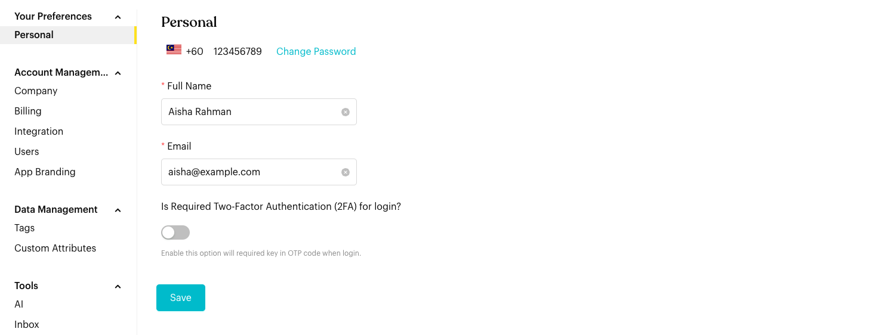

# Personal

## What is Personal Settings?

Manage your individual profile information, security preferences, and login credentials.

## How to set it up (Step by Step)



**Open Personal Settings**

Go to `Settings` > `Your Preferences` > `Personal`.

<figure><figcaption>
Personal settings
</figcaption></figure>



**Update Profile Information**

* Full Name: Your display name in the platform.
* Email: Your primary email address for notifications and login.
* Contact Number: Your registered phone number (cannot be changed directly).



**Configure Security**

* **Is Required Two-Factor Authentication (2FA) for login?**: Turn this on to require an OTP code via WhatsApp when you log in.



**Change Password**

Click the **Change Password** link next to your phone number to update your login credentials. You will need to enter your current password and a new 6-character minimum password.



## Important behavior to know

* **2FA Requirement**: Once enabled, 2FA applies to every login attempt for security.
* **Email Updates**: Changing your email will affect where you receive platform notifications.

## Best practice 💡

* **Enable 2FA**: We highly recommend keeping 2FA enabled to protect your account.
* **Strong Passwords**: Use a unique password not shared with other services.
