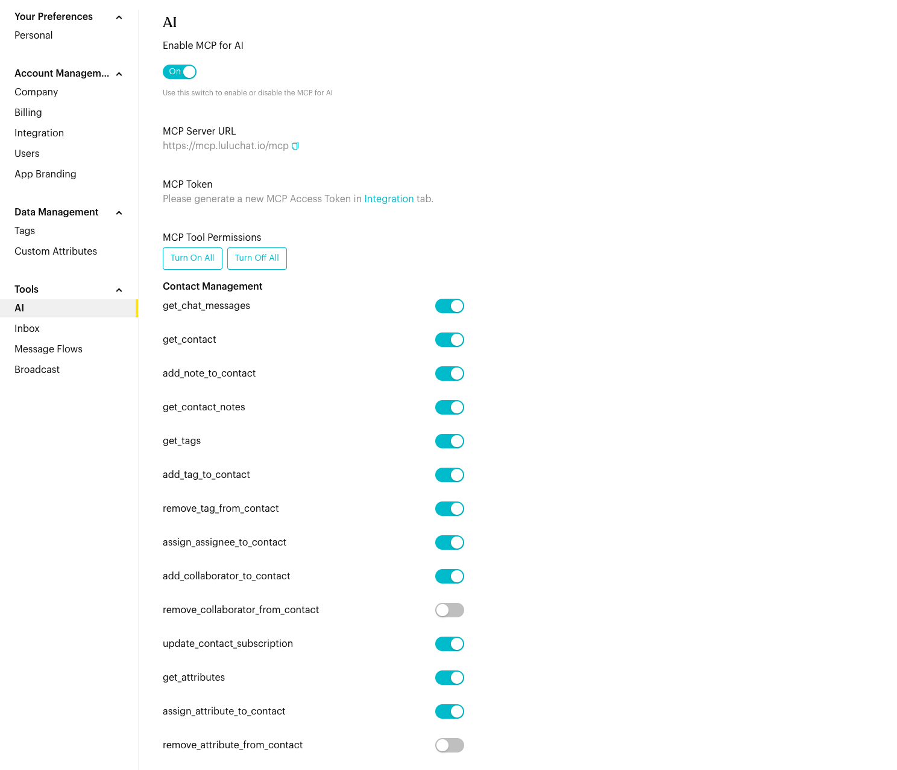
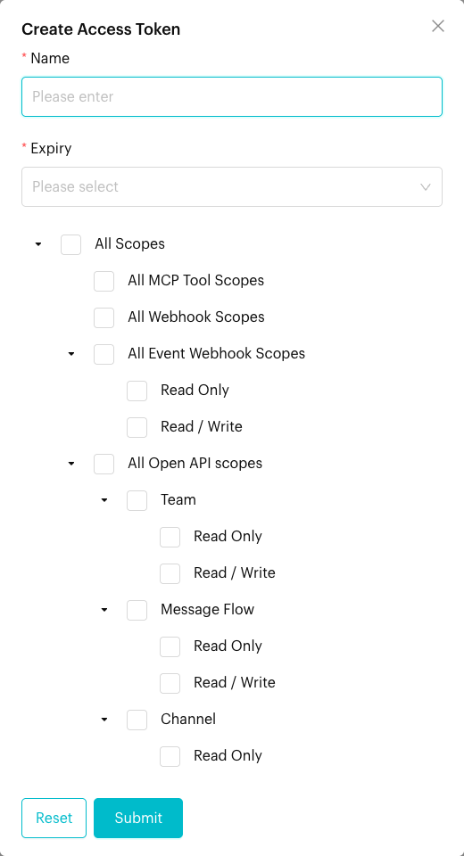

# AI

## What is AI Settings?

AI Settings allow you to enable and configure AI-powered features for your workspace, including Model Control Protocol (MCP) which lets AI agents use advanced automation tools.

## When does it trigger?

These settings take effect whenever a contact interacts with an **AI Agent node** in your Message Flows. The AI agent's capabilities and permissions are determined by what you configure here.

## How to set it up (Step by Step)



#### Access AI Settings

Go to `Settings` in the left menu, then navigate to Tools > AI.




#### Enable MCP

Toggle Enable MCP for AI to "On" to allow your AI agents to perform complex tasks like checking databases or calling external APIs. Use the **MCP Tool Permissions** list to turn each tool on or off. Tools are grouped by feature (Contact Management, Inbox Tabs, Workspace Management, Deal, Ticketing, Forms and Booking). Use **Turn On All** or **Turn Off All** for quick changes, then click **Save**. See [Available Tools](../../mcp/tools/index.md) for what each tool does.

<figure><figcaption>
AI settings
</figcaption></figure>



#### Create MCP Token

You will also need an MCP Token, which you can generate in the `Settings > Account > Integration` tab. You will need this for your AI service provider.

<figure><figcaption>
Create Access Token: tick All MCP Tool Scopes
</figcaption></figure>



#### Configure MCP Server URL

[https://mcp.luluchat.io/mcp](https://mcp.luluchat.io/mcp) will be your MCP Server URL, pass it to your AI service provider.




For step-by-step setup in Claude, Cursor, VS Code and other AI apps, see [Connect with an Access Token](../../mcp/connect.md). For what each tool does, see [Available Tools](../../mcp/tools/index.md).


## What happens after it triggers?

Once configured, your AI agents will be able to provide more relevant, data-driven responses. If a tool permission is granted, the AI can "call" that tool to perform a specific action during a live chat.

## Important behavior to know

* **Advanced Flows Only**: AI Agents and MCP are typically used in complex conversation paths where standard "If/Else" logic isn't enough.
* **Token Security**: Your MCP token is sensitive. Do not share it with anyone outside your trusted administration team.
* **Integration Required**: AI features require a valid API key from **Praxus AI** to function.

## Common issues & solutions

* **AI Agent not responding**: Check if the "Enable MCP for AI" toggle is on and verify that your API key in the Integration tab is valid.
* **Permission Denied errors**: If the AI tries to perform an action but fails, ensure that specific tool is enabled in your **MCP Tool Permissions** list.

## Best practice 💡

* **Least Privilege**: Only enable the specific tool permissions an AI agent needs. This makes the agent faster and more reliable.
* **Test Before Launch**: Always test your AI-powered flows with a test contact to ensure the agent follows your instructions correctly.
