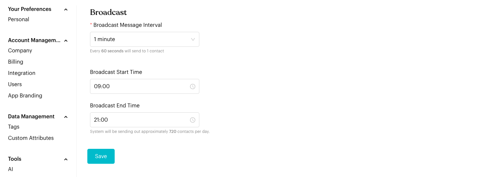

# Broadcast

## What are Broadcast Settings?

Broadcast settings control when and how fast your broadcasts are sent. These settings help you manage your daily message volume and ensure messages are delivered during your preferred hours.

## When does it trigger?

These settings take effect every time you launch a **Broadcast**. The system uses the interval and time windows defined here to regulate the delivery of your messages.

## How to set it up (Step by Step)



#### Open Broadcast Settings

Go to `Settings` from the left menu, then select `Broadcast` under the Tools section.

<figure><figcaption>
Broadcast settings (sample data)
</figcaption></figure>



#### Configure Message Interval

Select the **Broadcast Message Interval**, from **30 seconds** to **30 minutes**. This is how long the system waits between sends. On WhatsApp Personal channels, one contact is sent per interval. On WhatsApp Cloud (WABA) channels, several contacts are sent per interval; the note under the field shows the exact number.



#### Set Sending Hours

Pick the **Broadcast Start Time** and **Broadcast End Time**. The system only sends messages within this daily window. The note under the end time shows roughly how many contacts will be sent per day, e.g. a 1-minute interval from 09:00 to 21:00 sends about **720 contacts per day**.



#### Save Changes

Click **Save** to apply your new configuration.



## What happens after it triggers?

Once saved, all pending or newly started broadcasts will follow the new rules. For example, if you change the end time to earlier, any active broadcast will stop sending sooner than previously planned.

## Important behavior to know

* **Daily Capacity Calculation**: Your total daily message capacity is derived from these three fields. A shorter interval or a longer window increases your daily potential.
* **Off-Hours Queue**: If you launch a broadcast outside of these hours, messages will wait in a queue and start sending automatically at the next **Start Time**.
* **Anti-Spam Protection**: The interval is crucial for protecting your WhatsApp account from being flagged for suspicious activity.

## Common issues & solutions

* **Broadcast stopped sending**: Check if the current time is outside your **End Time**. Sending will resume automatically tomorrow morning.
* **Limit reached message**: If your current settings only allow for 1,000 messages/day and your broadcast has 5,000, it will take 5 days to complete.

## Best practice 💡

* **Align with Audience**: Set your sending window to when your customers are awake and active.
* **Start Slow**: When using a new channel, start with a longer interval (e.g. 1 minute or more) and shorten it gradually as your channel reputation grows.
