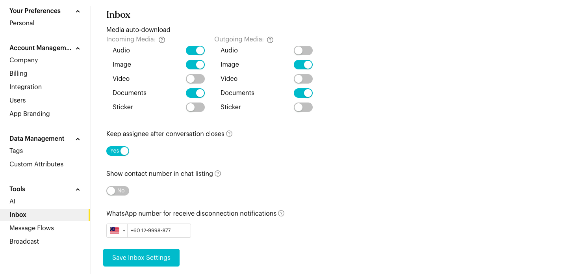
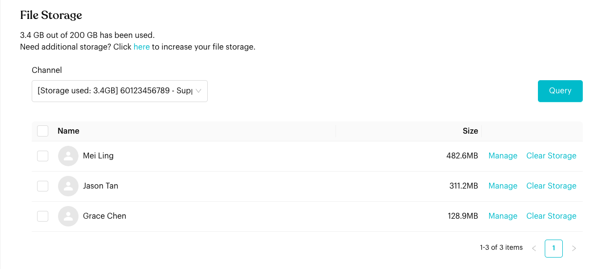

# Inbox

## What is Inbox Settings?

Configure media handling, conversation behavior, and manage file storage.

## How to set it up (Step by Step)



#### Configure Media Auto-download

Choose which media types are automatically downloaded when received or sent. This helps save bandwidth and storage.

* Incoming Media: Select Audio, Image, Video, Documents, or Stickers.
* Outgoing Media: Select which types you send that should be auto-processed.

<figure><figcaption>
Inbox settings (sample data)
</figcaption></figure>



#### Set Conversation Behavior

* Keep assignee after conversation closes: Toggle "Yes" to ensure the same teammate remains owner even after a thread is resolved.
* Show contact number in chat listing: Toggle "Yes" to always display the phone number next to the contact name in your inbox list.
* WhatsApp number for receive disconnection notifications: Enter a WhatsApp number to be alerted when a channel disconnects.

Click **Save Inbox Settings** to apply your changes.



#### Monitor File Storage

View your current storage usage at the bottom.

* Example: "0.5 GB out of 120 GB has been used."
* Note: If you run out of space, click the link to view subscription upgrade options.

<figure><figcaption>
File Storage
</figcaption></figure>



#### Manage Storage Space

Choose a **Channel** and click **Query** to see which contacts use the most space in that channel.

* Manage: Opens the media library for that specific contact.
* Clear Storage: Permanently deletes all media files for that contact to free up space.



## Important behavior to know

* **Storage Deletion**: "Clear Storage" is permanent. You cannot recover media files once they are deleted from the platform.
* **User Preference**: These settings affect how the inbox behaves for all team members in this workspace.

## Best practice 💡

* **Selective Auto-download**: Disable auto-download for large Video files if you primarily use Luluchat for text and images.
* **Regular Cleanup**: Periodically clear storage for old or inactive contacts to stay within your plan limits.
