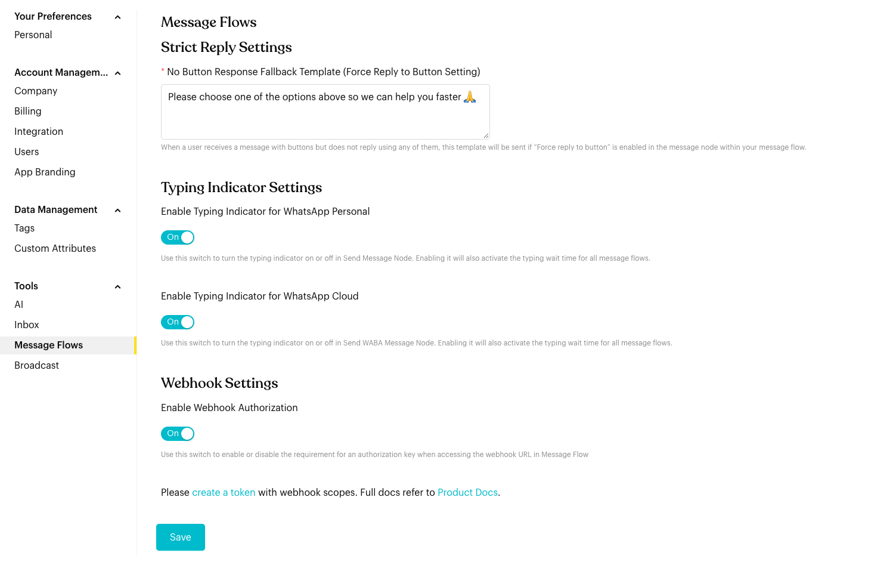

# Message Flows

## What is Message Flows Settings?

Manage global behavior for your message flows: the fallback reply for unanswered buttons, typing indicators, and webhook security.

Go to `Settings` > `Tools` > `Message Flows`.

<figure><figcaption>
Message Flows settings
</figcaption></figure>

## How to set it up (Step by Step)



#### Set the Strict Reply fallback message

Under **Strict Reply Settings**, enter the **No Button Response Fallback Template**. This message is sent when a contact receives a message with buttons but replies without tapping one of them, and **Force reply to button** is turned on in that message node.

Example: *Please choose one of the options above so we can help you faster 🙏*



#### Enable Typing Indicators

Make your automated replies feel more human by showing a "typing..." status before messages are sent.

* **Enable Typing Indicator for WhatsApp Personal**: Applies to the Send Message node.
* **Enable Typing Indicator for WhatsApp Cloud**: Applies to the Send WABA Message node.
* Turning it on also turns on the typing wait time for all message flows.



#### Secure your flow's webhook URL

**Enable Webhook Authorization** requires an access token when anyone calls the webhook URL of a message flow (the [Webhook Trigger](../../developer-guide/webhook-trigger.md)). When it's on, create an access token with webhook scopes in [Integration](../account/integration.md) and send it in the `Authorization: Bearer` header.



#### Save

Click **Save** to apply your changes.



## Important behavior to know

* **Strict Reply**: The fallback message is only sent from message nodes that have **Force reply to button** turned on.
* **Typing Wait Time**: Typing indicators only show if the message node in your flow has a delay value set.
* **Webhook Authorization**: Once it's on, requests to your flow's webhook URL without a valid access token are rejected. Update your systems with a token before turning it on.

## Best practice 💡

* **Friendly fallback**: Keep the fallback message short and remind the contact to tap a button.
* **Realistic Delays**: Set typing wait times to match the length of the message (e.g., 2-3 seconds) for a natural feel.
* **Secure Webhooks**: Turn on Webhook Authorization for flows that are triggered from your own systems.
