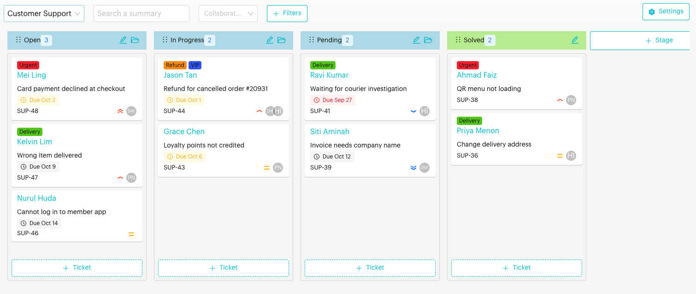
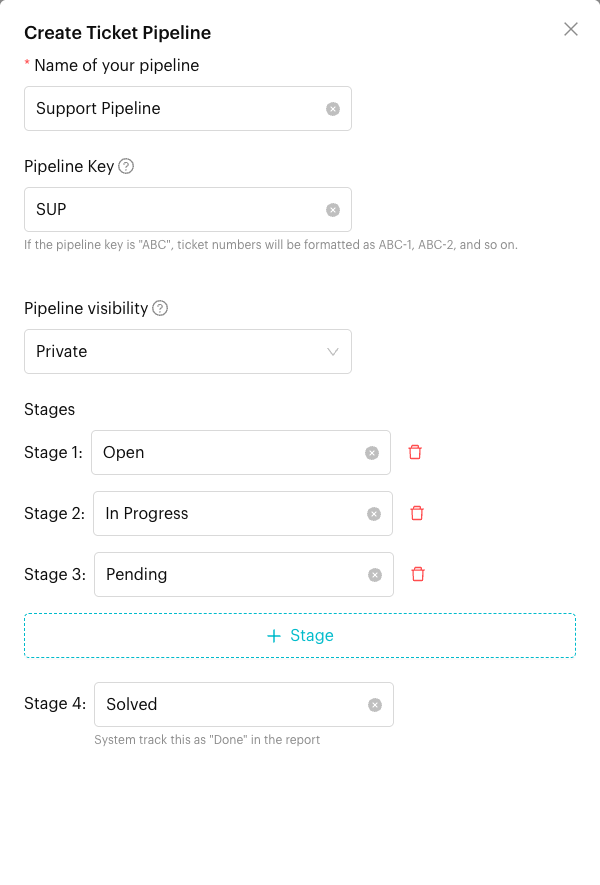
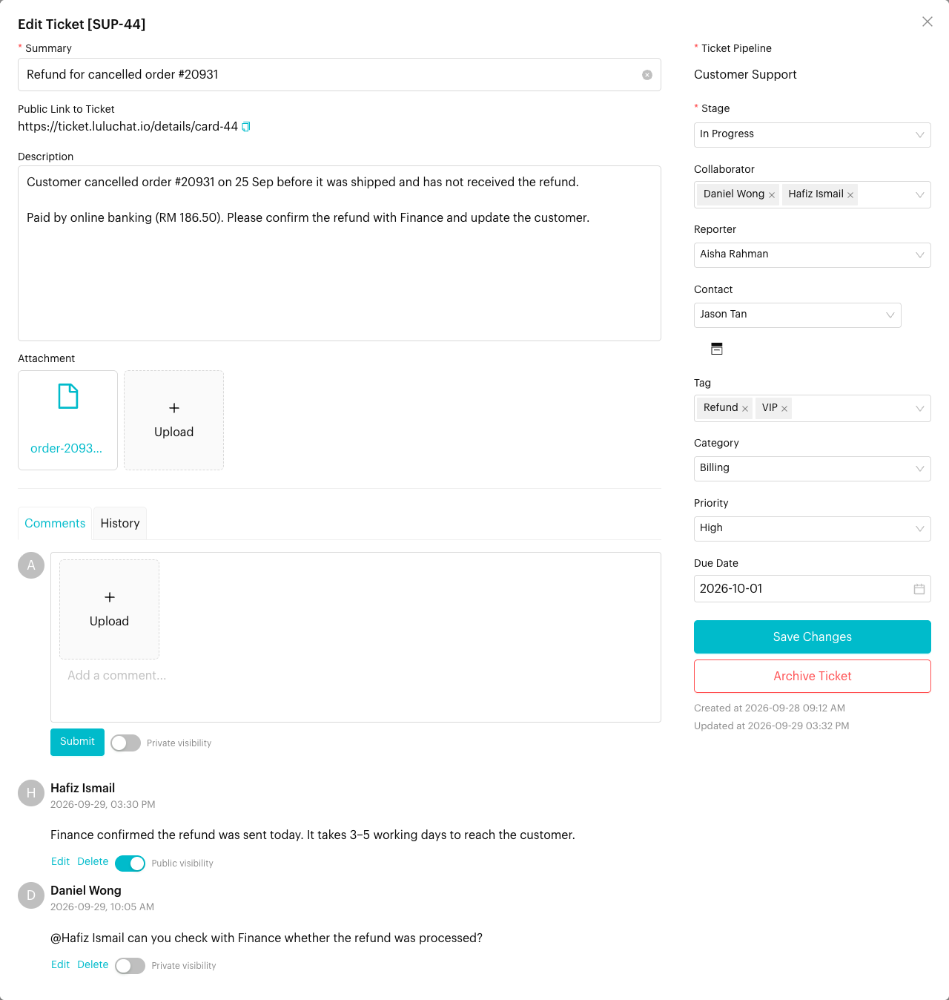

# Tickets: Board

## What is the Tickets Board?
The Board is a visual Kanban interface where you manage your day-to-day ticketing work. Each ticket is a card, and each column is a stage. Move cards from left to right as the work progresses.

Open it from `Tickets` > `Board` in the left menu, then choose a pipeline at the top.

<figure><figcaption>
Tickets Board (sample data)
</figcaption></figure>

## Pipelines

A pipeline is a set of stages for one type of work, e.g. *Customer Support*, *Returns* or *IT Requests*.

### Creating a pipeline
If you don't have a pipeline yet, click **Create Ticketing Pipeline**. To add another pipeline later, open the pipeline selector at the top of the board and click **Create Ticketing Pipeline** at the bottom of the list. The **Create Ticket Pipeline** form opens:

| Field | Description |
| --- | --- |
| **Name of your pipeline** | E.g. *Support Pipeline* |
| **Pipeline Key** | Up to 5 characters used as the ticket number prefix. With the key `SUP`, tickets are numbered `SUP-1`, `SUP-2` and so on. |
| **Pipeline visibility** | **Private**: only your team can see tickets. **Public**: each ticket also gets a shareable [public link](#public-link-to-ticket). |
| **Stages** | A new pipeline starts with *Open*, *In Progress* and *Pending*. Rename, delete or add stages with **+ Stage**. |
| **Final stage** | Every pipeline ends with a *Solved* stage. You can rename it, but it can't be removed. Luluchat counts tickets in this stage as **Done** in the [Tickets Report](../reports/tickets.md). |


The **Pipeline Key** can't be changed after the pipeline is created. Choose a short, clear key such as `SUP`, `RET` or `IT`.


<figure><figcaption>
Create Ticket Pipeline form
</figcaption></figure>

### Editing or deleting a pipeline
Click **Settings** at the top right of the board:
- **Edit Ticketing Pipeline**: Change the name or the visibility.
- **Delete Ticketing Pipeline**: Permanently delete the pipeline.

## Stages

- **Add Stage**: Click **+ Stage** at the right end of the board, enter a stage name and click **Add Stage**. New stages are normal (custom) stages.
- **Rename**: Click the **pencil** icon on a stage header.
- **Archive**: Click the **folder** icon on a stage header. The *Solved* stage can't be archived.
- **Reorder**: Drag a stage header to a new position.

Each stage header shows how many tickets are in it. The *Solved* stage has a green header so you can quickly spot finished work.

## Ticket cards

Each card shows:
- **Tags** on the ticket
- **Contact** name. Click it to open the conversation in the Inbox.
- **Due date**, highlighted when it is due within a week or has passed
- **Ticket number**, e.g. `SUP-12`
- **Priority** icon
- **Collaborators** avatars

Actions on the board:
- **Create Ticket**: Click **+ Ticket** at the bottom of a stage column. The ticket is created in that stage.
- **Move Ticket**: Drag a card to another stage, or up and down to reorder it.
- **View/Edit Ticket**: Click a card to open the ticket form.

## Filtering the Board
Use the top bar to narrow down the cards:
- **Search a summary**: Find tickets by words in the summary (title).
- **Collaborators**: Show tickets for specific team members, or *Unassigned* tickets with no collaborators.
- **Filters**: Open the filter panel for more options:

| Filter | Options |
| --- | --- |
| **Collaborators** | One or more team members, or *Unassigned* |
| **Tags** | One or more ticket tags |
| **Due Date** | *With due date*, *Overdue*, *Due within 1 week*, *Due within 1 month*, *Due within this month* |
| **Ticket Number** | Part or all of a ticket number, e.g. `SUP-12` |
| **Priority** | *Highest*, *High*, *Medium*, *Low*, *Lowest* or *Not set* |
| **Created At / Updated At** | A date range |

The **Filters** button shows how many filters are active. Click **Clear Filters** in the panel to reset them. Your filters are remembered while the browser tab stays open.

## The Ticket Form
Click a card to open **Edit Ticket [SUP-12]**, or click **+ Ticket** to open **Create a Ticket**.

**Left side: the ticket content**

| Field | Description |
| --- | --- |
| **Summary** | A short title for the ticket (required) |
| **Public Link to Ticket** | Shown only for tickets in a public pipeline. Click the copy icon to copy it. |
| **Description** | Full details of the request |
| **Attachment** | Upload files up to 100 MB each |
| **Comments** | Discuss the ticket with your team. See [Comments](#comments). |
| **History** | Who created, archived or unarchived the ticket, and who changed its stage or collaborators, and when |

**Right side: the ticket details**

| Field | Description |
| --- | --- |
| **Ticket Pipeline** | The pipeline the ticket belongs to |
| **Stage** | The ticket's current stage (required) |
| **Collaborator** | The team members working on the ticket |
| **Reporter** | Who raised the ticket. Defaults to you when you create a ticket. |
| **Contact** | The customer the ticket is about. Click the **Inbox** icon next to it to open their conversation. |
| **Tag** | Labels for grouping and filtering. Create new tags with a name and color from the tag dropdown. |
| **Category** | The type of work, e.g. *Billing* or *Technical Issue*. Create new categories from the dropdown. Categories power the *Categories of work* chart in the [Tickets Report](../reports/tickets.md). |
| **Priority** | *Highest*, *High*, *Medium*, *Low* or *Lowest*. New tickets default to *Medium*. |
| **Due Date** | When the ticket should be resolved. Shows **Overdue** in red once the date has passed. |

Click **Create Ticket** or **Save Changes** to save. The created and last updated times are shown under the buttons.

To remove a ticket from the board without deleting it, click **Archive Ticket**. You can restore it later from **Archived Tickets** in the [List](./list.md) view.

<figure><figcaption>
Ticket form in a public pipeline (sample data)
</figcaption></figure>

### Comments
- Type in **Add a comment...** and click **Submit**. You can attach files to a comment.
- Type **@** to mention a teammate.
- Use **Edit** or **Delete** under your comment to change or remove it.

In a **public** pipeline, each comment also has a visibility switch:
- **Private visibility** (default): Only your team can see the comment.
- **Public visibility**: The comment is also shown on the public ticket page.

## Public Link to Ticket

### What is it?
When a pipeline's visibility is **Public**, every ticket in it gets a page that anyone with the link can open without logging in, e.g. `https://ticket.luluchat.io/details/...`. Use it to let customers, partners or vendors follow a ticket's progress.

### How to share a ticket


#### Make the pipeline public
Create the pipeline with **Pipeline visibility** set to **Public**, or change it with **Settings** > **Edit Ticketing Pipeline**.



#### Copy the link
Open a ticket. Under **Summary**, click the copy icon next to **Public Link to Ticket**.



#### Choose what the viewer sees
Switch the comments you want to share to **Public visibility**. Comments stay private unless you switch them.



### Important behavior to know
- **Pipeline-level setting**: All tickets in a public pipeline have a public link. You can't make only some tickets public.
- **Read-only**: Visitors can view the ticket but can't change it.
- **Private comments stay private**: Only comments set to **Public visibility** appear on the public page.
- **Anyone with the link**: Links can't be guessed, but anyone who has one can open it. Only share it with the right people.

## Important behavior to know
- **Ticket numbers** come from the pipeline key and increase automatically, e.g. `SUP-1`, `SUP-2`.
- **Solved is "done"**: Tickets count as completed in reports when they're moved to the pipeline's *Solved* stage.
- **Archiving**: Archived tickets and stages disappear from the board, but their data is kept.
- **Inbox sync**: Tickets linked to a contact appear in the **Tickets** tab of the contact's [Contact Info](../inbox/contact-info/tickets.md) panel.

## Common issues & solutions
- **Can't find a ticket**: Clear your filters, or check **Archived Tickets** in the [List](./list.md) view.
- **Can't archive the Solved stage**: The final Done stage is required and can't be archived. Rename it if needed.
- **Can't change the ticket number prefix**: The Pipeline Key is fixed once the pipeline is created. Create a new pipeline if you need a different key.
- **No public link on a ticket**: The pipeline is Private. Edit the pipeline and set visibility to **Public**.
- **Customer can't see a comment on the public page**: Switch that comment to **Public visibility**.

## Best practice 💡
- **Keep it updated**: Move tickets as soon as the work progresses so the board and reports stay accurate.
- **Always set a priority, category and due date** so the team knows what to tackle first and reports stay meaningful.
- **Use Solved for finished work** instead of leaving tickets in the last working stage.
- **Keep internal notes private** and only share customer-facing updates as public comments.
